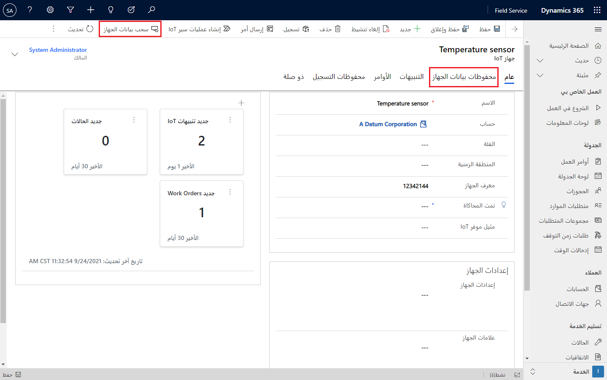
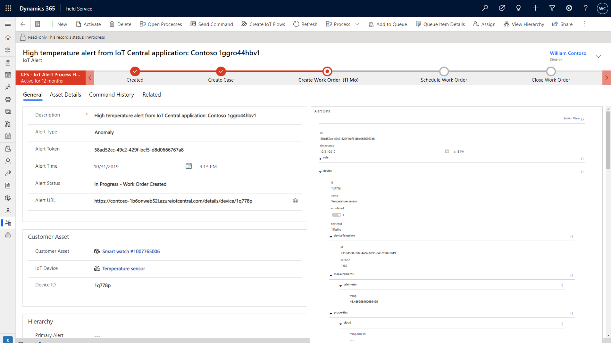
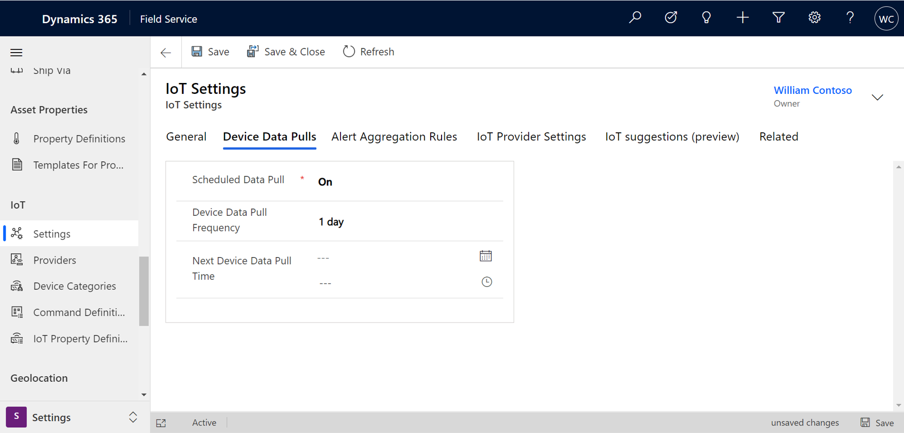

تقوم أجهزة IoT بإنشاء البيانات. في أي وقت، يقوم مستشعر جهاز IoT بتوصيل معلومات التقارير عن الجهاز.
وتسمى المعلومات التي يتم الإبلاغ عنها بالخاصية. قد تكون خاصية جهاز IoT عبارة عن قراءة لدرجة الحرارة أو الرطوبة أو الشبكة اللاسلكية التي يتصل بها الجهاز. وفقاً للإعدادات والحدود التي تم تحديدها للأجهزة الموجودة في محور IoT الذي يتم استخدامه، وقد تقرر الأنظمة الاستفادة أو عدم الاستفادة من هذه المعلومات. على سبيل المثال، يقوم مستشعر درجة الحرارة بإعداد تقارير عن درجة الحرارة الحالية باستمرار. عندما تتجاوز درجة الحرارة هذه حداً تم تحديده مسبقاً، فقد يتم التبليغ عن تلك القراءة في مكان ما.

ويمكن للمؤسسات التي تستخدم Dynamics 365 Field Service استرداد هذه المعلومات وسحبها إلى بيئة Field Service الخاصة بها. بعد تعيين خصائص الشبكة اللاسلكية وقناة الإرسال على أحد الأجهزة، يمكنك سحب بيانات الجهاز وعرض الخصائص التي تم الإبلاغ عنها حالياً في Connected Field Service. استناداً إلى المعلومات التي يتم سحبها للأسفل، قد تستخدم المؤسسة هذه المعلومات لتحديد الخطوات التالية في التطبيق.

في Dynamics 365، يمكن التقاط بيانات جهاز Connected Field Service بعدة طرق:

-   **سحب بيانات الجهاز** - يبدأ سحب بيانات الجهاز مباشرةً من سجل جهاز IoT في Field Service.

-   **تنبيه IoT** - عند إنشاء تنبيه، يتم إرسال تفاصيل التنبيه إلى Connected Field Service.

-   **سحب البيانات المجدول** - مشابه لسحب بيانات الجهاز مباشرةً، إلا أنه يتم وفقاً لجدول زمني محدد.

## سحب بيانات الجهاز

إن أبسط طريقة لسحب البيانات من الجهاز هي إجراء سحب بيانات الجهاز.
أثناء وجودك على سجل جهاز IoT، يمكنك تحديد زر **سحب بيانات الجهاز** على شريط الأوامر، والذي سيقوم بسحب أحدث البيانات من الجهاز. يتوفر أيضاً زر **سحب بيانات الجهاز** في سجلات الأصول للعميل.
إذا كان الأصل متصلاً بأجهزة IoT، فإن تحديد زر **سحب بيانات الجهاز** سيؤدي إلى سحب البيانات لكافة أجهزة IoT المتصلة.

> [!div class="mx-imgBorder"]
> 

بعد سحب البيانات، ستتوفر قائمة بسحب البيانات للجهاز في علامة تبويب **محفوظات بيانات الجهاز** .

## بيانات الجهاز على تنبيهات IoT

هناك طريقة أخرى لإنشاء تقرير عن البيانات وهي من خلال تنبيهات IoT. يتم إنشاء التنبيهات عند تجاوز حد في مركز IoT، مثل درجة الحرارة التي تتجاوز القراءة التي تم تصنيفها على أنها آمنة. استناداً إلى حل مركز IoT الذي تستخدمه، يمكن تشغيل الأتمتة التي ترسل هذه البيانات إلى Dynamics 365 Field Service. يتم التقاط هذه المعلومات في سجل تنبيه IoT. عندما يتم تشغيل تنبيه، يتم سحب بيانات الجهاز تلقائياً للجهاز المقترن.

> [!div class="mx-imgBorder"]
> 

يمكن للمؤسسات استخدام البيانات الموجودة في سجل التنبيهات للمساعدة على تحديد الخطوات التالية. على سبيل المثال، إذا تجاوزت درجة الحرارة حداً ما ولكنها كانت ضمن نطاق محدد، فقد تختار التفاعل عن بُعد. إذا لم يكن يتم إعداد تقارير عن البيانات أو كانت خارج النطاق الآمن، فقد ترغب في إرسال شخص ما للعمل عليها. سيتم التعمق في مناقشة هذا المفهوم فيما بعد.

## عمليات سحب بيانات الجهاز المجدولة

إذا كانت مؤسستك تستخدم مركز Azure IoT على أنه موفر IoT الخاص بك، فيمكنك أيضاً جدولة عمليات سحب بيانات الجهاز لإتمامها عندما تحتاج إليها. من خلال جدولة عمليات سحب الجهاز وفقاً لجدول منتظم، يمكنك التأكد من توفر أحدث عمليات قراءة البيانات حسب حاجتك إليها.

يتم تحديد الجدولة من منطقة **الإعدادات** لتطبيق Connected Field Service. حدد سجل **إعدادات IoT** ثم حدد علامة التبويب **عمليات سحب بيانات الجهاز**. وبعد تشغيل هذا الإعداد، يمكنك تكوين تكرار عمليات سحب البيانات وفقاً لاحتياجاتك.

> [!div class="mx-imgBorder"]
> 
