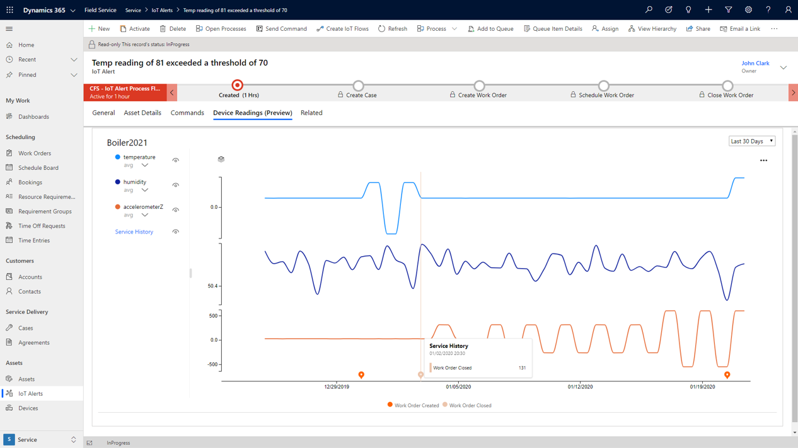
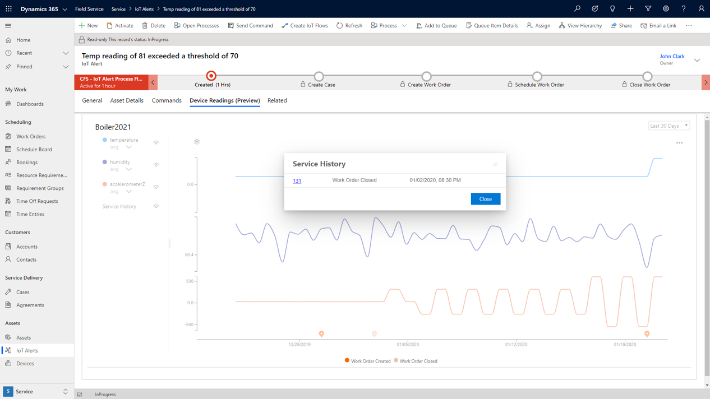
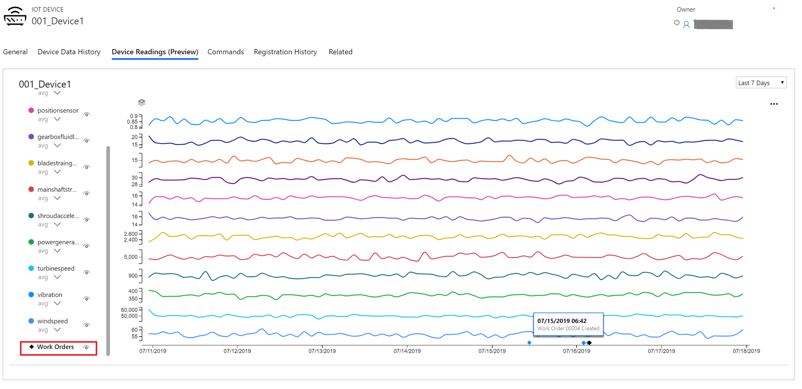

للتأكد من أنك تقوم بصيانة العناصر حسب الضرورة، يجب أن يكون لديك فهم كامل للجهاز، بما في ذلك أدائه الحالي ونوع الإصلاحات التي تم إجراؤها على الجهاز في الماضي. للمساعدة في فهم الحالة الحالية للجهاز، ومحفوظات إصلاحه، وتأثير أوامر العمل المنفذة، يمكن لـ Connected Field Service عرض قراءات الأجهزة في الوقت الفعلي تقريباً وقياسات المستشعر السابقة في مخطط جنباً إلى جنب مع تفاصيل أمر العمل.

بعد تمكين الجهاز وتكوينه، يتم عرض هذه المعلومات على مخطط قراءات الجهاز، والذي يتوفر في تنبيهات IoT، وأمر العمل، والحالة، والجهاز، ونماذج الأصول.

> [!div class="mx-imgBorder"]
> 

لتمكين مخطط قراءات الجهاز، يحتاج المسؤولون إلى نشر Time Series Insights في اشتراك Azure عند نشر أو ترقية Connected Field Service مع Azure IoT Hub لمؤسستهم. يعد Azure Time Series Insights حلاً جاهزاً يساعد المؤسسات على جمع بيانات IoT وتخزينها لتوفر على المدى الطويل وإنشاء نماذج لالتقاط سياق البيانات وتحليل البيانات لتحديد الاتجاهات.

لمزيد من المعلومات، راجع [تمكين مخطط قراءات الأجهزة](/dynamics365/field-service/cfs-visualizations-iot-hub?azure-portal=true#enable-the-device-readings-chart).

## استخدام مخطط قراءات الأجهزة

يتضمن مخطط قراءات الجهاز البيانات التي تأتي من أنواع متعددة من السجلات، بشرط أن يكون السجل مرتبطاً بجهاز IoT. علي سبيل المثال، إذا كنت تعمل على إحدى الحالات المرتبطة بجهاز IoT، يمكنك استخدام علامة التبويب **قراءات الأجهزة** في سجل الحالة لعرض قراءات الأجهزة. إذا كنت في أمر عمل مع جهاز متصل، فسيتضمن أمر العمل علامة التبويب **قراءات الأجهزة**.

لعرض قراءات الجهاز لأنواع معينة من السجلات، يجب أن تكون البيانات التالية في مكانها الصحيح.

|     النموذج          |     البيانات المطلوبة                                                                                                                                   |
|-------------------|-----------------------------------------------------------------------------------------------------------------------------------------------------|
|     الجهاز        |     معرف الجهاز ليس فارغاً.                                                                                                                       |
|     أمر العمل    |     يحتوي أمر العمل على تنبيه IoT ذي صلة، ويحتوي تنبيه IoT على جهاز IoT ذي الصلة. معرف الجهاز في جهاز IoT ليس فارغاً.            |
|     الحالة          |     تحتوي الحالة على تنبيه IoT ذي الصلة، ويحتوي تنبيه IoT على جهاز IoT ذي الصلة. معرف الجهاز في جهاز IoT ليس فارغاً.                  |
|     أصل         |     معرف الجهاز ليس فارغاً. مخطط قراءات الأجهزة هو لمعرف الجهاز الذي تم تعيينه في قسم **سمات الجهاز المتصل** من نموذج **الأصل**.    |
|     تنبيه IoT     |     يحتوي التنبيه على جهاز IoT ذي الصلة. معرف الجهاز في جهاز IoT ليس فارغاً.                                                             |

افتح علامة التبويب  **قراءات الأجهزة**  في تنبيه IoT أو أمر العمل أو الحالة أو الجهاز أو نموذج **الأصل**. يمكنك تغيير الفترة الزمنية التي تريد العمل بها.
أثناء استخدام الماوس للتمرير فوق الرسم البياني، سيتم عرض تلميحات الأدوات التي توفر تفاصيل القياس. يتم عرض الحالات وأوامر العمل المرتبطة بتنبيه IoT كدبابيس على مخطط قراءة الأجهزة. يمكنك عرض سجل الخدمة لأحد الأصول.

> [!div class="mx-imgBorder"]
> 

حدد رمز العين الموجود بجوار  **أوامر العمل** لإظهار أوامر العمل التي تم إنشاؤها وإغلاقها أثناء الفترة الزمنية المحددة أو إخفائها.

> [!div class="mx-imgBorder"]
> 

لمزيد من المعلومات، راجع [الإطارات المتجانبة للملخص في Connected Field Service](/dynamics365/field-service/cfs-summary-tiles/?azure-portal=true).
