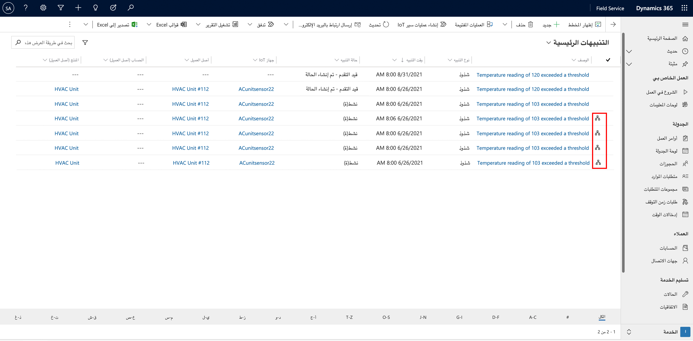

في Dynamics 365 Field Service، تمثل تنبيهات IoT مجموعة فرعية من رسائل IoT التي قد تتطلب الانتباه، على سبيل المثال عندما تكون أداة الاستشعار المكونة في الثلاجة التي قمت بصيانتها بتنبيه أن الرطوبة قد ارتفعت فوق الحد المقبول. عند ورود هذه التنبيهات، قد تقرر تقديم دعم عن بُعد للصنف. بدلاً من ذلك، لدعم تقديم الخدمة، قد ترغب في تحويل IoT الوارد إلى أمر عمل، والذي يمكن بعد ذلك جدولته وتعيينه إلى فني خدمة.

## تشغيل تنبيهات IoT

قبل استكشاف عملية العمل مع سجلات تنبيه IoT يجب عليك أولاً فحص كيفية إنشاء التنبيهات وتشغيلها. وتقوم موزّعات IoT بمعالجة العديد من البيانات للأجهزة. عندما تتدفق معلومات جهاز IoT إلى مركز Azure IoT، يمكنك إنشاء قواعد تحدد متى يجب إنشاء تنبيهات IoT استناداً إلى رسائل IoT الواردة. على سبيل المثال، يمكن أن يكون لديك مشغل تنبيه عندما تكون قراءة درجة الحرارة على منظم الحرارة الذكي أعلى من 70 درجة.

عندما تصل الرسائل، فإنك تحتاج إلى طريقة لمراجعتها ثم تحديد معايير إطلاق تنبيه. إحدى الأدوات التي تُستخدم غالباً مع محاور Azure IoT هي Azure Stream Analytics، وهي خدمة تحليلات في الوقت الفعلي. ومع وصول البيانات من الأجهزة المتصلة إلى IoT Hub، سيقوم Stream Analytics بتحليل البيانات ويمكن أن يطلق الأحداث بناءً على المعايير المحددة.

على سبيل المثال، عندما قمت مسبقاً بتوزيع Connected Field Service، تم أيضاً إنشاء وظيفة تحليلات التدفق التي تتضمن معايير محددة مسبقاً حول درجة حرارة جهاز المحاكاة الخاص بك. يمكنك العثور على هذه المعايير وتحريرها في **Stream Analytics** في مجموعة الموارد الخاصة بك. عندما تكون في التدفق، انتقل إلى **استعلام** في الجزء الأيمن وحدد **IoTStream**.

العنصران الأساسيان في قسم IoTStream هما:

-   **الأحداث** - يعرض جزء الأحداث في الجزء السفلي من الشاشة جميع رسائل IoT الواردة من الجهاز المتصل.

-   **JSON لإنشاء تنبيه** - يعرض الجزء العلوي رمز JSON الذي يقوم بإنشاء تنبيهات IoT من رسائل IoT.

> [!div class="mx-imgBorder"]
> 

في الصورة السابقة، يحدد كود JSON أنه عندما تكون قراءة درجة حرارة الجهاز أكبر من درجة الحرارة المرجعية، فإن الوظيفة ستقوم بالحصول على التفاصيل مثل معرف الجهاز وقراءة درجة الحرارة ودرجة الحرارة القصوى. سيتم تمرير هذه البيانات إلى Dynamics 365 في سجل **تنبيهات IoT**.

## تشغيل تنبيهات IoT باستخدام جهاز المحاكاة

يوضح المثال التالي كيفية تشغيل تنبيهات IoT باستخدام جهاز المحاكاة الخاص بك من الإصدارات السابقة. انتقل إلى عنوان URL الخاص بجهاز المحاكاة الذي قمت بتكوينه مسبقاً. عندما تكون في جهاز المحاكاة، باستخدام القائمة المنسدلة لمعرف الجهاز، حدد جهاز IoT لمحاكاته. (تذكر أنه سيتم ملء هذه الأجهزة بناءً على أجهزة IoT التي قمت بتسجيلها مباشرةً في مركز IoT أو داخل Dynamics 365 Field Service).

> [!div class="mx-imgBorder"]
> 

> [!NOTE] 
> إذا كنت لا تستخدم Azure IoT Hub، فيمكنك إنشاء تنبيهات IoT في Field Service استناداً إلى رسائل IoT في موفر IoT المخصص. لمزيد من المعلومات، راجع [مصادر بيانات IoT الموسعة لـ Connected Field Service](/dynamics365/field-service/cfs-custom-iot-provider/?azure-portal=true).

## عرض تنبيهات IoT في Field Service

بعد إنشاء القاعدة في Stream Analytics، سيقوم المنطق بإنشاء تنبيهات IoT استناداً إلى معايير القاعدة. استخدم مثال المحاكاة 70 درجة كحد لدرجة الحرارة، لذلك عندما تجاوزت درجة الحرارة 70 درجة، تم إنشاء تنبيه IoT. يوفر سجل **تنبيه IoT** التفاصيل الضرورية للتنبيه. يعرض قسم **بيانات التنبيه** التفاصيل التي تم التقاطها كجزء من استعلام Stream Analytics السابق.

بناءً على ما تم تحديده في استعلام Stream Analytics، تم إرسال بيانات التنبيه التالية:

-   **معرّف الجهاز** - يحدد معرّف الجهاز الذي قام بإنشاء التنبيه، مثل **HVACUnit20**.

-   **Readingtype** - تحديد النوع أو القراءة. يدعم جهاز المحاكاة أنواع قراءة **درجة الحرارة** وأيضاً **الرطوبة**.

-   **القراءة** - يحدد قيمة القراءة الفعلية للجهاز، مثل **71**.

-   **Eventtoken** - رقم رمز الحدث المميز للحدث.

-   **Threshold** - القيمة الحدية التي تم تجاوزها في القراءة، مثل **70**.

-   **Ruleoutput** - يحدد إخراج القاعدة بناءً على الحدث مثل **AlarmTemp**.

-   **الوقت** - يسجل وقت وقوع الحدث.

> [!div class="mx-imgBorder"]
> 

بناءً على سياسات مؤسستك والتفاصيل المحددة التي تم الإبلاغ عنها في التنبيه، قد تقرر اتخاذ إجراءات مختلفة بشأن تنبيه IoT. على سبيل المثال، بناءً على درجة الخطورة، قد تختار التفاعل عن بُعد مع الجهاز باستخدام خيار **إرسال الأمر** في شريط الأوامر، أو يمكنك تحويل التنبيه إلى سجل الحالة أو أمر العمل.

## تحويل تنبيه IoT إلى أمر عمل

وخارج النطاق التقليدي، عندما يتم إنشاء تنبيه IoT، فإنه سيتضمن سير إجراءات العمل الذي يمكن أن يساعد في إرشادك خلال عملية العمل مع التنبيه خلال دورة الحياة وتحويلها إلى سجلات، مثل الحالات وأوامر العمل.

> [!div class="mx-imgBorder"]
> 

يتضمن سير إجراءات العمل خمس مراحل:

-   **تم الإنشاء** - المرحلة الأولية التي ستكون تلقائياً هي المرحلة النشطة بعد إنشاء تنبيه IoT في البداية.

-   **‏‫إنشاء حالة‬** - تُستخدم لتحويل التنبيه إلى سجل حالة بحيث يمكن التحقق منه عن بُعد.

-   **إنشاء أمر العمل** - يستخدم بعد تحويل سجل الحالة إلى أمر عمل للإشارة إلى ضرورة إرسال شخص ما إلى الموقع.

-   **جدولة أمر العمل** - يشير إلى أن أمر العمل جاهز للجدولة والإرسال.

-   **إغلاق أمر العمل** - يساعد في التقاط التفاصيل الضرورية قبل إغلاق أمر العمل.

> [!div class="mx-imgBorder"]
> 

## تنظيم تنبيهات IoT

وبشكل عام، يتم إنشاء العديد من تنبيهات IoT لنفس جهاز IoT لنفس المشكلة. ونتيجة لذلك، سيتعرف النظام على العناصر المتشابهة ويقوم بتجميعها معاً.

> [!div class="mx-imgBorder"]
> 

لمزيد من المعلومات، راجع [التنبيهات في Connected Field Service](https://youtu.be/tkBSLhKNfmQ?azure-portal=true) للحصول على عرض توضيحي بالفيديو.
