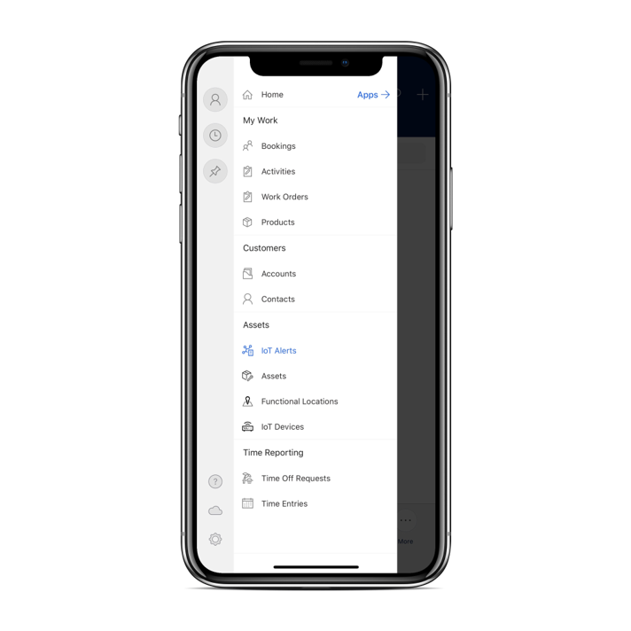
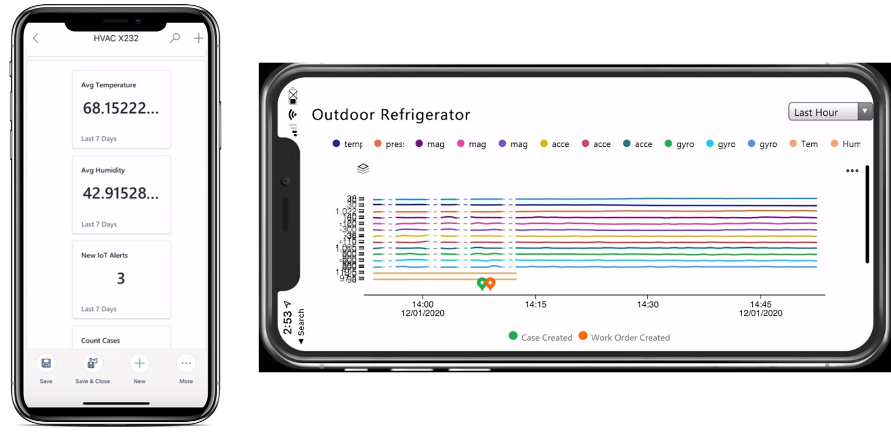
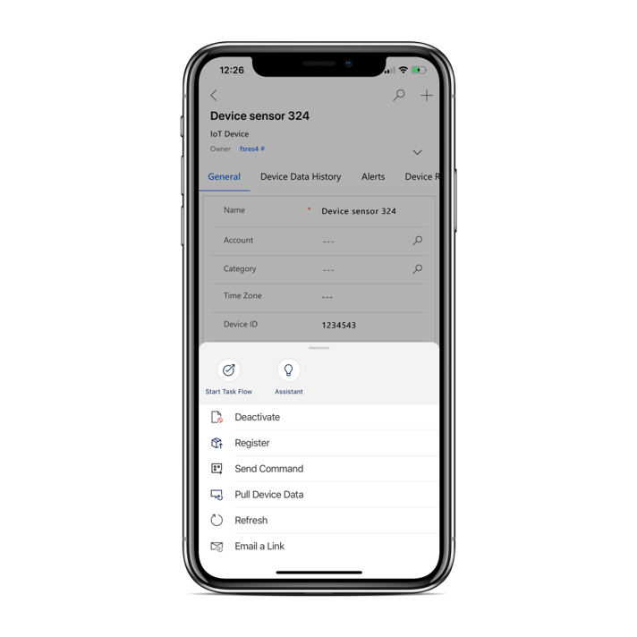

غالباً ما يتم إرسال عمال الخطوط الأمامية في هذا المجال لخدمة أجهزة IoT لأن الجهاز لا يعمل على النحو المنشود ويحتاج إلى إصلاح أو لأن العامل يقوم بتثبيت جهاز جديد.
يمكن للمؤسسات التي تستخدم Connected Field Service لإنشاء أوامر عمل من بيانات IoT أن تزود الفنيين ببيانات IoT الهامة وإجراءات Connected Field Service مباشرةً من تطبيق الأجهزة المحمولة لتحسين تقديم الخدمة في الموقع.

في كثير من الأحيان، سيستخدم عمال الخطوط الأمامية Connected Field Service من أجل:

-   عرض بيانات IoT المتعلقة بالأصول لفهم سياق الإصلاح بشكل أفضل.

-   تسجيل أجهزة IoT الجديدة عند تثبيت أصل لتوصيله بـ Azure IoT أو موفر IoT المخصص.

-   إرسال الأوامر لاستكشاف المشاكل وإصلاحها.

باستخدام الإصدار الحالي من Field Service وتطبيق Dynamics 365 Field Service ‏Mobile، يمكن للعاملين في الخطوط الأمامية تنفيذ هذه المهام مباشرةً من داخل تطبيق الأجهزة المحمولة. يتضمن تطبيق Field Service Mobile مجموعة **الأصول** التي تتضمن الأصناف ذات الصلة بخدمة أصول العميل.
تتضمن العديد من أصول العملاء مستشعرات جهاز IoT لمراقبة الجوانب المختلفة للجهاز.

> [!div class="mx-imgBorder"]
> 

نظراً لأن أحد العاملين في الخطوط الأمامية يقوم بتنفيذ أمر عمل لأحد الأصول، فقد يجدون أنه من المفيد مراجعة بيانات IoT الحديثة للأجهزة المرتبطة بهذا الأصل. على سبيل المثال، في حالة صيانة الثلاجة، قد يرغب العامل في مراجعة البيانات من مستشعرات درجة الحرارة والرطوبة للحصول على مزيد من المعلومات الأساسية التي يمكن أن تساعد في عملية استكشاف الأخطاء وإصلاحها.

عند الوصول إلى أحد أصول العميل الذي قام بتوصيل أجهزة IoT المرتبطة به على تطبيق الأجهزة المحمولة، يمكنك استخدام علامة التبويب **الملخص** لعرض مربعات الملخص المرتبطة بالجهاز.
تعرض مربعات الملخص نظرة عامة على نشاط IoT الأخير الذي يتعلق بالأصل. في قسم **قراءات الجهاز**، يمكنك عرض أحدث قياسات IoT المرسومة على الرسم البياني.

> [!div class="mx-imgBorder"]
> 

## تسجيل أجهزة IoT الجديدة

يتضمن النوع الشائع لأمر العمل تثبيت شيء ما، مثل الثلاجة، للعميل.
أثناء إجراء التثبيت، من المرجح أن يرغب عامل في الخطوط الأمامية في توصيل مستشعرات درجة الحرارة والرطوبة بجهاز IoT لـ Azure IoT وتسجيلها. بعد تسجيل جهاز IoT، سيبدأ عرض البيانات من الجهاز في Connected Field Service وفي تطبيق الأجهزة المحمولة.

يمكن للمندوبين إجراء هذه العملية من تطبيق الأجهزة المحمولة المتصل بالإنترنت لتسجيل جهاز IoT عن طريق تحديد **المزيد...** في الجزء السفلي من الشاشة ثم تحديد **تسجيل**.

> [!div class="mx-imgBorder"]
> 

## استكشاف الأخطاء وإصلاحها عن طريق إرسال الأوامر

في كثير من الأحيان، أثناء عمل الفني على أحد الأجهزة، سيكون من المفيد أن يقوم بالإجراءات اللازمة مثل إعادة تشغيل الجهاز أو إيقاف تشغيله.
توفر Connected Field Service للمؤسسات القدرة على إرسال أوامر إلى الأجهزة مباشرةً من Dynamics 365 Field Service.

> [!IMPORTANT]
> يجب على المسؤول تحديد الأوامر وتكوينها في Azure IoT قبل أن يتمكن الفنيون من تشغيل الأوامر من تطبيق Field Service Mobile. بالإضافة إلى ذلك، قد ترغب المؤسسات في إنشاء تعريفات الأوامر لتبسيط عملية إرسال الأوامر.

تتضمن الأوامر النموذجية إعادة التشغيل وإيقاف التشغيل، من بين أوامر مخصصة أخرى خاصة بالجهاز.

من سجل جهاز IoT، حدد **المزيد...** في الجزء السفلي من الشاشة.
من القائمة التي تظهر، حدد **إرسال الأمر**. بناءً على الأوامر التي تم تكوينها المتاحة، يمكنك اختيار أمر محدد من القائمة.
