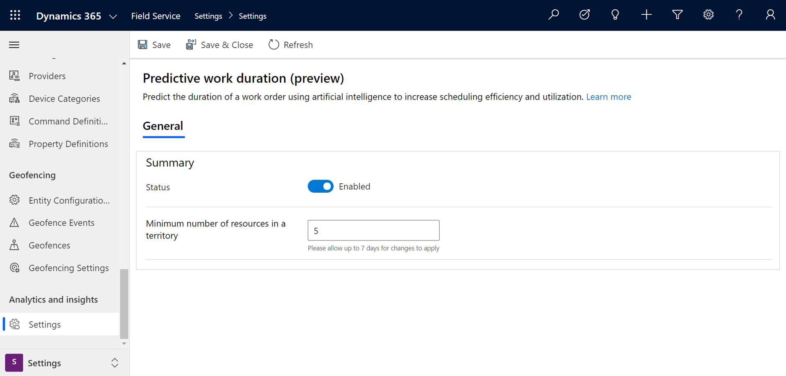
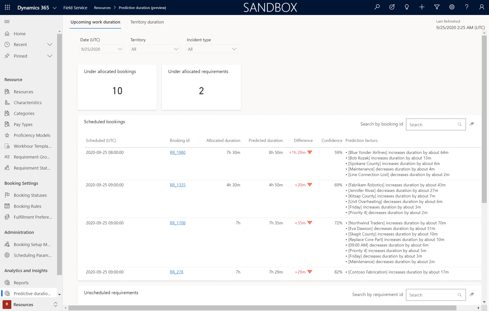
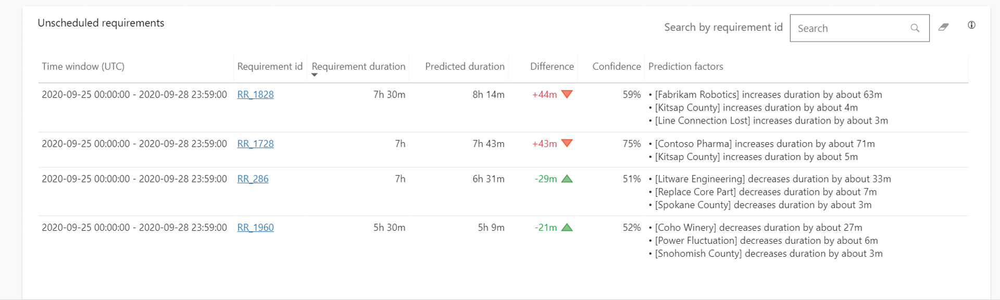
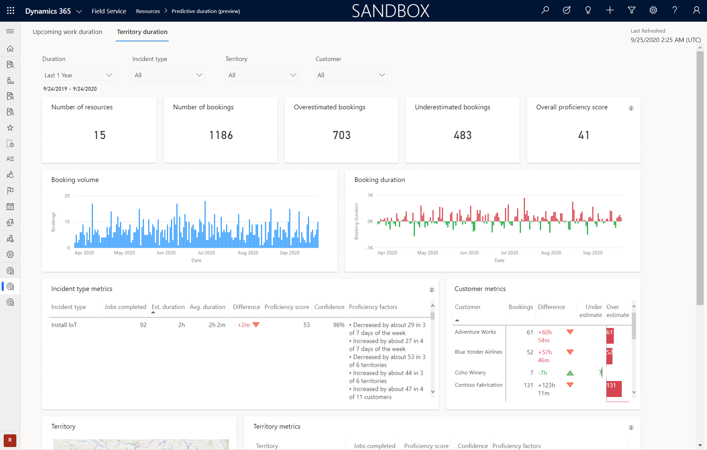
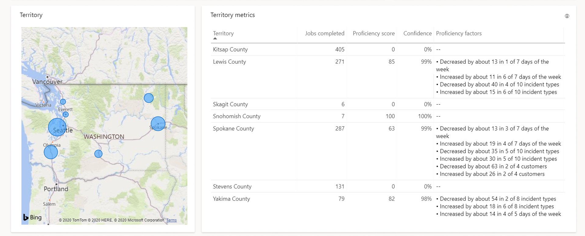
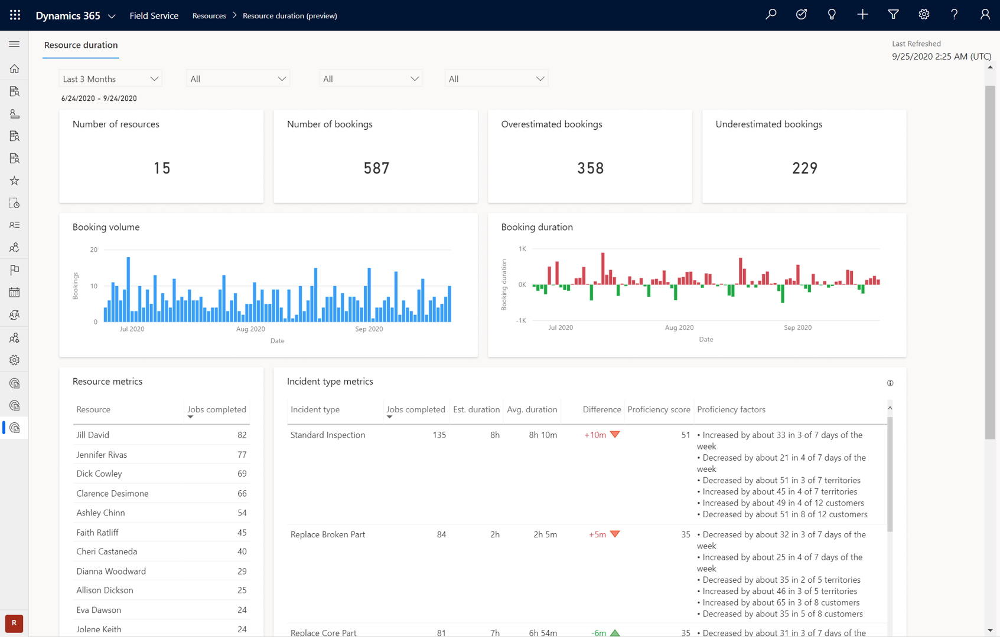
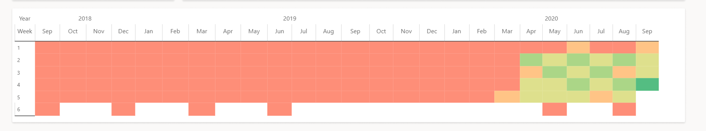

غالباً ما يعين مرسلو Field service مدة محددة لنوع الوظيفة، على الرغم من العوامل المختلفة التي قد تؤثر في الوقت المطلوب لإكمال العمل. على سبيل المثال، قد يقدر أن أمر عمل لإجراء صيانة النظام يستغرق ساعة. قد يستغرق الفني الأقل خبرة أكثر من ساعة، في حين أن الفني الأكثر خبرة قد يكون قادراً على إكمال المهمة في نصف ذلك الوقت. يمكن أن يؤدي استخدام المدد الثابتة إلى حدوث تأخيرات يمكن أن تتعاقب عبر الشركة بأكملها، مما قد يقلل من الاستخدام ويقلل من الفعالية الإجمالية للجدولة.

ومن خلال تحليل البيانات التاريخية وتطوير فهم أفضل للنتائج السابقة، يمكن للمنظمات أن تضع تنبؤات أكثر استنارة حول مقدار الوقت الذي سيستغرقه العنصر ليكتمل. يمكن أن تساعد ميزة **مدة العمل التنبؤية‬** في Dynamics 365 Field Service على التنبؤ بنتائج الجدولة، والتي يمكنها تحسين الكفاءة الكلية.

باستخدام نماذج الذكاء الاصطناعي، فإن ميزة **مدة العمل التنبؤية** تستند في عملها إلى معلومات سجل الحجز وأوقات الاكتمال. استناداً إلى عوامل مثل أداء المورد السابق والعميل ونوع العمل، يمكن لهذه الميزة حساب مدة أكثر واقعية. يمكن للمرسلين استخدام هذه المدة المحسوبة لتحديد كيفية جدولة عنصر.

أهم العوامل التي تؤثر في التنبؤات:

-   أداء المورد

-   نوع الحادث‬

-   العميل (خدمة العملاء)

-   نوع أمر العمل

-   الاختلافات الإقليمية

-   التغييرات المتعلقة بالوقت

## الشروع في العمل

قبل أن تتمكن من بدء تطبيق فترات العمل التنبؤية، ستحتاج إلى تمكين الميزة في بيئتك. في تطبيق Dynamics 365 Field Service، انتقل إلى منطقة الإعدادات ثم حدد **الإعدادات** تحت قسم **التحليلات والرؤى المتعمقة** . حدد **الحالة** في الصفحة **‏‫مدة العمل التنبؤية‬ (معاينة)**.

بعد تمكين الميزة، يجب أن تقرر ما إذا كنت ترغب في إدخال قيمة في الحقل **الحد الأدنى لعدد الموارد الموجودة في المنطقة** . يساعدك هذا الحقل على تعيين قيود علة التحليلات والتقارير. سيتم حذف الأقاليم التي لها نفس الموارد أو أقل من القيمة التي قمت بتعريفها في هذا الحقل. على سبيل المثال، إذا قمت بتعيين هذا الحقل إلى **10**، سيتم استبعاد المناطق التي تحتوي على 10 أو أقل من الموارد من تحليلات المناطق والتقارير. يمكن أن يساعد هذا القيد في حماية خصوصية الفني.

> [!div class="mx-imgBorder"]
> 

عند تمكين ميزة مدة العمل التنبؤية، سيكون لديك حق الوصول إلى ثلاثة تقارير:

-   **مدة العمل القادمة**: يظهر المدد المتوقعة للحجوزات القادمة ويقارن التنبؤات بالمبلغ المخصص.

-   **مدة المنطقة** - يوفر توزيعات التنبؤ حسب الإقليم.

-   **مدة المورد**: يوفر تفاصيل التوقع والتخصيص حسب المورد.

تفحص المقاطع التالية كل تقرير بمزيد من التفصيل.

## مدة العمل القادم

يتوفر تقرير **المدة التنبؤية** من مجموعة **التحليلات والرؤى** في منطقة **الموارد** ضمن تطبيق Field Service. في تقرير **المدة التنبؤية**، تشمل علامة التبويب **مده العمل القادم** على مخططين وتوفر تنبؤات المتطلبات غير المجدولة والحجوزات المجدولة.

يوفر الجزء العلوي من التقرير طرق تصفية البيانات أو تقسيمها:

-   **التاريخ**: حدد التاريخ المستقبلي (الأيام السبعة القادمة).

-   **المنطقة**: حدد من قائمة مناطق الموارد.

-   **نوع الحدث**: حدد من قائمة أنواع الأحداث.

توجد التحليلات التالية أسفل مقسمات طرق العرض:

-   **الحجوزات المخصصة**: عدد الحجوزات التي تم تخصيصها ضمن مدة متوقعة.

-   **المتطلبات المخصصة**: عدد المتطلبات التي تم تخصيصها ضمن مدة متوقعة.

> [!div class="mx-imgBorder"]
> 

يتضمن كل مخطط المقاييس التالية:

-   **مدة التخصيصات/المتطلبات**: تحدد كيفية تخصيص الوقت حالياً لإجراء حجز مجدول أو تحديده في سجل المتطلبات.

-   **المدة التنبؤية**: تحدد مقدار الوقت الذي يتوقع النظام أن المهمة سوف تستغرق على أساس عوامل مختلفة.

-   **الفرق**: إجمالي الفرق بين المدة المخصصة/المتطلبة والمدة المتوقعة.

-   **الدقة**: احتمال أن تكون المدة الفعلية قريبة من المدة المتوقعة. تشير النقاط الأعلى (أقرب إلى 100 بالمائة) إلى التوقع الذي يتم تصحيحه، بينما تكون النقطة الأقل (الأقرب إلى الصفر) تعني أن التنبؤ قد يكون غير صحيح.

-   **عوامل التنبؤ**: الرؤى حول العوامل التي تم أخذها في الاعتبار عندما كنت تتنبأ بالمدة وكيف تؤثر هذه العوامل في التنبؤ.

> [!div class="mx-imgBorder"]
> 

## مدة المنطقة

توفر علامة التبويب **مدة المنطقة** تقريراً يفصل البيانات حسب المناطق.

> [!div class="mx-imgBorder"]
> 

كما هو الحال في تقرير **مدة العمل القادم**، يتضمن تقرير **مدة المنطقة** عدة طرق يمكن بها تصفية المعلومات استناداً إلى احتياجاتك:

-   **المدة**: تسرد القيم المعرفة مسبقاً لتصفيتها حسب المدة، مثل:

    -   آخر ثلاثة أشهر

    -   آخر ستة أشهر

    -   العام الماضي

    -   العامان الماضيان

-   **نوع الحدث**: التصفية حسب أنواع الحدث.

-   **المنطقة**: التصفية حسب مناطق الخدمة.

-   **العميل**: تصفية تقرير المنطقة حسب العميل.

أسفل عوامل التصفية، توجد التحليلات التي ستقوم بتمييز العناصر الهامة التي يمكن قياسها والمرتبطة بالمؤسسة:

-   **عدد الموارد**: إظهار عدد الموارد المتضمنة في الحجوزات.

-   **عدد عمليات الحجز**: يعرض عدد الحجوزات المكتملة.

-   **الحجوزات المبالغ في تقديرها**: تظهر عدد الحجوزات التي يتم مبالغة تقدير تكلفتها مقارنةً بالمدة الفعلية.

-   **الحجوزات دون التقدير**: إظهار عدد الحجوزات التي يتم تقليل تقديرها مقارنة بالمدة الفعلية.

-   **درجة الكفاءة الإجمالية**: إجمالي كفاءة الذكاء الاصطناعي عبر كافة المناطق.

يتضمن تقرير **تنظيم مدة المنطقة** المخططات التالية للمساعدة على تبسيط عملية الفصل بين المعلومات والتصوير:

-   **حجم الحجز**: إظهار عدد الحجوزات على عوامل التصفية التي تم اختيارها (المدة والمنطقة، وهكذا).

-   **مدة الحجز**: تقارن الحجوزات المبالغ في تقديرها ودون التقدير ضمن عوامل التصفية التي تم اختيارها (المدة والمنطقة، وهكذا).

-   **مقاييس العميل** إظهار الحجوزات والفرق والتقديرات المبالغ في تقديرها ودون التقدير حسب العميل.

-   **قياسات نوع الحدث**: إظهار المهام المكتملة والمدة المقدرة ومتوسط المدة والفرق ونتائج الكفاءة والدقة وعوامل الكفاءة حسب نوع الحدث.

-   **المنطقة**: مخطط تصور المقاييس حسب المناطق المحددة.

-   **مقاييس المناطق**: إظهار الوظائف المكتملة ودرجات الكفاءة والثقة وعوامل الكفاءة لكل إقليم.

> [!div class="mx-imgBorder"]
> 

## مدة المورد

يمكنك البحث عن تقرير **مدة المورد** من خلال الانتقال إلى **الموارد > التحليلات والرؤى المتعمقة > مدة المورد**.

> [!div class="mx-imgBorder"]
> 

> [!div class="mx-imgBorder"]
> 

يتضمن التقرير **مدة الموارد** العديد من التحليلات للمساعدة على إظهار العوامل التي تؤثر في مؤسستك. يعرض الجزء العلوي من التقرير التحليلات التالية:

-   **عدد الموارد**: إظهار عدد الموارد المتضمنة في الحجوزات.

-   **عدد عمليات الحجز**: يعرض عدد الحجوزات المكتملة.

-   **الحجوزات المبالغ في تقديرها**: تظهر عدد الحجوزات التي يتم مبالغة تقدير تكلفتها مقارنةً بالمدة الفعلية.

-   **الحجوزات دون التقدير**: إظهار عدد الحجوزات التي يتم تقليل تقديرها مقارنة بالمدة الفعلية.

بالإضافة إلى التحليلات السابقة، يشتمل تقرير **مدة المورد** على المخططات التالية التي يمكن للمرسلين استخدامها لفهم حجوزات مؤسستك بشكل أفضل خلال فترة محددة:

-   **حجم الحجز**: إظهار عدد الحجوزات عبر الفترة المحددة.

-   **مدة الحجز**: تقارن الحجوزات المبالغ في تقديرها ودون التقدير في الفترة الزمنية.

-   **قياسات الموارد**: تظهر عدد المهام التي يكملها أحد الموارد.

-   **قياسات نوع الحدث**: تظهر المهام المكتملة والمدة المقدرة ومتوسط المدة والفرق ونتائج الكفاءة وعوامل الكفاءة حسب نوع الحدث.

تحتوي كل محادثة مقاييس على مقاييس أكثر تفصيلاً تحدد توزيع النقاط:

-   **نتائج الكفاءة**: النقاط التي تشير إلى احتمالية إكمال الحجز في غضون المدة المقدرة. تشير النقاط الأعلى إلى احتمالية كبيرة لإتمام الحجز خلال المدة المقدرة وتشير النقاط الأدنى إلى العكس.

-   **احتمال الدقة** احتمال أن درجة الكفاءة التي يتم حسابها من العينات قريبة من درجة الكفاءة الحقيقية. تشير النقاط الأعلى إلى أن درجة الكفاءة الأقرب إلى الحقيقة، وتشير النقاط الأدنى إلى أن درجة الكفاءة الأبعد عن الحقيقة.

-   **عوامل الكفاءة**: ملخص لعوامل مثل أنواع الحوادث وحسابات الخدمة ويوم الأسبوع والمهارات ومطابقة التصنيف التي تساهم في درجة الكفاءة.

لمزيد من المعلومات، راجع [فترات العمل التنبؤية واقتراحات كفاءة الموارد](/dynamics365/field-service/analytics-predictive-work-duration?azure-portal=true#resource-duration/).
