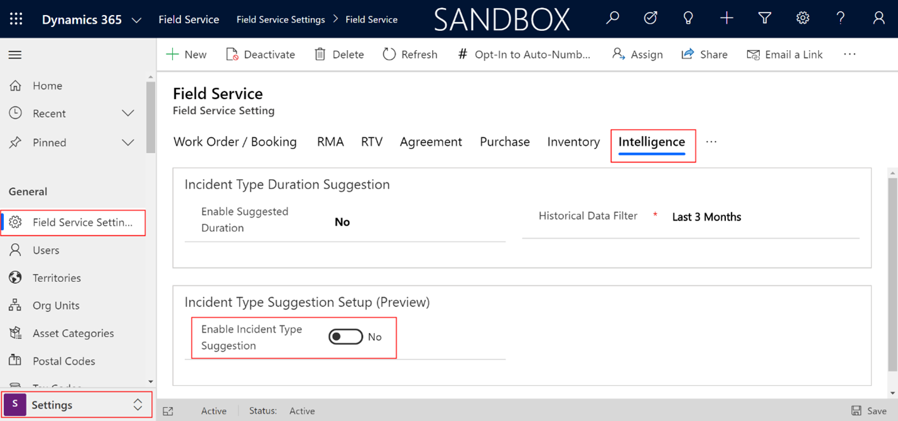
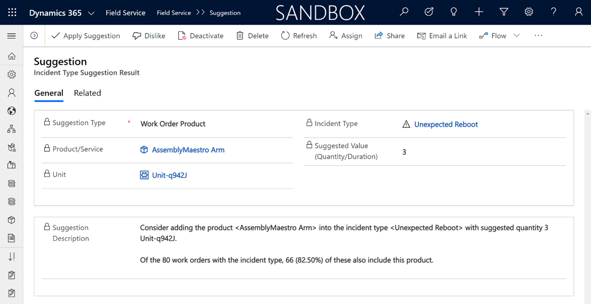
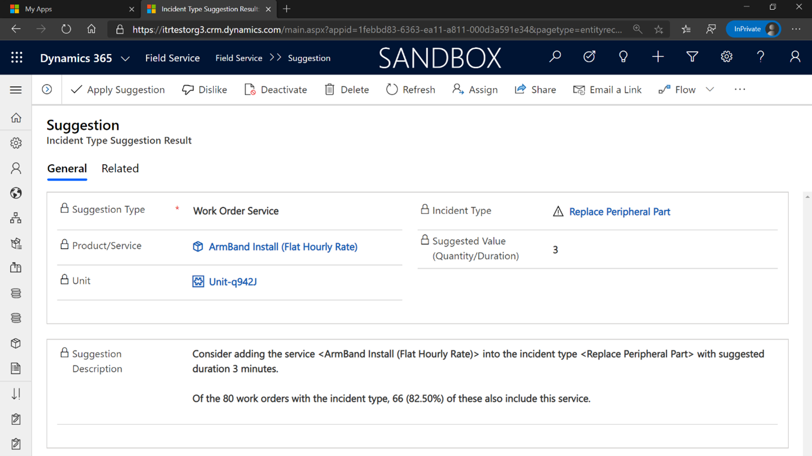
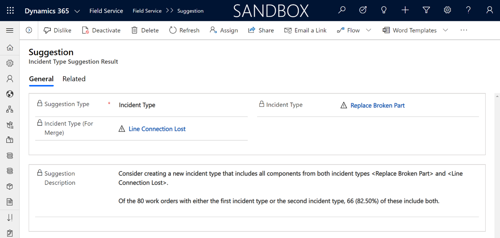

يستخدم Dynamics 365 Field Service أنواع الحوادث لتبسيط إنشاء أوامر العمل. يتضمن نوع الحدث خدمات ومنتجات ومهام معرفة مسبقاً تتم إضافتها تلقائياً إلى أمر العمل عند تحديد نوع الحدث هذا. على سبيل المثال، يمكنك إنشاء نوع حدث يسمى **إعادة معايرة النظام** يتضمن الأصناف التالية:

-   **منتج** - منتج A

-   **مهام الخدمة**

    -   إجراء الاختبار

    -   بدء إعادة المعايرة

    -   حفظ الإعدادات

    -   الحصول علي توقيع العميل

عندما يكون نوع الحدث **إعادة معايرة النظام** مرتبطاً بأمر عمل جديد، ستتم إضافة المنتج A المحدد ومهام الخدمة المحددة إليه تلقائياً، مما يوفر الوقت لأن الأصناف لن تحتاج إلى إضافتها بشكل فردي.

عندما يتم تحديد أنواع الحدث في البداية، فقد تشمل المنتجات والخدمات والمهام بناءً على ما قد تم تضمينه في الماضي.
ومع ذلك، نظراً لأن العاملين في الخطوط الأمامية ينفذون أوامر العمل بمرور الوقت، فقد تتم إضافة الأصناف الأخرى التي لم يتم تحديدها في البداية في نوع الحدث إلى أوامر العمل.

توصي ميزة **اقتراحات الذكاء الاصطناعي لنوع الحدث** بالطرق يمكنك من خلالها تحسين أنواع الحوادث الخاصة بك من خلال التعلم من أوامر العمل السابقة وتقديم الاقتراحات بناءً على تلك البيانات. على سبيل المثال، عند إنشاء نوع الحدث لأول مرة يسمى **إعادة معايرة النظام**، فقد قمت فقط بتضمين المنتج A. ومع ذلك، نظراُ لأن العاملين في الخطوط الأمامية ينفذون أوامر العمل في هذا المجال، فقد يستخدمون أيضاً المنتج B لإكمال إعادة المعايرة.

ومن خلال استخدام الذكاء الاصطناعي، يمكن للنظام معرفة هذه المعلومات واقتراح إضافة المنتج B إلى نوع الحدث **إعادة معايرة النظام** لأوامر العمل المستقبلية.

سيوفر هذا الأسلوب الوقت للفنيين من خلال:

-   عدم مطالبتهم بإدخال منتج أمر العمل الآخر.

-   المساعدة على تخطيط متطلبات المخزون بشكل أفضل من خلال معرفة المنتجات النموذجية المطلوبة والأكثر أهمية.

-   التأكد من أن تطبيق عملك يعكس الواقع.

يمكنك تمكين اقتراحات نوع الحادث بالانتقال إلى منطقة **الإعدادات** في تطبيق Field Service وتحديد **إعدادات Field Service > علامة التبويب الذكاء** في علامة التبويب هذه، يمكنك تمكين الميزة وتكوين إعدادات مختلفة مرتبطة بها.

> [!div class="mx-imgBorder"]
> 

بعد تمكين الميزة، ستتوفر إعدادات متعددة مرتبطة بالميزة:

-   **عامل تصفية البيانات التاريخية** - يحدد مقدار البيانات التاريخية التي يتم تحليلها كجزء من كل عملية تشغيل.

-   **‏‫تكرار التشغيل‬** - يحدد عدد المرات التي سيقوم فيها النظام بتحليل أنواع الحوادث وتقديم اقتراحات، إن أمكن. حالياً، لا يمكن تغيير هذا الإعداد.

-   **إرجاع أفضل نتائج X** - تملي عدد الاقتراحات التي سيتم إرجاعها من كل تشغيل.

بعد تحليل الأصناف، سيعرض النظام قائمة بنتائج الاقتراح.
ستندرج هذه الاقتراحات في واحدة من ثلاث فئات:

-   **منتج أمر العمل** - يقترح النظام إضافة منتج إلى نوع حدث.

-   **خدمة أمر العمل** - يقترح النظام إضافة خدمة إلى نوع الحدث.

-   **نوع الحدث** - يقترح النظام دمج نوعين من أنواع الحوادث معاً في نوع حدث واحد.

## منتج أمر العمل

في هذا السيناريو، حدد النظام منتجاً يجب إضافته إلى نوع حدث معين. والسبب هو أنه غالباً ما تتم إضافة هذا المنتج إلى أوامر العمل التي تضمنت هذا النوع من الحوادث. يقترح النظام المنتج وكمية المنتج التي يجب تضمينها بناءً على الحالات السابقة.

على سبيل المثال، توضح الصورة التالية أن النظام يقترح إضافة منتجات **AssemblyMaestro Arm** الثلاثة إلى نوع الحدث **إعادة التشغيل غير المتوقع** . يرجع السبب إلى أنه من بين 80 أمر عمل تضمنت هذا النوع من الحوادث، تضمن 82.5 بالمائة من أوامر العمل هذه أيضاً هذا المنتج المحدد.

> [!div class="mx-imgBorder"]
> 

## خدمة أمر العمل

في هذا السيناريو، حدد النظام خدمة يجب إضافتها إلى نوع حدث معين. مثل منتج أمر العمل، سيقترح النظام أيضاً أن كمية الخدمة تستند إلى المثيلات السابقة. توضح الصورة التالية أن النظام يقترح إضافة ثلاث خدمات **تثبيت Armband (سعر ثابت لكل ساعة)** إلى نوع الحدث **استبدال الجزء الطرفي**. والسبب هو أنه، من بين 80 أمر عمل تضمنت هذا النوع من الحوادث، تضمن 82.5 بالمائة منها تلك الخدمة أيضاً.

> [!div class="mx-imgBorder"]
> 

## نوع الحادث‬

في هذا السيناريو، حدد النظام العديد من أنواع الحوادث التي غالباً ما تتم إضافتها إلى نفس أمر العمل. نتيجة لذلك، قرر النظام أنه يجب عليك دمجها في نوع حادثة واحد يتضمن جميع المنتجات والخدمات ومهام الخدمة من كلا نوعي الحوادث.

توضح الصورة التالية أن النظام يقترح عليك إنشاء نوع حدث جديد يتضمن جميع المكونات من أنواع **استبدال الجزء المكسور** وكذلك **فقد اتصال الخط**. السبب هو أنه من بين 80 أمر عمل مع أنواع حوادث **استبدال الجزء المكسور** أو **فقد اتصال الخط**، تضمن 82.5 بالمائة منهم تلك الخدمة أيضاً.

> [!div class="mx-imgBorder"]
> 

نظراً لأن النظام يوفر الاقتراحات، يمكنك اختيار أحد الخيارات التالية:

-   **تطبيق الاقتراح** - سيقوم النظام بإضافة المنتج أو الخدمة إلى نوع الحادث نيابة عنك.

-   **لم يعجبني** - ستتم إزالة الاقتراح من القائمة. يساعد هذا الخيار على تحسين نموذج اقتراح الذكاء الاصطناعي.

> [!IMPORTANT]
> لا يتوفر خيار **تطبيق الاقتراح** إلا من خلال اقتراحات المنتجات والخدمات. لا يتوفر عندما يكون نوع الاقتراح **نوع الحدث**.
ستحتاج إلى القيام بهذه المهمة يدوياً.

بعد قيامك بتطبيق أو عدم الإعجاب باقتراح ما، سيضمن النظام عدم إرجاع مجموعة محددة مجمعة من المعلمات (نوع الحدث، المنتج/الخدمة/نوع الحدث للدمج، القيمة المقترحة، الوحدة) كاقتراح من قبل النظام.
يضمن هذا الأسلوب استمرار النظام في تقديم الاقتراحات الأكثر قيمة فقط.

لمزيد من المعلومات، راجع [اقتراحات نوع حدث الذكاء الاصطناعي](/dynamics365/field-service/configure-incident-types?azure-portal=true#ai-suggestions).
