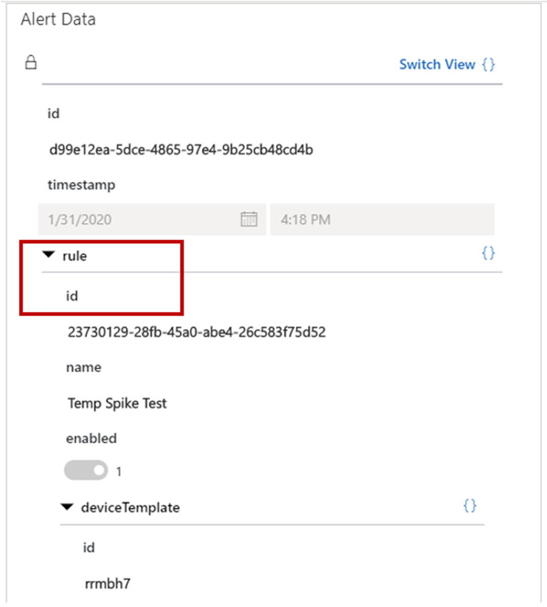

تجعل Connected Field Service بيانات IoT قابلة للتنفيذ من خلال السماح لمؤسستك بتحويل تنبيهات IoT إلى حالات وأوامر عمل يمكن التحقيق منها من قبل الأشخاص المناسبين لاحقاً. على سبيل المثال، قد يشير مستشعر درجة حرارة IoT إلى ارتفاع في درجة الحرارة يتجاوز حداً معيناً، مثل 85 درجة فهرنهايت (30 درجة مئوية). يمكن إرسال هذه المعلومات إلى Dynamics 365 كتنبيه IoT، والذي عند استناده إلى المحتويات يمكن تحويله إلى سجل حالة إذا كانت درجة حرارة التنبيه بين 85 و99 درجة فهرنهايت (30 و37 درجة مئوية) أو في أمر العمل إذا كانت درجة حرارة التنبيه أكثر من 100 درجة فهرنهايت (38 درجة مئوية).

وأخيراً، يمكن للذكاء الاصطناعي التعلم من الإجراءات التي يتم اتخاذها بشأن تنبيهات IoT هذه والبدء في تقديم توصيات حول تنبيهات IoT الأكثر أهمية وما يجب القيام به.

يمكن لميزة **‏‫اقتراحات الذكاء الاصطناعي لتنبيهات IoT‬** وضع علامة على تنبيهات IoT باستخدام أولوية مقترحة ونوع الحدث من خلال التعلم من سجل الخدمة السابق.

من خلال تمكين اقتراحات تنبيهات IoT، ستتمكن من القيام بما يلي:

-   تحديد تنبيهات IoT ذات الأولوية الأعلى.

-   عليك أن تكون أكثر استباقية في التعامل مع المشكلات ذات التأثير الأكبر.

-   تخصيص موارد محدودة لتنبيهات IoT التي تصبح حالات وأوامر عمل.

-   استخدم الذكاء الاصطناعي للتوسع والتعلم من الموظفين ذوي الخبرة الذين يعرفون كيفية الاستجابة للمشكلات التي تظهرها بيانات IoT.

في المثال المذكور سابقاً، قمت بتحويل تنبيه إلى أمر عمل عندما تجاوزت درجة الحرارة الحد الأدنى بمقدار 15 درجة.
سوف يتعلم نموذج الذكاء الاصطناعي من هذه الإجراءات، وفي المرة القادمة عندما يصل تنبيه درجة حرارة جديد إلى 15 درجة أو أكثر فوق الحد الأدنى، قد يقترحه الذكاء الاصطناعي كأولوية عالية ثم يقترح **إعادة ضبط المعايرة** **كنوع الحدث**.

> [!div class="mx-imgBorder"]
> 

> [!NOTE]
> تمثل الأولوية أولوية العمل، والتي يتم قياسها بالتأثير المالي أو رضا العملاء. على سبيل المثال، إذا قام تنبيه IoT بإخطار المؤسسة بأن تدفئة المبنى معطلة، وقد يكون لهذا الانقطاع تأثير كبير على حدث ما وعلى رضا العملاء، فإن هذه الحالة ستمثل أولوية عالية بسبب التأثير الكبير للأعمال.

> [!IMPORTANT]
> لاستخدام هذه الميزة، ستحتاج إلى Connected Field Service مع أيٍ من المنتجات التالية: Microsoft Azure IoTHubأو Azure IoT Central أو موفر IoT المخصص (يتطلب تكويناً إضافياً).

## التكوين

ستكوم بتكوين اقتراحات الذكاء الاصطناعي لـ IoT من منطقة **إعدادات** تطبيق Field Service. في الإعدادات، انتقل إلى قسم **IoT** وحدد علامة التبويب **إعدادات > اقتراحات IoT**، ثم قم بتعيين زر التبديل **اقتراحات IoT** على **تم تمكينه**.

> [!div class="mx-imgBorder"]
> 

بعد الموافقة على شروط الاستخدام، ستكون مهمتك التالية هي تحديد كيفية استخدام مؤسستك لتنبيهات IoT بشكل أساسي فيما يتعلق بالأجهزة وأصول العملاء.

سيكون لديك خياران لتختار منهما:

-   **معرف الجهاز** - حدد هذا الخيار إذا كانت مؤسستك تقوم بإدارة تنبيهات بشكل أساسي تنبيهات IoT من الأجهزة الفردية، فعلى سبيل المثال، إذا كان لديك موازين حرارة متصلة بالإنترنت تقوم بإرسال قراءات درجة الحرارة.

-   **أصل العميل** - حدد هذا الخيار إذا كانت مؤسستك تقوم بإدارة IoT بشكل أساسي من الأجهزة المرتبطة بأصول العميل، فعلى سبيل المثال إذا كانت لديك أصول العميل التي تمثل الغرف في المبنى، ولكل غرفة أجهزة متعددة ترسل البيانات. عندما يتم إنشاء أوامر العمل من تنبيهات IoT، فإنها تكون مرتبطة بأصل العميل.

> [!div class="mx-imgBorder"]
> 

> [!TIP]
> إذا لم تكن متأكداً من الخيار الذي تختاره، أو إذا كانت مؤسستك تقوم بإدارة تنبيهات IoT على مستوى الجهاز وعلى مستوى أصل العميل، فاترك هذا الخيار باعتباره معرف الجهاز الافتراضي.

بعد ذلك، ستحتاج إلى تحديد معرف القاعدة. ستقوم قواعد اقتراحات IoT بمراقبة بيانات الجهاز وتقوم بتشغيل التنبيهات بناءً على البيانات. تقوم اقتراحات معرفات القواعد بمساعدة IoT في العثور على قواعد التنبيه الخاصة بك المحددة في IoT Central أو IoTHub بناءً على نوع التوزيع الخاص بك.

يحتوي معرف القاعدة على صنفين:

-   **القاعدة/المعرف** - حدد ما إذا كنت تقوم بتطبيق Azure IoT Central.

-   **Ruleoutput** - حدد ما إذا كنت تستخدم Azure IoT Hub.

يمكنك تحديد مسارات القاعدة من خلال فحص JSON في تنبيه IoT.

> [!div class="mx-imgBorder"]
> 

توضح الصورة التالية المكان الذي يمكنك من خلاله العثور على القاعدة/المعرف الخاص بـ IoT Central.

> [!div class="mx-imgBorder"]
> 

تُظهر الصورة التالية مسار قاعدة ruleoutput لـ Azure IoTHub.

> [!div class="mx-imgBorder"]
> 

يمكن أن يحتوي كل جهاز IoT على العديد من خصائص الجهاز المقترن به. وهذه الخصائص هي الإشارات التي تأتي من الأجهزة المتصلة بالإضافة إلى متغيرات وخصائص الجهاز الآخر. لضمان إجراء اقتراحات IoT الصحيحة، فيجب عليك تحديد خصائص الجهاز التي يجب أن يأخذها نموذج الذكاء الاصطناعي في الاعتبار لتقديم الاقتراحات. على سبيل المثال، قد يكون لميزان الحرارة المتصل بالإنترنت خاصية **القراءة** في الجهاز، والتي تنقل درجة الحرارة الفعلية التي تم تسجيلها في التنبيه، مثل 85 درجة فهرنهايت للتأكد من أن الاقتراح يقوم بالبحث في الصنف الصحيح.

> [!div class="mx-imgBorder"]
> 

وبشكل افتراضي، يتم استخدام حقل  **‏‫بيانات تتبع الاستخدام‬** في IoT Central  **ونوع القراءة** وحقول **القراءة** في IoTHub كخصائص الجهاز. ومع ذلك، يمكنك أيضاً إضافة حقول مخصصة. على سبيل المثال، قد يكون لديك نموذج يقوم بربط التكلفة المالية بكل قراءة لدرجة الحرارة؛ حيث يمكن إضافة هذه الإضافة المخصصة في حقل **بيانات تتبع الاستخدام** كخاصية للجهاز يجب أن يأخذها نموذج الذكاء الاصطناعي في الاعتبار.

بعد إدخال معلوماتك الأولية، سيستغرق الأمر 24 ساعة قبل أن تبدأ في رؤية التوصيات. وبعد ذلك، سيقوم النظام بمراجعة البيانات السابقة والبيانات الواردة.

ستعرف أن الاقتراحات المستندة إلى الذكاء الاصطناعي تعمل عند عرض الأولوية ونوع الحادث المقترحين في طريقة عرض **‏‫تنبيهات IoT محددة الأولويات** . يمكنك إضافة  **الأولوية المقترحة** وحقول الذكاء الاصطناعي الأخرى إلى عرض الإعداد الافتراضي  الأساسي **تنبيهات IoT** أو لأي من طرق العرض المخصصة الخاصة بك.

> [!div class="mx-imgBorder"]
> 

يتم أيضاً عرض الأولوية ونوع الحدث المقترح في نموذج **تنبيه IoT**.

> [!div class="mx-imgBorder"]
> 

لمزيد من المعلومات، يرجى الرجوع إلى [الذكاء الاصطناعي لتنبيهات IoT مع اعتبارات التكوين](/dynamics365/field-service/iot-alerts-ai-based-suggestions/?azure-portal=true).
