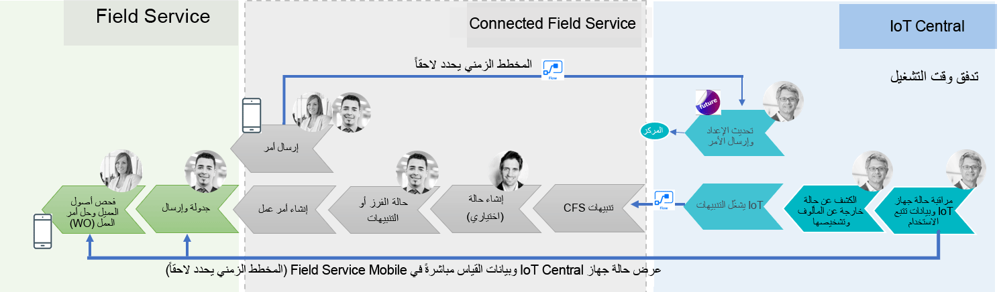
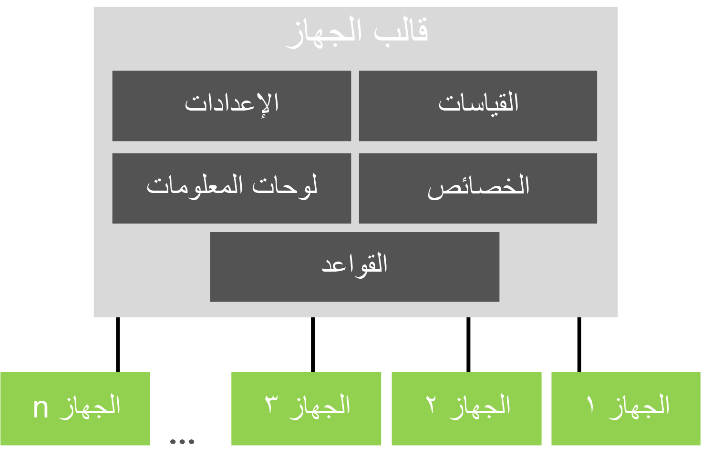

إن Azure IoT Central هو حل البرمجيات كخدمة (SaaS) الذي يقوم باستخراج العديد من المكونات منخفضة المستوى لحل IoT في نهج يستند إلى نموذج قابل للتخصيص. تم تكوين الحل في IoT Central بمستوى مماثل من التجريد كما هو الحال في تطبيقات Dynamics 365. يمكن استخدام Azure IoT Central مع Connected Field Service عن طريق تنفيذ تدفقات Power Automate التي يتم تشغيلها كنتيجة لقاعدة IoT Central.

يسلط الرسم التوضيحي التالي الضوء على تقسيم العمل بين IoT Central وConnected Field Service وميزات تطبيق Field Service الأساسية.

## عمليات نشر Azure IoT Central

يتمثل أحد الاختلافات الرئيسية مع نشر Azure IoT Central في أن مكونات IoT Hub أثناء وجودها، غير متاحة للتمديد مباشرة.
تتم جميع التخصيصات عبر تجريدات Azure IoT Central.
باستخدام مدخل Azure IoT Central، ستحدد الحل الذي تقوم بإنشائه وتتفاعل معه.

لإنشاء حل، ستنشئ تطبيق Azure IoT Central.
لتسهيل التجربة، يوجد تطبيق نموذجي. يمكنك أيضاً إنشاء واحد مخصص حيث تحدد جميع خصائص الجهاز. في التدريبات في هذه الوحدة النمطية، ستقوم بإنشاء تطبيق مخصص يعتمد على حاوية المهملات الذكية وتوصيلها بـ Dynamics 365.

عند إنشاء تطبيق، يحدد قالب الجهاز سلوك وقدرات الأجهزة. على سبيل المثال، قد يشتمل نموذج جهاز حاوية القمامة الذكية الخاص بنا على حالة الغطاء (فتح/إغلاق) بالإضافة إلى عمليات القياس الأخرى المتعلقة بالجهاز.

فيما يلي مزيد من التفاصيل حول كل مكون من مكونات قالب الجهاز الرئيسية.

|   القالب           |         التفاصيل                                                                                                                                                                                                                                                                                         |
|--------------|--------------------------------------------------------------------------------------------------------------------------------------------------------------------------------------------------------------------------------------------------------------------------------------------------|
| القياسات | يمكن أن تكون هذه بيانات القياس عن بعد، وهي بيانات السلاسل الزمنية من الجهاز. الحالة، على سبيل المثال، هل الغطاء مفتوح، أو حدث، على سبيل المثال، يضغط العميل على الزر لطلب التقاط القمامة.  يتم تخزين بيانات السلاسل الزمنية لاستخدامها بواسطة خدمة التحليلات، وهي Azure Time Series Insights.                                 |
| الخصائص   | هذه بيانات تعريف الجهاز، على سبيل المثال موقع الالتقاط للحاوية أو رقم حساب العميل أو أي بيانات تعريف ثابتة أخرى.                                                                                                                                                          |
| الإعدادات     | تتحكم الإعدادات في سلوك جهازك، على سبيل المثال، يمكن أن يكون لدينا ميزة التحكم في الرائحة ويمكن أن يتحكم الإعداد في مدى نشاط الميزة (مرتفع، متوسط، منخفض).                                                                                                                     |
| الأوامر     | هذه تسمح بإرسال الأوامر عن بعد إلى الجهاز. باستخدام Connected Field Service، سيؤدي هذا إلى توسيع الأمر إلى واجهة مستخدم Dynamics 365.  على سبيل المثال، يمكن إرسال أمر لفرض إغلاق الغطاء إذا تُرك مفتوحاً.                                                         |
| لوحات المعلومات   | تحتوي لوحات المعلومات على مربعات تحتوي على معلومات عن الجهاز.  يمكن أن تشمل هذه الإعدادات والخصائص وحتى الخرائط.  على سبيل المثال، يمكننا تضمين خريطة توضح موقع الجهاز.  سيكون هذا مفيداً بعد حدث طقس شديد مع نفخ علب القمامة في كل مكان. |
| القواعد        | القواعد هي كيفية مراقبة القياسات من جهازك وتشغيل الإجراءات.  بالنسبة لنا، ستكون هذه هي الطريقة التي نستخدم بها Power Automate لإنشاء تنبيه IoT لـ Connected Field Service.                                                                                                                |

بمجرد إعداد النموذج الخاص بك، يمكنك إنشاء أجهزة محاكاة أو توصيل جهاز حقيقي. في الوحدة التالية، ستقوم بإنشاء تطبيق مخصص لإدارة حاوية المهملات الذكية ثم توصيلها بـ Dynamics 365 باستخدام موصل Azure IoT Central.
