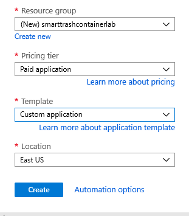
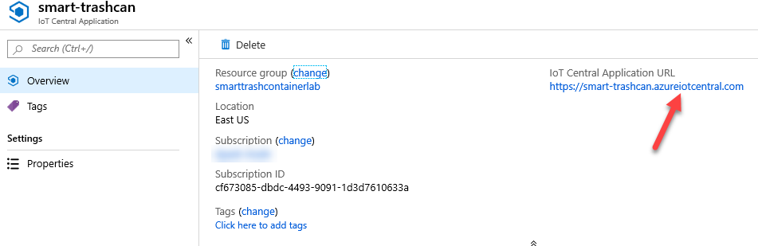
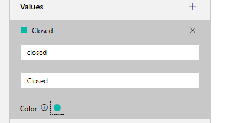
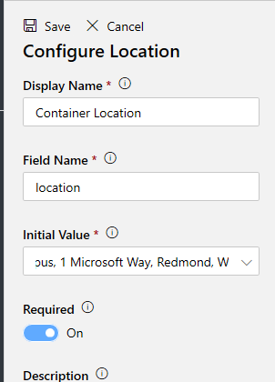
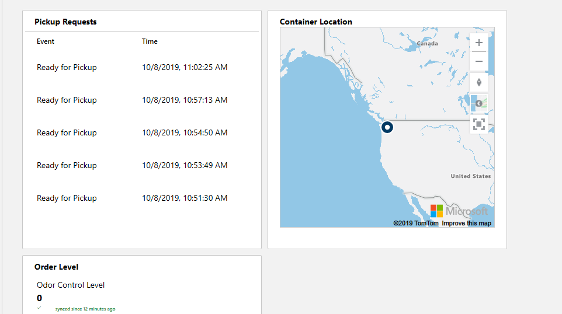

## تمرين 1: إنشاء تطبيق Azure IoT Central 

في هذا التمرين، ستقوم ببناء حل IoT باستخدام IoT Central للتكامل مع حاويات المهملات الذكية المضمنة في Contoso. وكجزء من ذلك، سيتم إعداد بيانات تتبع الاستخدام بما في ذلك أحداث التعقب التي تم إنشاؤها بواسطة العميل الذي يطلب الاستلام عند طلب الحاوية.

### المهمة 1: بدء الإصدار التجريبي Azure IoT Central

1.  انتقل إلى مدخل [Azure](https://portal.azure.com/?azure-portal=true) وانقر فوق **إنشاء مورد**.

1.  ابحث عن **IoT Central** وحدد **تطبيق IoT Central**.

1.  انقر فوق **إنشاء**.

1.  أدخِل **smart-trashcan** في **اسم المورد**، أدخِل **عنوان URL الفريد للتطبيق** **(استخدم smarttrashcan\<date\>\<initials\>)**، حدد **الاشتراك**، وانقر فوق **إنشاء جديد.**

1.  أدخِل **smarttrashcontainerlab** إذا كان متاحاً، ثم انقر فوق **موافق**.

1.  تحديد **مستوى التسعير** على أنه **تطبيق مدفوع**، حدد **التطبيق المخصص** **للقالب**، وحدد **الموقع** الخاص بك، وانقر فوق **إنشاء**.

    

1.  بعد اكتمال التوزيع، انقر فوق **الانتقال إلى المورد**.

1.  انقر فوق **عنوان URL لتطبيق IoT Central**.

    > [!NOTE]
    > إذا ظهرت مشكلة عدم تحميل الصفحة أو عدم تكوين المورد، فحاول تغيير المستعرض ومن المفترض أن يتم حل المشكلة.

    

### المهمة 2: إنشاء قالب الجهاز

1.  بعد تحميل الصفحة بنجاح، حدد لوحة **إنشاء قالب الجهاز**.

1.  حدد **العميل**.

1.  أدخِل **حاوية المهملات الذكية** للاسم وانقر فوق **إنشاء**.

### المهمة 3: إنشاء قياس بيانات تتبع الاستخدام

1.  حدد **جديد** وحدد **بيانات تتبع الاستخدام**.

1.  اكتب **النسبة المئوية الكاملة** في **اسم العرض**، **percentfull** في **اسم الحقل**، **النسبة المئوية** في **الوحدات**، **0** في **الحد الأدنى**، **100** في **الحد الأقصى**، **0** في **العدد العشري**، حدد أي **لون** تفضله وانقر فوق **حفظ**.

### المهمة 4: إنشاء قياس المنطقة

1.  انقر فوق **جديد** وحدد **المنطقة‏‎**.

1.  أدخِل **منطقة Lid** في **اسم العرض**، **lidstate** في **اسم الحقل**، وانقر فوق **إضافة قيمة**.

1.  أدخِل **مفتوح** في **القيمة**، **مفتوح** في **اسم العرض**، وحدد **أحمر** في **اللون**، وانقر فوق **إضافة قيمة.**

1.  أدخِل **مغلق** في **القيمة**، **مغلق** في **اسم العرض**، وحدد **أخضر** في **اللون**

    

1.  انقر فوق **حفظ**.

### مهمة 5: إنشاء حدث جديد

1.  انقر فوق **جديد** وحدد **حدث‎**.

1.  أدخِل **جاهز للاستلام** في **اسم العرض**، **readyforpickup** في **اسم الحقل**، **المعلومات** في **الخطورة الافتراضية**، وانقر فوق **حفظ**.

### المهمة 6: إضافة إعداد للتحكم في الرائحة

1.  قم بالتبديل إلى علامة التبويب **إعدادات** وحدد "رقم".

1.  أدخل **مستوى التحكم في الرائحة** في **اسم العرض**، **ocl** في **اسم الحقل**، **0** في **عدد المواضع العشرية** و **0** في **الحد الأدنى**، و **3** في **الحد الأقصى** وانقر فوق **حفظ**.

### المهمة 7: إضافة خاصية لموقع حاوية المهملات

1.  قم بالتبديل إلى علامة التبويب **الخصائص** وحدد **الموقع**.

1.  أدخِل **موقع الحاوية** في **اسم العرض**، **الموقع** في **اسم الحقل**، **Microsoft Main Campus, 1 Microsoft Way, Redmond, WA 98052** في **القيمة الأولية**، اجعل الحقل **مطلوباً**، ثم انقر فوق **حفظ**.

    

## تمرين 2: إنشاء نموذج لوحة المعلومات 

في هذا التدريب الذي يتم بناء قالب الجهاز الخاص بك الآن، ستقوم بتخصيص لوحة المعلومات للأجهزة لتكون أكثر فائدة.

### المهمة 1: إضافة عناصر أساسية إلى لوحة المعلومات

1.  قم بالتبديل إلى علامة التبويب **لوحة المعلومات** وحدد **سجل الأحداث**.

1.  أدخِل **طلبات الاستلام** في **العنوان** وحدد الرمز **جاهز للاستلام**. تأكد من أن ذلك سيؤدي إلى إزالة الرمز المحظور.

1.  انقر فوق **حفظ**.

1.  حدد **تعيين**.

1.  أدخِل **موقع الحاوية** في **العنوان**، حدد **موقع الحاوية** **للموقع**، وانقر فوق **حفظ**.

1.  حدد **الإعدادات** و **الخصائص**.

1.  أدخِل **مستوى الأمر** **للعنوان** وانقر فوق **إضافة/إزالة**.

1. حدد **مستوى التحكم في الأمر** وانقر فوق **إضافة**. تأكد من أنه تم نقله إلى الأعمدة المحددة.

1. انقر فوق **موافق**.

1. انقر فوق **حفظ**.

1. يجب أن تبدو لوحة المعلومات الخاصة بك مثل الصورة أدناه.

    
