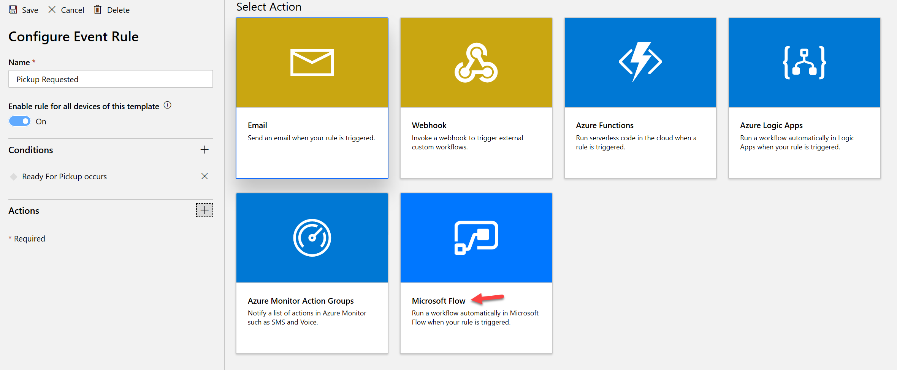

الآن بعد أن قمت ببناء تطبيق Azure IoT Central، فلنلقِ نظرة على كيفية توصيل ذلك مع Connected Field Service. لتحقيق ذلك، سنستخدم موصلات Power Automate لتسجيل الأجهزة ورفع التنبيهات باستخدام Dynamics 365.

## Power Automate

عادةً، باستخدام حل Connected Field Service، يمكنك إنشاء أصل العميل ثم تسجيل الجهاز. يمكنك إنجاز نفس المهمة باستخدام Power Automate عن طريق إنشاء تدفق سجل محدد. هذا يعني إما أنك تحدد أصل العميل من القائمة أو تقوم بتشغيل التدفق من سجل أصول عميل معين. سيستخدم التدفق موصل IoT Central لتسجيل الجهاز باستخدام IoT Central (وأيضاً مع مثيل IoT Hub المضمن). التالي هو التدفق الذي ستقوم ببنائه في الوحدة التالية للقيام بالتسجيل.

إشعار بالإضافة إلى تحديث أصل العميل بمعرف الجهاز، ستقوم أيضاً بإنشاء سجل جهاز IoT، والذي يتم استخدامه إذا قمت بإرسال أي أوامر أو إجراءات أخرى من Dynamics 365.

بمجرد تسجيل الجهاز، تكون قد أنشأت اتصالاً بين الجهاز في IoT Central وأصل العميل في Dynamics 365 Field Service. لمواصلة السيناريو الخاص بنا لحاوية قمامة ذكية، في الوحدة السابقة، قمنا بإعداد حدث للإشارة إلى أن الحاوية كانت جاهزة للاستلام. لنلقِ الآن نظرة على كيف يمكننا رفع تنبيه إلى Dynamics 365 بحيث يمكن جدولته للالتقاط.

## القواعد

لبدء العملية، سنستخدم ميزة القواعد الخاصة بـ IoT Central. تم إنشاء القواعد لمراقبة القياس عن بُعد للجهاز وتنفيذ إجراء عند استيفاء أحد الشروط. بالإضافة إلى النظر إلى قيم الوقت الفعلي، يمكن للقواعد أيضاً أن تنظر في خصائص الجهاز. على سبيل المثال، قد تتضمن الخصائص معلومات حدية تختلف حسب الجهاز بناءً على التثبيت. فيما يلي مثال على القاعدة التي ستنشئها للرد على حدث الاستعداد للاستلام. لاحظ أن هناك عدة خيارات للإجراءات عند استيفاء شرط القاعدة. سنستخدم إجراء Microsoft Flow (Power Automate) لإنشاء سجل تنبيه IoT.

لإنشاء التدفق، ستستخدم مرة أخرى موصل تدفق IoT Central الذي يسمح ببناء تدفق يتم تشغيله بواسطة قاعدة محددة في IoT Central. التدفق نفسه بسيط، فهو يطابق أصل العميل باستخدام معرف الجهاز الذي أدى إلى التدفق. بعد ذلك، يتم إنشاء سجل IoT Alert لكل من الأصول المطابقة.

مع إنشاء تنبيه IoT، يمكن أن يتدفق بعد ذلك إلى إمكانات عمليات الأعمال العادي في Dynamics 365 Field Service، بما في ذلك جدولة زيارة إلى الموقع. في الوحدة التالية، ستضيف تسجيل الجهاز ورفع التنبيهات إلى تطبيق IoT Central الذي أنشأته في الوحدة 2.
