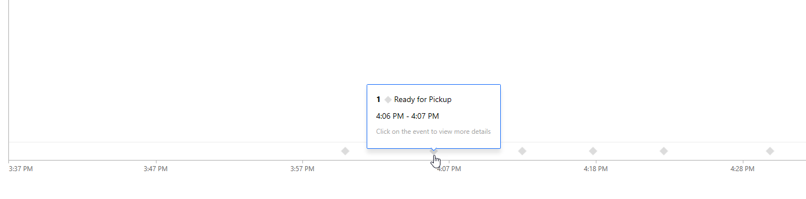

## تمرين 1: تسجيل جهاز 

> [!NOTE]
> تمت إعادة تسميه الحدث الخاص بكتابه هذه التمرينات Microsoft Flow باسم Power Automate. Power Automate هو اسم مجموعة العمليات التلقائية التي تتضمن التدفق. من المتوقع وجود بعض الصور الموجودة في الشاشة هنا للانتقال إلى التسمية الجديدة عبر الوقت. يجب ان تظل الوظائف كما هو متوقع.

### المهمة 1: إنشاء تدفق 

في هذه المهمة، ستقوم بإنشاء تدفق يقوم بتسجيل أحد الأجهزة.

1.  انتقل إلى [Power Apps](https://make.powerapps.com/?azure-portal=true) وتأكد من أنك في البيئة الصحيحة.

1.  حدد **التطبيقات**، وانقر لفتح تطبيق **Connected Field Service**.

1.  حدِّد **أصول العملاء**.

1.  انقر فوق **تدفق** وحدد **إنشاء تدفق**.

1.  انقر فوق **تسجيل الدخول**.

1.  قم بتوفير بيانات الاعتماد الخاصة بك إذا لزم الأمر.

1.  حدد **التدفقات الخاصة بي**، وانقر فوق **جديد**، وحدد **+ فوري - من فارغ**.

1.  انقر فوق **تخطي**.

1.  ابحث عن **وقت تحديد سجل** وحدد **وقت تحديد السجل (Microsoft Dataverse)**.

1. حدد **الإعداد الافتراضي** لـ **البيئة**، و **أصول العملاء** لـ **اسم الكيان**، وانقر **+ خطوة جديدة.**

1. ابحث عن **إنشاء جهاز** وحدد **إنشاء إجراء لجهاز Azure IoT Central**.

1. انقر فوق **تسجيل الدخول**.

1. قم بتسجيل الدخول باستخدام بيانات الاعتماد التي استخدمتها لإنشاء تطبيق **Azure IoT Central** و **قبول** الإذن المطلوب.

1. حدد **smart-trashcan** *(اسم تطبيق IoT Central الذي أنشأته)* لـ **التطبيق**، وحدد القالب الذي أنشأته، وانقر فوق **اسم الجهاز**، وأدخل **Azure IoT**، وحدد **السم** من نافذة **المحتوى الديناميكي**.

    

1. حدد **نعم** لـ **محاكاة الجهاز**.

1. انقر فوق **+ خطوة جديدة**.

1. ابحث عن إنشاء سجل جديد وحدد **إنشاء سجل جديد (Dataverse)**.

1. حدد **الحالي** لـ **البيئة**، وحدد **أجهزة IoT** لـ **اسم الكيان**، وانقر فوق حقل **الاسم**، وحدد **الجهاز** **الاسم** من إجراء **إنشاء جهاز** في جزء **المحتوى الديناميكي**.

1. انقر فوق الزر **...** **قائمة**، وحدد **إعادة تسمية**.

1. أعد تسمية الخطوة **إنشاء الجهاز**، وانقر فوق **إظهار الخيارات المتقدمة**.

1. انقر فوق حقل **معرف الجهاز**، اكتب **Azure IoT** وحدد **معرف الجهاز** من إجراء **إنشاء الجهاز** في جزء **المحتوى الديناميكي**.

1. قم بتعيين **قيمة حالة التسجيل** إلى **مسجل**، وقم بتعيين **قيمة المحاكاة** إلى **نعم**، وقم بتعيين **حالة قيمة السبب** إلى **نشط**.

    

1. انقر فوق حقل **الحساب**، وحدد **حساب** من إجراء **عند إنشاء سجل** في جزء **المحتوى الديناميكي**، وانقر فوق **إخفاء الخيارات المتقدمة**.

1. انقر فوق **+ خطوة جديدة**.

1. ابحث عن **سجلات القائمة** وحدد **سجلات القائمة (Dataverse)**.

1. حدد **الحالي** لـ **البيئة**، حدد **أدوار الاتصال** لـ **اسم الكيان**، وانقر فوق **إظهار الخيارات المتقدمة**.

1. أدخل ***اسم eq** **"جهاز IoT المتصل"** _ لـ _* استعلام التصفية** وانقر فوق **إخفاء الخيارات المتقدمة.**

    

1. انقر فوق **+ خطوة جديدة**.

1. ابحث عن **إنشاء سجل جديد**، وحدد **إنشاء سجل جديد (Dataverse)**.

1. حدد **الحالي** لـ **البيئة**، وحدد **اتصالات** لـ **اسم الكيان**.

1. أعد تسمية الخطوة **إنشاء اتصال**، وانقر فوق **إظهار الخيارات المتقدمة**.

1. انقر فوق حقل **متصل من** وحدد **أصل العميل** من إجراء **عند تحديد سجل** في صفحة **المحتوى الديناميكي**.

1. حدد **msdyn_customerassets** لـ **متصل من نوع**.

    

1. انقر فوق حقل **متصل إلى** وحدد **جهاز IoT** من إجراء **إنشاء الجهاز** في جزء **المحتوى الديناميكي**.

1. حدد **msdyn_iotdevices** لـ **متصل إلى نوع**.

    

1. انقر فوق حقل **دور لـ** وحدد **دور الاتصال** من إجراء **تسجيلات القوائم** في جزء **المحتوى الديناميكي**.

1. ستختتم خطوتك في **التطبيق علي كل منها.** انقر فوق **إضافة إجراء**.

1. ابحث عن **تحديث سجل** وحدد **تحديث سجل (Dataverse)**.

1. حدد **الحالي** لـ **البيئة**، وحدد **أصول العملاء** لـ **اسم الكيان**، وانقر فوق حقل **معرف السجل**، وحدد **أصل العميل** من إجراء **عند تحديد سجل** في صفحة **المحتوى الديناميكي**.

1. انقر فوق **عرض الخيارات المتقدمة**.

1. انقر فوق حقل **الحساب** وحدد **الحساب** من إجراء **عند تحديد سجل** في صفحة **المحتوى الديناميكي**.

    

1. انقر فوق **إخفاء الخيارات المتقدمة**.

1. أعد تسمية خطوة **تحديث أصل العميل**.

1. قم بالتمرير لأعلى وأعد تسمية جهاز تسجيل التدفق.

    

1. **احفظ** التدفق.

### المهمة 2: اختبار جهاز التسجيل 

1.  عد إلى تطبيق **Connected Field Service**، ثم انقر فوق **أصول العملاء**.

1.  انقر فوق **جديد**.

1.  أدخل **اختبار الجهاز** **للاسم** وانقر فوق **حفظ**.

1.  انقر فوق **تدفق** وحدد التدفق الذي أنشأته.

1.  انقر فوق **متابعة**.

1.  انقر فوق **تسجيل الدخول** إذا تمت المطالبة بذلك و **متابعة**.

1.  سجل الدخول باستخدام بيانات اعتماد **Azure** الخاصة بك.

1.  انقر فوق تشغيل **التدفق**.

1.  انقر فوق **تم**.

1. قم بتحديث الصفحة.

1. يجب ان يقوم التدفق بملء سمات جهاز الاتصال.

    

## التمرين 2: إنشاء تنبيهات IoT 

في هذا التمرين، ستقوم بإنشاء تنبيه IoT لطلب التقاط حاوية المهملات. 

**المتطلب الأساسي:** تأكد من توفير الاقراص المضغوطة في البيئة الافتراضية.

### المهمة 1: إنشاء تنبيه طلب الانتقاء 

1.  انتقل إلى **Azure IoT Central** وافتح شريط التنقل الأيمن.

1.  حدد **الأجهزة**.

1.  افتح الجهاز الذي تم إنشاؤه بواسطة التدفق.

1.  حدد علامة التبويب **قواعد**، ولا يمكنك إضافة قاعدة جديدة إلى أحد الأجهزة مباشرةً. انقر فوق **قوالب الجهاز.**

1.  افتح **قالب الجهاز** الذي قمت بإنشائه.

1.  حدد علامة التبويب **قواعد**، وانقر فوق **+ جديد**، وحدد **حدث**.

1.  ادخل **الانتقاء المطلوب** لـ **الاسم**، ثم انقر فوق **+** من أجل **إضافة شرط**.

1.  حدد **جاهز للالتقاط** لـ **القياس** وانقر فوق **حفظ**.

1.  انقر فوق **+** لإضافة **إجراء**.

1. حدِّد **Microsoft Flow**.

1. انقر فوق جديد وحدد **تلقائي - من فارغ**.

1. أدخل **إنشاء تنبيهات** لـ **الاسم**، وابحث عن **IoT Central**، وحدد **عند إطلاق قاعدة**، وانقر فوق **إنشاء**.

    

1. انقر فوق **تسجيل الدخول**.

1. قم بتوفير بيانات الاعتماد.

1. حدد **smart-trashcan** *(اسم تطبيق IoT Central الذي أنشأته)* لـ **التطبيق**، و **الانتقاء المطلوب** لـ **القاعدة**، وانقر فوق **خطوة جديدة**.

1. ابحث عن **Microsoft Dataverse** وحدد **سجلات القوائم**.

1. حدد **البيئة الصحيحة**، وحدد **أصول العملاء** لـ **اسم الكيان**، وانقر فوق **إظهار الخيارات المتقدمة**.

1. اكتب **msdyn_deviceid eq 'Azure IoT '** وضع المؤشر الخاص بك إلى الداخل بعد IoT.

1. حدد **معرف الجهاز**.

1. انقر فوق **+ خطوة جديدة**.

1. حدد **تطبيق على كل واحد**.

1. حدد **قيمة**.

1. انقر فوق **إضافة إجراء**.

1. ابحث عن **Microsoft Dataverse** وحدد **إنشاء سجل جديد**.

1. حدد **البيئة الصحيحة**، وحدد **تنبيهات IoT** لـ **اسم الكيان**، ثم انقر فوق حقل **الوصف**.

1. حدد **اسم الجهاز** من الاجراء "عند تشغيل القاعدة" في المحتوي الديناميكي واكتب - في نهايته.

1. حدد **اسم القاعدة** من إجراء "عند تشغيل القاعدة" في المحتوى الديناميكي، وانقر فوق **إظهار الخيارات المتقدمة**.

1. حدد حقل **بيانات التنبيه** وانقر فوق علامة التبويب **تعبير**.

1. اكتب **utcNow()** وانقر فوق **موافق**.

1. حدد حقل **وقت التنبيه** وحدد **الطابع الزمني**.

1. حدد حقل **معرف الجهاز** وحدد **معرف الجهاز** من إجراء  **عند تشغيل قاعدة** في جزء **المحتوى الديناميكي**.

1. حدد حقل **أصل العميل** وحدد **أصل العميل**.

1. انقر فوق **إخفاء الخيارات المتقدمة**.

1. انقر فوق **حفظ**.

1. انقر فوق **تم**.

### المهمة 2: اختبار التنبيهات 

1.  حدد الأجهزة وافتح **اختبار الجهاز** الذي تم إنشاؤه بواسطة التدفق.

1.  حدد علامة التبويب **قواعد** وحدد القاعدة المطلوبة للالتقاط.

1.  يجب أن يقوم المحاكي بإنشاء **طلب انتقاء** جديد كل بضعة دقائق.

    

1.  انتقل إلى تطبيق **Connected Field Service**.

1.  حدد **تنبيهات IoT**.

1.  يجب أن تشاهد التنبيهات التي تم إنشاؤها بواسطة جهاز المحاكاة. سيكون وصف التنبيه سلسلة من **اسم الجهاز** و **اسم القاعدة**.

    
