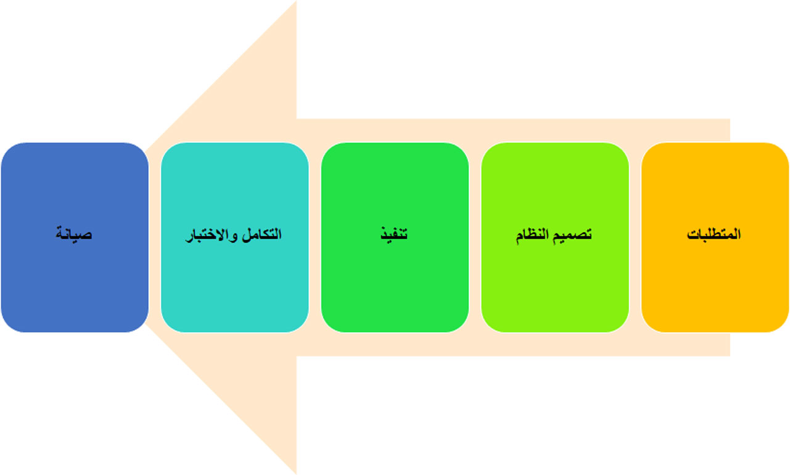
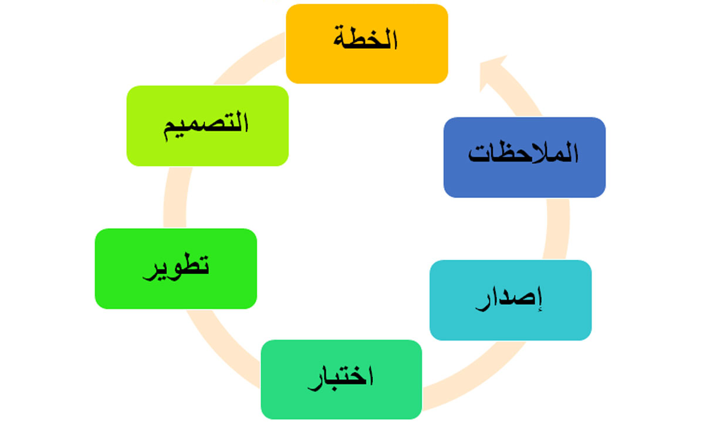
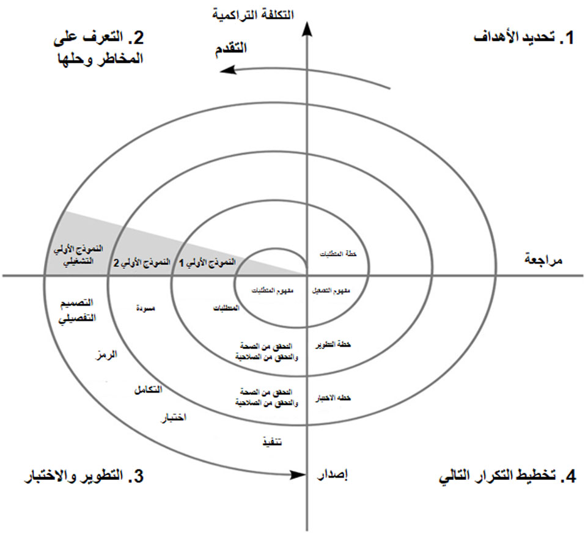

تحظى إدارة دورة حياة التطبيق (ALM) بمنظور شامل يستمر حتى يتوقف استخدام التطبيق.Application lifecycle management (ALM) has a broad perspective that continues until the application is no longer used. قد تختلف منهجيات إدارة دورة حياة التطبيق، ومن ثمّ يُعدّ اختيار المنهجية الصحيحة المناسبة لاحتياجاتك أمراً مهماً للتطوير.Methodologies for ALM can vary, so choosing the correct methodology for your needs is crucial for development. يتمثّل الهدف من هذه الوحدة وإدارة دورة حياة التطبيق في المساعدة على زيادة إنتاجية المطوّر وتحسين التعاون بين الفِرق وتوفير الشفافية لعناصر العمل.The goal of this module and ALM is to help increase developer productivity, improve collaboration between teams, and provide transparency for work items.

تستكشف هذه الوحدة منهجيات إدارة دورة حياة التطبيق (ALM) وتساعدك في تحديد المنهجية التي يجب استخدامها حسب احتياجات تطوير البرامج.This unit explores the methodologies for ALM and helps you determine which methodology should be used based on software development needs.

هناك عدة نُهج لإدارة دورة حياة التطبيق.There are several approaches to ALM. تنطوي كل منهجية منها على مزايا وعيوب، وذلك حسب نوع المشروع والبرنامج المستخدَم.Each methodology has advantages and disadvantages, depending on the type of project and software being used.

ثمة ثلاث منهجيات شائعة هي ‏‫منهجية الشلال‬ ومنهجية Agile و‏‫المنهجية الحلزونية.The three common methodologies are Waterfall, Agile, and Spiral.

## منهجية الشلالWaterfall methodology

منهجية الشلال هي نهج تسلسلي.The Waterfall methodology is a sequential approach. ينقسم المشروع إلى عدة مراحل حيث يتم الانتقال من المرحلة السابقة إلى المرحلة التالية حتى يتم الانتهاء من المشروع.The project is divided into different phases that flow from the previous phase to the next phase until the project is finished. ويتم توثيق كل مرحلة بدقة بالتسليمات والمراجعات والموافقات الواضحة.Each phase is thoroughly documented with clear deliverables, reviews, and approvals. لا تبدأ عادةً المرحلة التالية في منهجية الشلال حتى تنتهي المرحلة السابقة.Usually, the next phase in the Waterfall methodology does not start until the previous phase is finished. على سبيل المثال، إذا أردتَ تنفيذ تطبيقات Finance and Operations، فسيتعيّن تحديد جميع المتطلبات المتعلقة بكل تكامل قبل أن يبدأ المطوّرون في التطوير.For example, if you were to implement Finance and Operations apps, all the requirements for every integration would need to be defined before developers could begin development.

ينبغي مراعاة اتباع منهجية الشلال عندما يكون المشروع بسيطاً والمتطلبات معروفة ومحددة بوضوح ولا يهدف النطاق الكامل للمشروع إلى التغيير ويتم تنفيذ المشروع دفعة واحدة.The Waterfall methodology should be considered when the project is simple, the requirements are known and well-defined, the full scope of the project is not intended to change, and the project is implemented all at once.

## منهجية AgileAgile methodology

تُعد Agile منهجية تكرارية وتُركِّز على تقديم الملاحظات المستمرة لتغيير التسليمات وإضافتها إلى المشروع.The Agile methodology is iterative and focuses on continuous feedback to alter and add deliverables to the project. وعلى النقيض من منهجية الشلال، فإن مراحل منهجية Agile قد تعود إلى بعضها،Unlike the Waterfall methodology, the Agile phases can loop back into each other. مما يعني أنه يمكن العمل على تنفيذ مراحل مختلفة في وقت واحد.This means that different phases can be worked simultaneously. على سبيل المثال، إذا تم تحديد المتطلبات المتعلقة بتكامل واحد، فإنه يمكن للمطوّرين البدء في العمل على هذا التكامل حتى لو كانت عمليات التكامل الأخرى لا تزال في مرحلة تجميع المتطلبات.For example, if requirements are defined for one integration, the developers can begin working on that integration even if other integrations are still in a requirements-gathering phase. تنقسم عادةً مشاريع Agile إلى دورات متكررة لها مدة محددة (عادةً لمدة أسبوع أو أسبوعين).Usually, Agile projects are separated into sprints, which have a defined duration (usually one or two weeks). تحتوي هذه الدورات المتكررة على قائمة التسليمات المقرر الانتهاء منها أثناء الدورة المتكررة.These sprints have a list of deliverables to be finished during the sprint.

يُعد نهج Agile مفيداً حينما تكون المتطلبات غير واضحة عند بدء المشروع، أو يُتوقّع وجود متطلبات أو تسليمات إضافية خلال دورة حياة التطبيق، أو إذا كان لا يلزم إصدار المشروع دفعة واحدة.The Agile approach is useful when the requirements are unclear when the project starts, additional requirements or deliverables are expected over the lifecycle of the application, or if the project does not need to be released all at once. كما أنه يعتبر أيضاً مثالياً للمشاريع التي تعتمد على المستخدم، ولا سيما إذا كان الفريق متفرّغاً تماماً للمشروع.Agile is also great for user-driven projects, especially if the project team is fully devoted to the project. ونظراً لأن نهج Agile يشمل العديد من الجهات الفاعلة العاملة بأجزاء مختلفة من المشروع في نفس الوقت، فقد يكون من الصعب تحقيق الاتصال والتنسيق بشأن المشروع.Because the Agile approach involves many players who are working on different pieces of the project at the same time, communication and coordination of the project can be difficult. لذلك، فمن المفيد أن يوجد فريق المشروع في نفس الموقع.Therefore, it is beneficial to have the project team in the same location.

ونظراً للطابع التكراري لأسلوب Agile، فقد يُعد تعقّبه أمراً معقداً. وفي كثير من الأحيان تتم إعادة تحديد أولويات العمل عندما تتجاوز التسليمات الدورة المتكررة الأصلية أو إذا كان يلزم إضافة دورات متكررة جديدة لاحقاً.Because of the iterative nature of Agile, this method can be complex to track. Work is frequently reprioritized when deliverables go past the original sprint or if new sprints need to be added later.

## ‏‫المنهجية الحلزونيةSpiral methodology

تجمع المنهجية الحلزونية بين جوانب ‏‫منهجية الشلال‬ ومنهجية Agile.Spiral methodology combines aspects of the Waterfall and Agile methodologies. تُركِّز المنهجية الحلزونية على تقييم المخاطر من خلال تقسيم المشروع إلى أجزاء أو دورات أصغر.Spiral focuses on risk assessment by breaking up the project into smaller segments or cycles. في بداية كل دورة، يتم تحديد المتطلبات والأهداف لإنشاء نموذج أولي.At the beginning of each cycle, requirements and objectives are identified to create a prototype. وتمرّ كل دورة بنفس الخطوات لإنشاء نموذج أولي.Each cycle goes through the same steps to create a prototype. في نهاية الدورة، تتم مراجعة النموذج الأولي والتخطيط للدورة التالية.At the end of a cycle, the prototype is reviewed and the next cycle is planned.

تُعد المنهجية الحلزونية مناسبة تماماً للأنظمة المعقدة واسعة النطاق.The Spiral methodology works well for large-scale, complex systems.
يلزم إجراء تقييم سليم للمخاطر لتحديد المجالات التي قد تنطوي على مشكلات.Proper risk assessment is required to identify risk areas for issues.
دون تقييم المخاطر، من الممكن أن تظهر مشكلات في البرنامج قد تزيد من التكاليف.Without risk assessment, issues can appear in the software that might increase costs.
