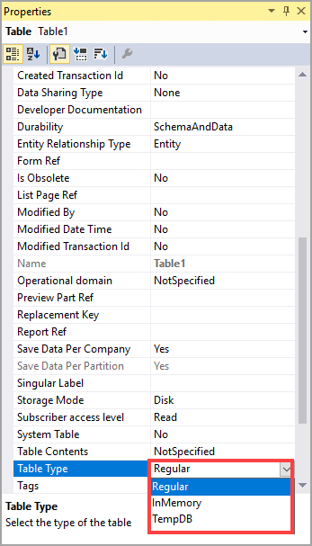

تشرح هذه الوحدة الجداول المؤقتة، والأنواع المختلفة للجداول المؤقتة، ومتى يجب استخدامها.

تسمح لك الجداول المؤقتة بإنشاء البيانات المؤقتة وتنظيفها بكفاءة. نوعا الجداول المؤقتة هما:

-   `InMemory`
-   `TempDB` 

يمكن تحديد نوع الجدول في خاصية `TableType` بالجدول.

تستخدم جداول `InMemory` ملف أسلوب الوصول التسلسلي المفهرس (ISAM) الموجود في طبقة العميل أو طبقة AOS. لا يحتوي Microsoft SQL Server على اتصال بملف ISAM. يتم تخزين البيانات في الذاكرة حتى تصل إلى 128 كيلوبايت، ثم تتم كتابة مجموعة البيانات في ملف قرص على طبقة الخادم. يتم إنشاء مثيلات جداول `InMemory` عند إدراج السجل الأول. الجدول موجود والذاكرة مخصصة فقط للجدول أثناء وجود مخزن مؤقت للسجل. 

يمكن استخدام جدول `InMemory` عندما تحتاج إلى تخزين البيانات واستردادها دون كتابة البيانات في قاعدة البيانات. يشبه هذا الحاوية، ولكن تتيح لك جداول `InMemory` استخدام الفهارس لتسريع استرداد البيانات. إذا كنت تستخدم عدداً قليلاً من السجلات، فيجب عليك استخدام حاوية، وليس جدول `InMemory`. يمكنك استخدام بنية X++ SQL للانضمام إلى جدول `InMemory`، ومع ذلك، عادةً ما تكون عمليات الربط وعمليات SQL غير فعالة.

جداول `TempDB` تستخدم قاعدة بيانات `TempDB` لـ SQL Server. يتسبب هذا النوع من الجدول في إزالة البيانات عند عدم استخدامها بواسطة الطريقة الحالية أو عند إعادة تشغيل النظام. يتم تحويل الجداول العادية تلقائياً إلى جداول `TempDB` عن طريق تعطيل مفتاح التكوين للجدول، مما يسمح للمراجع إلى الجدول المعطل في النظام بالاستمرار في التجميع والتشغيل.
بالإضافة إلى ذلك، تُستخدم جداول `TempDB` بشكل شائع في التقارير لمعالجة البيانات.

تتضمن إمكانات جداول `TempDB` ما يلي:

-   الانضمام إلى الجداول العادية.
-   استخدام المفاتيح الخارجية.
-   أن تكون لكل شركة أو عالمية.
-   الاحتواء على الفهارس.
-   وجود الأساليب ولكن مع عدم القدرة على تجاوز الأساليب.
-   إنشاء مثيل من العميل أو مستوى الخادم.
-   قيد الاستخدام كاستعلام.
-   عدم وجود متطلبات لمفتاح التكوين.

تحتوي جداول `TempDB` على القيود التالية أيضاً:

-   عدم القدرة على إدارة بيانات التاريخ الفعلي.
-   لا تحتوي على إجراءات حذف.
-   لا يتم تطبيق أمان مستوى السجل.
-   لا يمكنك استخدامها في طرق العرض.
