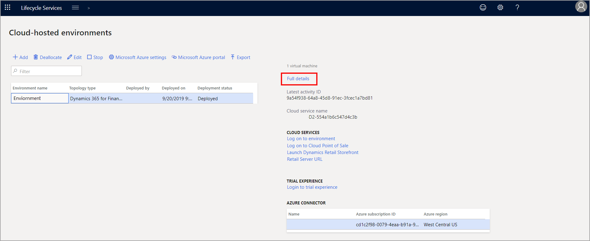

يمكن أن تؤدي الاستعلامات التي تم إنشاؤها بشكل سيئ إلى حدوث مشكلات في الأداء. يمكنك تطبيق بعض أفضل الممارسات على الاستعلامات لتجنب الآثار غير الضرورية على الأداء. 

-   **يجب على جميع الاستعلامات سحب البيانات المطلوبة اللازمة** - يجب أن تسحب الاستعلامات الخاصة بك من قائمة حقول محددة. على سبيل المثال، إذا كنت بحاجة إلى سحب رقم حساب أحد العملاء، فيجب قصر الاستعلام الخاص بك على سحب حقل **رقم الحساب** فقط. إذ سيؤدي سحب حقول غير ضرورية إلى خفض مستوى الأداء.
-   **تجنب الاستعلامات المتداخلة** - الاستعلامات المتداخلة عبارة عن استعلامات داخل استعلام. على سبيل المثال، يظهر استعلام متداخل إذا قمت بإنشاء استعلام لسحب جدول **عميل**، ثم إنشاء استعلام ثانٍ لسحب جدول **مبيعات** استناداً إلى الاستعلام الأول. بدلاً من ذلك، استخدم انضمام لربط الجدولين في استعلام واحد.

أنواع الانضمام الأربعة التي يمكنك اجراؤها مع استعلامات محددة هي:

-   **انضمام** - يسحب الانضمام القياسي السجلات التي تتطابق على الجدولين كليهما، كانضمام داخلي.
-   **صلة خارجية** - يسحب هذا الانضمام السجلات بصرف النظر عما إذا كانت هذه السجلات تتطابق على الجدولين كليهما.
-   **صلة Exists** - يسحب هذا الانضمام جميع السجلات من الجدول الأول التي تتطابق مع السجلات في الجدول الثاني. ولا يتم إرجاع أي سجلات من الجدول الثاني.
-   **صلة Notexists** - يسحب هذا الانضمام جميع السجلات من الجدول الأول التي *لا* تتطابق مع السجلات في الجدول الثاني. ولا يتم إرجاع أي سجلات من الجدول الثاني.

يمكن أن يزيد استخدام الانضمام المناسب من الأداء عن طريق تقليل عدد السجلات والحقول غير المطلوبة التي يتم سحبها.

في الجداول الكبيرة والجداول التي تزيد بسرعة، مثل جدول حركات المخزون، يجب استخدام *فهرس* و *إشارة فهرس* في الاستعلامات لفرز البيانات. يطلب *فهرس* الكلمات الأساسية من النظام البحث عن الفهرس الأمثل لاستخدامه في فرز البيانات. وتقترح *إشارة الفهرس* فهرساً.

بالإضافة إلى ذلك، يمكن أن تساعدك بعض الأدوات في تحديد مناطق يمكن تحسين الأداء فيها. مساحة عمل **مرشد التحسين** ضمن تطبيقات التمويل والعمليات هي المكان الذي يمكنك فيه رؤية قائمة بالرسائل من آخر فحص أداء للفرص المحتملة نحو تحقيق أداء أفضل. يمكنك الاحتفاظ بقواعد ومعدل تكرار فحص الأداء من **إدارة النظام > مهام دورية > الاحتفاظ بقاعدة التحقق من صحة التشخيصات** و **إدارة النظام > مهام دورية > قاعدة التحقق من صحة تشخيصات الجدول**.

توفر Lifecycle Services أدوات تساعدك في مراقبة الأداء. وللوصول إلى هذه الأدوات، انتقل إلى صفحة **بيئات مستضافة على الشبكة السحابية** وحدد ارتباط **كل التفاصيل**.

