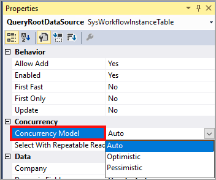

+يُستخدم التزامن للتحكم في وقت توفر البيانات لتنفيذ عمليات أخرى. تستخدم تطبيقات Finance and Operations نموذجين للتزامن:

-   **عنصر التحكم في التزامن غير المعزز بحماية التغييرات (PCC)** - يقوم بقفل السجلات بمجرد استرجاعها من قاعدة البيانات.
-   **عنصر التحكم في التزامن المعزز بحماية التغييرات (OCC)** - يقوم بتأمين السجلات أثناء تحديثها.

يجب استخدام نموذج PCC عندما يكون هناك منطق تسلسل يتطلب أقفالاً على السجل أو عندما يُحتمل وجود تعارض أثناء التحديث.

يجب استخدام OCC في الجداول لأنها تعمل على تحسين الإنتاجية على عكس PCC. ويُفضل أيضاً استخدام عنصر التحكم OCC إذا تم تحديث الجدول أو حذفه من نموذج وليس من كود.
 
يتميز عنصر التحكم OCC بمزايا تساعد على زيادة أداء قاعدة البيانات:

-   يتم استخدام موارد أقل لقفل السجلات أثناء التحديثات.
-   يتم قفل السجلات لفترة زمنية أقصر عند استخدام OCC بدلاً من PCC.
-   تظل السجلات متاحة للعمليات الأخرى أثناء اختيارها من قاعدة البيانات.

يحدث عيب استخدام عنصر التحكم OCC عندما تحاول عمليتان تحديث نفس السجل في نفس الوقت. عند وقوع ذلك، سيفشل التحديث، ما قد يؤدي إلى خفض مستوي أداء قاعده البيانات إذا كانت هناك محاولات متعددة لإجراء التحديثات.

يتم تحديد نموذج التزامن لجميع الجداول القياسية في تطبيقات Finance and Operations وتستخدم معظم الجداول OCC. يمكنك تعيين نموذج التزامن في خاصية الجدول `OccEnabled`. بالإضافة إلى ذلك، يمكنك تجاوز نموذج تزامن الجدول في عبارة **Select**. بعد الكلمة الرئيسية *Select* يمكنك استخدام الكلمة الرئيسية *optimisticLock* أو *pessimisticLock* لاستبدال الكلمة الرئيسية `forUpdate`.

