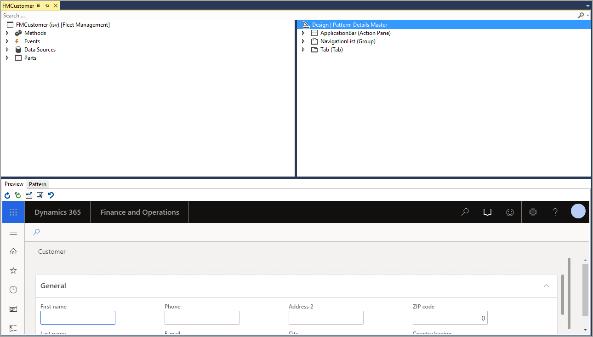

تعد أنماط النماذج جزءاً لا يتجزأ من تجربة تطوير النموذج.Form patterns are an integrated part of the form development experience. توفر هذه الأنماط بنية النموذج بناءً على نمط، والذي يتضمن عناصر التحكم المطلوبة والاختيارية.These patterns provide form structure based on a style, which includes required and optional controls. توفر الأنماط أيضاً العديد من خصائص التحكم الافتراضية.The patterns also provide many default control properties. في حين أن تطبيق نمط النموذج ليس جزءاً مطلوباً من عملية تطوير النموذج، فإننا نوصي به كأفضل ممارسة.While applying a form pattern is not a required part of the form development process, we recommend it as a best practice. بالإضافة إلى أنماط النماذج ذات المستوى الأعلى، يمكن تطبيق الأنماط الفرعية على عناصر التحكم في الحاوية وتوفير التوجيه والاتساق للمحتوى الفرعي في نموذج، مثل علامة التبويب السريعة.In addition to top-level form patterns, subpatterns can be applied to container controls and provide guidance and consistency for sub content on a form, such as a FastTab. 

تجعل الأنماط تطوير النموذج أسهل من خلال توفير تجربة إرشادية للتأكد من أن النماذج صحيحة ومتسقة.Patterns make form development easier by providing a guided experience to ensure that the forms are correct and consistent. تساعد الأنماط في التحقق من صحة هياكل الشكل والتحكم والتحقق من صحة استخدام عناصر التحكم في بعض الأماكن.Patterns help validate form and control structures and validate the use of controls in some places. تساعد الأنماط أيضاً على ضمان أن كل شكل جديد يصادفه المستخدم يمكن التعرف عليه فوراً من حيث المظهر والوظيفة.Patterns also help guarantee that each new form that a user encounters is immediately recognizable in appearance and function. نظراً لأن الأنماط توفر العديد من خصائص التخطيط الافتراضية، فإن النماذج تساعد في ضمان وجود تخطيط سريع الاستجابة.Because patterns provide many default layout properties, forms help ensure a responsive layout. أخيراً، تساعد الأنماط أيضاً في ضمان توافق أفضل مع التصحيحات والإصلاحات والترقيات.Finally, patterns also help guarantee better compatibility with patches, hotfixes, and upgrades.

يستمر دعم العديد من أنماط النماذج والقوالب من Microsoft Dynamics AX ‏2012 في تطبيقات Finance and Operations.Many of the form styles and templates from Microsoft Dynamics AX 2012 continue to be supported in Finance and Operations apps. إذا لم يعد نمط النموذج القديم أو القالب مدعوماً، فمن المحتمل أن يكون هناك مسار ترحيل إلى النمط الحالي.If a legacy form style or template is no longer supported, there is likely a migration path to a current pattern.

يتم استخدام العديد من أنماط النماذج في تطبيقات Finance and Operations.Many form patterns are used in Finance and Operations apps. تسلط القائمة التالية الضوء على الأنماط الأكثر شيوعاً التي ستواجهها وتطورها.The following list highlights the most common patterns that you will encounter and develop. للحصول على قائمة كاملة بأنماط النماذج والأنماط الفرعية المدعومة، انتقل إلى وحدة الملخص في هذه الوحدة.For a full list of supported form patterns and subpatterns, go to the Summary unit of this module.

-   **نمط القائمة البسيطة** - يُستخدم للاحتفاظ بالبيانات للكيانات التي تحتوي على ستة حقول أو أقل ولا توجد علاقات أصل/فرعية.**Simple List pattern** - Used to maintain data for entities that contain six or fewer fields and no parent/child relationships.
-   **القائمة البسيطة ونمط التفاصيل** - يُستخدم للاحتفاظ بالبيانات للكيانات التي تحتوي على ستة حقول أو أكثر.**Simple List and Details pattern** - Used to maintain data for    entities that contain six or more fields.
-   **نمط التفاصيل البسيطة** - يُستخدم لتقديم مجموعة بسيطة من الحقول للمستخدم؛ بشكل عام، يكون في وضع العرض بدلاً من وضع التحرير.**Simple Details pattern** - Used to present a simple set of fields    to the user; generally, it is in view mode instead of in edit mode.
-   **نمط التفاصيل الرئيسية** - يُستخدم كطريقة أساسية لإدخال البيانات.**Master Details pattern** - Used as a primary method for entering    data. يمكن للمستخدمين عرض وتحرير البيانات المنظمة في علامات التبويب السريعة القابلة للتوسيع والطي.Users can view and edit data that is organized into expandable    and collapsible FastTabs.
-   **نمط حركة التفاصيل** - يُستخدم لتقديم تفاصيل البيانات في طريقة عرض الرأس وطريقة عرض البند.**Details Transaction pattern** - Used to present data details in a    Header view and a Line view.
-   **نمط صفحة القائمة** - يُستخدم لتقديم البيانات بطريقة مُحسَّنة لتصفح السجلات ويسمح للمستخدم باتخاذ إجراء بشأن سجل معين.**List Page pattern** - Used to present data in a manner that is    optimized for browsing records and allows the user to take action on a specific record.
-   **نمط جدول المحتويات** - يُستخدم عند طلب نموذجين على الأقل لتكوين الإعداد.**Table of Contents pattern** - Used when at least two forms are    required for setup configuration.
-   **نمط مساحة العمل** - يُستخدم لإنشاء مساحة تطبيقات Finance and Operations، وهي مجموعة من المهام وصفحات محددة تُستخدم لنشاط أعمال مهم.**Workspace pattern** - Used to create a Finance and Operations apps    workspace, which is a grouping of tasks and specific pages that are used for significant business activity.
-   **نمط المعالج** - يُستخدم لتوجيه المستخدم خلال مهمة محددة باستخدام سلسلة مرتبة من صفحات علامات التبويب.**Wizard pattern** - Used to guide a user through a specific task    by using an ordered series of tab pages.

في Visual Studio، يضاف نموذج إلى مشروع في نافذة مستكشف الحلول.In Visual Studio, a form is added to a project in the Solution Explorer window. تبدو نافذة مصمم النماذج مختلفة عن مصممي العناصر الآخرين بسبب الأجزاء الإضافية.The form designer window looks different from other element designers because of the additional panes. 

يتم استخدام الجزأين الأيمن والأيسر لإدارة خيارات النموذج والتصميم، بينما يعرض الجزء السفلي تصميم النمط بالإضافة إلى معاينة لكيفية عرض النموذج في واجهة المستخدم.The left and right panes are used to manage the form and design options, while the bottom pane shows the pattern design as well as a preview of how the form is viewed in the user interface. يتم استخدام الجزء الأيمن من النموذج لإدارة الأساليب والأحداث ومصادر البيانات، بينما يتم استخدام الجزء الأيمن لتطبيق الأنماط والأنماط الفرعية.The form's left pane is used to manage methods, events, and data sources, while the right pane is used to apply patterns and subpatterns. جزء النقش السفلي يشبه المعالج لأنه يرشدك خلال الخطوات الضرورية لإكمال النمط.The bottom pattern pane is like a wizard because it guides you through the necessary steps to complete the pattern. إذا تمت إضافة العناصر بترتيب مختلف عما أوامر جزء النمط أو لم تتم إضافة جميع العناصر، فستواجه أخطاء عند تنفيذ بناء.If elements are added in a different order than what the pattern pane commands or not all the elements are added, you will encounter errors when performing a build.

يوضح الفيديو التالي كيفية إضافة نموذج إلى مشروع وتطبيق نمط على النموذج:The following video shows how to add a form to a project and apply a pattern to the form:

> [!VIDEO https://www.microsoft.com/videoplayer/embed/RE4bJ1j]

 
