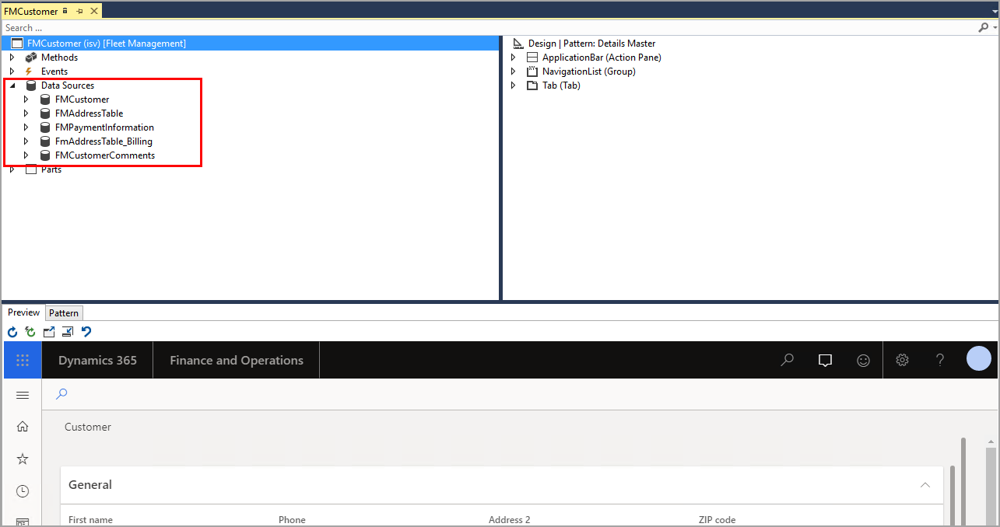

لعرض محتوى على صفحة في واجهة المستخدم، يجب إضافة مصدر بيانات إلى نموذج في نافذة مصمم النماذج لـ Visual Studio.To display content on a page in the  user interface, a data source must be added to a form in the form designer window of Visual Studio. يمكنك تحديد وسحب جدول أو استعلام من مشروعك في نافذة **مستكشف الحلول** أو سحب جدول نظام من نافذة **مستكشف التطبيقات**.You can select and drag a table or query from your project in the **Solution Explorer** window or drag a system table from the **Application Explorer** window. يمكنك اختيار استخدام جدول واحد أو عدة جداول، بناءً على عدد الحقول التي ستستخدمها في النموذج الخاص بك.You can choose to use one table or many tables, depending on the number of fields that you will use for your form. 

اتبع هذه الخطوات لإضافة مصدر بيانات من شجرة مكونات البرنامج (AOT) إلى النموذج باستخدام عملية التحديد والسحب:Follow these steps to add a data source from the Application Object Tree (AOT) to your form by using a select and drag process:

1.  تأكد من أن النموذج الخاص بك مفتوح في نافذة مصمم النماذج في Visual Studio.Ensure that your form is open in the form designer window in Visual    Studio.
2.  في نافذة **مستكشف التطبيقات**، قم بتوسيع عقدة **AOT**.In the **Application Explorer** window, expand the **AOT** node.
3.  قم بتوسيع عقدة **نموذج البيانات**.Expand the **Data Model** node.
4.  قم بتوسيع عقدة **الجداول** أو **ملحقات الجداول**، حسب نوع مصدر البيانات الذي تقوم بإضافته.Expand the **Tables** or **Table Extensions** node, depending on the    type of data source that you are adding.
5.  حدد الجدول المطلوب واسحبه من عقدة **AOT** إلى عقدة **مصادر البيانات** في الجزء الأيمن من إطار مصمم النماذج.Select and drag your desired table from the **AOT** node to the **Data Sources** node in the left pane of the form designer window.

وبدلاً من ذلك، يمكنك إضافة مصدر بيانات إلى النموذج الخاص بك باستخدام عقدة **مصادر البيانات** في في مصمم النماذج.Alternatively, you can add a data source to your form by using the **Data Sources** node in the form designer.

اتبع الخطوات التالية لإضافة مصدر بيانات من المشروع:Follow these steps to add a data source from your project:

1.  تأكد من أن النموذج الخاص بك مفتوح في نافذة مصمم النماذج في Visual Studio.Ensure that your form is open in the form designer window in Visual     Studio.
2.  في الجزء الأيمن من المصمم، انقر بزر الماوس الأيمن فوق عقدة **مصادر البيانات** وحدد **مصدر بيانات جديد**.In the left pane of the designer, right-click the **Data Sources**    node and select **New Data Source**.
3.  حدد **DataSource1** ضمن عُقدة **مصادر البيانات** وانتقل إلى نافذة **الخصائص**.Select **DataSource1** under the **Data Sources** node and go to the **Properties** window.
4.  حدد جدولك في القائمة المنسدلة لخاصية **الجدول**.Select your table in the **Table** property drop-down menu. يمكنك أيضاً تحديد أي جدول من عقدة **AOT** في هذه القائمة.You can    also select any table from the **AOT** node in this menu.
