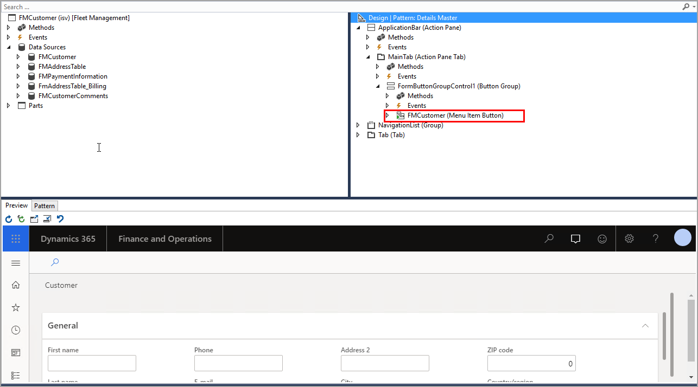

يتم استخدام عناصر القائمة في واجهة المستخدم لتطبيقات Finance and Operations لتزويد المستخدم بزر سيتم ربطه بصفحة أو مربع حوار أو تقرير أو تنفيذ إحدى المهام.Menu items are used in the Finance and Operations apps user interface to present the user with a button that will link to a page, dialog box, report, or perform a task. تتوفر أنواع مختلفة من عناصر القائمة في Visual Studio:Different types of menu items are available in Visual Studio:

-   **عنصر قائمة العرض** - لكائنات التطبيقات القابلة للتشغيل التي تعرض في الأساس النماذج ومربعات الحوار للمستخدم.**Display menu item** - For runnable application objects that primarily present forms and dialogs to the user.
-   **عنصر قائمة الإخراج** - لكائنات التطبيقات القابلة للتشغيل التي وظيفتها الأساسية طباعة نتيجة، مثل تقرير.**Output menu item** - For runnable application objects whose  primary function is to print a result, such as a report.
-   **عنصر قائمة الإجراءات** - لكائنات التطبيقات القابلة للتشغيل التي وظيفتها الأساسية تنفيذ مهمة، مثل إنشاء حركات في قاعدة البيانات أو تحديثها.**Action menu item** - For runnable application objects whose primary function is to do a job, such as creating or updating transactions in the database.

دون عنصر قائمة، يجب أن يقوم المستخدم بكتابة عنوان ويب للنموذج يدوياً.Without a menu item, the user would have to manually type in a web address for the form. توفر عناصر القائمة للمستخدم طريقة أسهل للانتقال إلى صفحة عن طريق تحديد زر أو ارتباط.Menu items give the user simpler way to go to a page by selecting a button or link. يمكن توسيع جزء التنقل الخاص بتطبيقات Finance and Operations لإضافة وحدة نمطية جديدة أو إضافة صفحة إلى وحدة نمطية موجودة.The Finance and Operations apps navigation pane can be extended to add a new module or to add a page to an existing module. 

تعرض لقطة الشاشة أدناه عنصر قائمة تمت إضافته إلى نموذج في بيئة المطورين:The screenshot below shows a menu item that has been added to a form in the developer environment:

