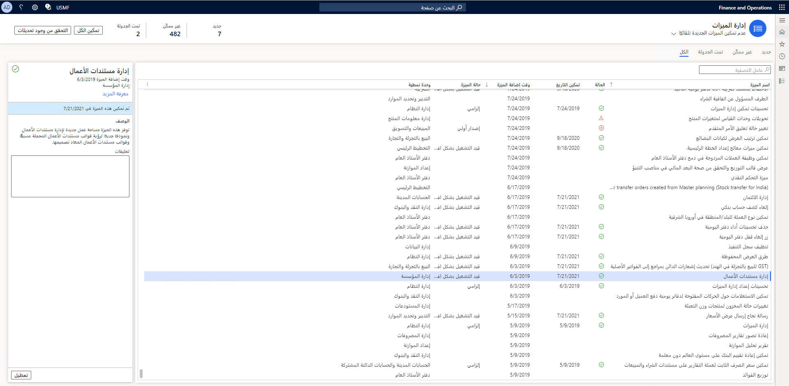
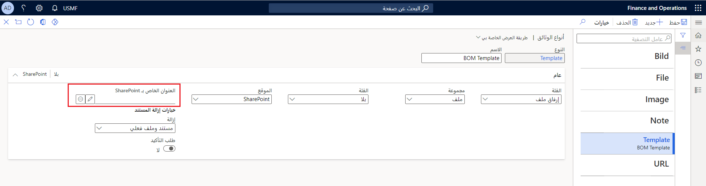
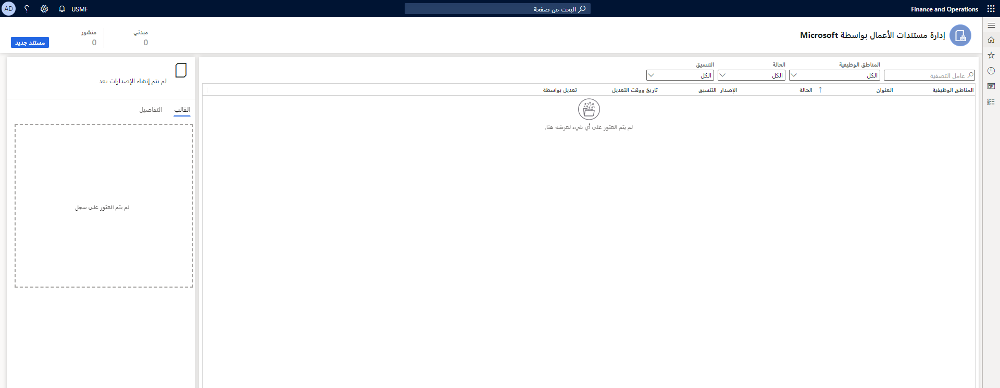
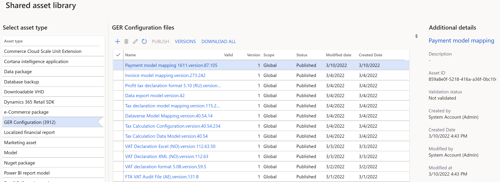
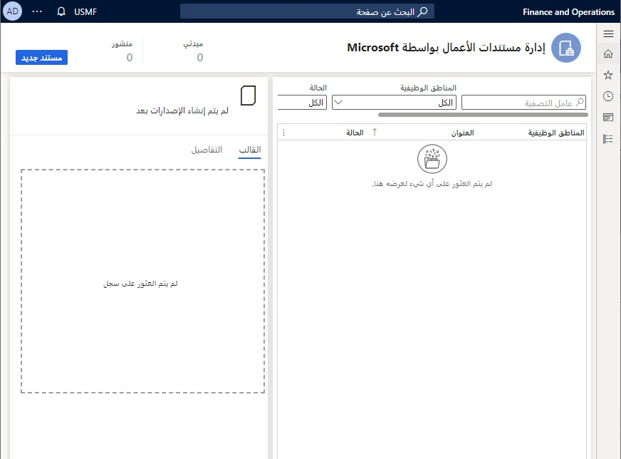

تتيح لك إدارة مستندات الأعمال في تطبيقات التمويل والعمليات إعداد مستندات الأعمال، مثل الفواتير داخل عميل الويب. يُمكنك تحرير قوالب مستندات الأعمال باستخدام خدمة Microsoft 365 أو تطبيق سطح المكتب المناسب Microsoft Office، باستخدام ميزة إدارة مستندات الأعمال. قد تتضمن عمليات التحرير التي يتم إجراؤها على المستندات تغيير تصميمات مستندات الأعمال وإضافة عناصر نائبة لبَيانات إضافية، دون الحاجة إلى إكمال تغييرات التعليمات البرمجية المصدر وعمليات التوزيع الجديدة. تعتمد الأداة على إطار عمل إعداد التقارير الإلكترونية لإعداد المستند، وتستخدم إطار عمل إدارة الطباعة لربط المستند المخصص بخيار الطباعة. 

تتيح إدارة مستندات الأعمال للمستخدمين إنشاء مستندات الإخراج وتعديلها، دون الاعتماد على تطوير تقارير SQL Server Reporting Services (SSRS). تدعم إدارة مستندات الأعمال حاليًا الإخراج إلى Microsoft Word وMicrosoft Excel وPDF. 

يُمكنك تمكين ميزة **إدارة مستندات الأعمال** من مساحة العمل **إدارة الميزات**.

> [!div class="mx-imgBorder"]
> 
 
## إعداد المعلمات
ستحتاج إلى إعداد نوع المستند المطلوب في **إطار عمل إدارة المستندات**، قبل إعداد إدارة مستندات الأعمال. استخدم نوع مستند **القالب** لتحديد تخزين مؤقت للمستندات بتنسيقات Office (Excel وWord) المستخدَمة كقوالب لتقارير التقارير الإلكترونية. بعد ذلك، تأكد من تقديم عنوان SharePoint للتخزين المؤقت. باستخدام تطبيقات Office لسطح المكتب، يُمكنك تحرير قالب التخزين المؤقت.

> [!div class="mx-imgBorder"]
> 

يُمكنك إعداد معلمات إدارة مستندات الأعمال الأساسية في صَفحة **معلمات مستندات الأعمال**. يُمكن لمستخدمين محددين فقط الوصول إلى الصَفحة. في علامة التبويب **المرفقات** في الصَفحة **معلمات مستند الأعمال**، ستحتاج إلى تحديد نوع المستند في الحقل **نوع مستند SharePoint**. نوع المستند هذا هو النوع الذي يجب استخدامه لتخزين القوالب مؤقتًا بتنسيقات Office أثناء تحريرها باستخدام تطبيقات سطح المكتب في Office. نوع المستند المحدد خاص بالشركة وسيتم استخدامه عندما يعمل المستخدم مع إدارة مستندات الأعمال في الشركة التي تم إعداد نوع المستند المحدد لها.

## استخدام إدارة مستندات الأعمال لتحرير أحد القوالب
يُمكن لمستخدمي الأعمال الوصول إلى قوالب مستندات الأعمال للتحرير في مساحة العمل **إدارة مستندات الأعمال**. 

> [!div class="mx-imgBorder"]
> 
 
اتبع هذه الإجراءات لتحرير قالب مستند في مساحة العمل **إدارة مستندات الأعمال**. للإعداد الأولي، يُمكنك استيراد القالب من Microsoft Dynamics 365 Lifecycle Services، مثل التقارير الإلكترونية. علاوةً على ذلك، يمكنك إنشاء قالب جديد عن طريق تحديد **إنشاء قالب**. يتم بعد ذلك استيراد القالب المحدد من المستودع العمومي ويتم إنشاؤه في مساحة عمل **إدارة مستندات الأعمال‬**. عندما تستورد القالب، سترى قائمة بالقوالب الخاصة بدور المستخدم المعين لك.  لن يقوم النظام بتنزيل القوالب غير القابلة للتطبيق على الدور المعين لك.
 
> [!div class="mx-imgBorder"]
> 

تعمل وحدة إدارة مستندات الأعمال مع وظيفة *العلامات* لهيكلة المستندات، والتي يتم توسيعها بعلامة جديدة تسمى **نوع مستند الأعمال**. تحدد علامة **نوع مستند الأعمال** مستند الإخراج الذي سيتم استخدام التكوين الحالي له. يُمكنك ربط المستند بـ "إدارة الطباعة"، بعد إضافة هذه العلامة. 

باستخدام التقارير الإلكترونية، يُمكنك تحرير مستند أعمال من مساحة العمل **إدارة مستندات الأعمال** عند إعدادها. يُمكنك تحرير ملفات Excel وWord مباشرة من مساحة العمل.

> [!div class="mx-imgBorder"]
> 
 
## قم بإعداد أُذونات الوصول
بشكل افتراضي، يُمكن لكل مستخدم لديه حق الوصول إلى مساحة عمل إدارة مستندات الأعمال عرض جميع قوالب حلول التقارير الإلكترونية المتوفرة، وذلك عند عدم تمكين الوصول إلى أُذونات إدارة مستندات الأعمال. ستُظهر **مساحة عمل إدارة مستندات الأعمال** فقط تلك القوالب الموجودة في تكوينات تنسيق التقارير الإلكترونية والتي تم تمييزها بالعلامة **نوع مستند الأعمال**.

يُمكنك تقييد قائمة القوالب المتوفرة في مساحة العمل **إدارة مستندات الأعمال** من خلال إعداد أُذونات الوصول. قد يكون هذا الأسلوب مفيدًا عند استخدام قوالب مختلفة لإنتاج مستندات أعمال لمجالات عمل مختلفة (مجالات وظيفية)، وعندما يُسمح بوصول مستخدم معين إلى قوالب مختلفة للتحرير في مساحة العمل **إدارة مستندات الأعمال**.

يُمكنك تعيين أُذونات الوصول إلى إدارة مستندات الأعمال لـ **المكون** الخاص بأُذونات الوصول. يُمكن فقط للمستخدمين التالين الوصول إلى الصَفحة:

- المستخدمون الذين تم تعيينهم لدور مسؤول النظام.
- المستخدمون الذين تم تعيينهم لأي دور آخر تم إعداده لأداء المهمة **تكوين الأُذونات للوصول إلى قوالب مستندات الأعمال للتحرير**.

