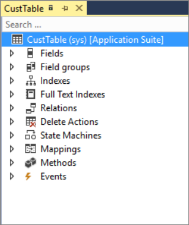

تحتوي الجداول على صفوف وأعمدة، تماماً مثل جدول البيانات. ويتم تخزينها في قاعدة بيانات والعمل معا لتسليم البيانات إلى المستخدم في المخرجات مثل النماذج والتقارير. يمكن إن تحتوي الجداول أيضاً على بيانات التعريف، وهي عبارة عن بيانات وصفية مثل إعدادات النظام. يمكن للمطورين تعديل خصائص الجدول والمكونات الموجودة من خلال الملحقات، أو يمكنهم إنشاء جداول جديدة. 

تتكون الجداول من حقول يتم تنظيمها في مجموعات حقول. يمكن إنشاء فهرس من حقول داخل جدول ومساعدات في استرداد البيانات. عندما تكون البيانات الموجودة في أحد الجداول متصلة بجدول آخر، مثل معلومات العميل المنتشرة عبر جداول متعددة، ستقوم بإنشاء علاقة جدول بين الجدولين.

في حين أن العديد من جداول النظام موجودة، فمن الضروري معرفة كيفية إنشاء جداول وحقول جديدة بحيث يمكنك تخصيص خبرة تطبيقات التمويل والعمليات. تتم إضافة الجداول إلى مشروع من خلال نافذة **مستكشف الحلول** بالنقر بزر الماوس الأيمن فوق مشروع وتحديد **إضافة > عنصر جديد**. يمكنك بعد ذلك تعديل هذه الجداول من خلال مصمم الجدول وإطارات **الخصائص**.

تعرض لقطة الشاشة أدناه CustTable (جدول العملاء).

يحتوي اطار **مصمم الجدول** على عقدة المستوى العلوي باسم الجدول والمكونات المختلفة الموجودة أسفله، مثل:

-   **الحقول** - إنشاء البيانات في الجدول ويمكن إن تكون قوائم تعداد أو أنواع بيانات ملحقة.
-   **مجموعات الحقول** - عبارة عن مجموعات منطقية لحقول قاعدة البيانات الفعلية. يمكن استخدام المجموعات في النماذج والتقارير بحيث يتم تحديث الكائنات المرتبطة تلقائياً لتعكس المحتوى الجديد للمجموعة، وذلك عند إجراء تعديل على مجموعة حقول.
-   **الفهارس** - عبارة عن أسلوب لتسريع استرداد البيانات من أحد الجداول.
-   **علاقات** - تحديد كيفية ارتباط جدول بسجلات في جداول أخرى.
-   **حذف الإجراءات** - تستخدم هذه العقدة في الجداول التي تتم ترقيتها من الإصدارات السابقة من Microsoft DynamicsAX. ويستخدم لتفصيل ما يجب حدوثه عند حذف بيانات في جدول ذي صله. مع تطبيقات التمويل والعمليات، يتم تحديد إجراءات الحذف في خصائص علاقة جدول.
-   **أجهزة الحالة** - تمكنك من إجراء انتقالات الحالة داخل سير العمل دون كتابة أية تعليمات برمجية إضافية.
    ويتم استخدامها بشكل أساسي مع مهام سير العمل.
-   **تعيينات** - من خلال التعيين، يمكنك إقران حقل تعيين بحقل في جدول واحد أو أكثر. وهذا يمكنك من استخدام نفس اسم الحقل للوصول إلى الحقول التي لها أسماء مختلفة في جداول مختلفة.
-   **الأساليب** - الأساليب هي أجزاء من التعليمات البرمجية التي تمت إضافتها إلى جدول يمكن تشغيله عند حدوث بعض الأحداث أو التغييرات في البيانات.
-   **الأحداث** - هي أيضا أجزاء من التعليمات البرمجية التي يتم رفعها كالعمليات السابقة والعمليات اللاحقة حول الأساليب الأساسية.

تتم إضافة الحقول إلى جدول باستخدام حركة النقر والسحب من المشروع في نافذة **مستكشف الحلول** أو من نافذة **مستكشف التطبيقات**. الحقول هي عادة التعدادات الأساسية (التعداد الأساسي) أو أنواع البيانات الملحقة (أنواع EDT). ونظرا لأن أنواع EDT التي تمت إعادة استخدامها خلال النظام، فمن المفيد التحقق من شجرة مكونات البرنامج (AOT) لمعرفة ما إذا كان الحقل المطلوب موجوداً بالفعل قبل إنشاء EDT جديد والإضافة إلى المشروع. يمكنك أيضاً إضافة حقل إلى جدول بالنقر بزر الماوس الأيمن فوق اسم الجدول في مصمم الجدول وإضافة حقل جديد. ولن تتمكن من التحديد في إطار **الخصائص** العنصر الذي سيتم الرجوع إليه لهذا الحقل، مثل التعداد الأساسي أو EDT.
