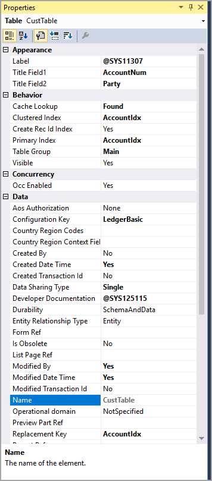

عند إضافة عنصر جديد، مثل جدول أو حقل، إلى مشروع، نوصي بتحديث خصائص العنصر وتعديلها. 

في حين أنه يمكن التحكم بالعديد من الخصائص، إلا أنه سيتم استخدام القليل منها بشكل شائع. 

-   **نوع الجدول** - تحديد ما إذا كان الجدول يعتبر جدول قاعدة بيانات عادي أو جدول مؤقت، مثل جدول TempDB أو InMemory.
-   **الاسم** - إذا تم استخدامه في نموذج ليتم عرضه في واجهة المستخدم كصفحة، فإن الاسم هو ما سيراه المستخدم على الصفحة.
    يجب أن تستخدم الأسماء والتسميات حالة كاميل لتحقيق الاتساق، ولكن سيتم عرض أسماء الجداول بأحرف كبيرة.
-   **التسمية** - ستُضاف من ملف التسمية وتُستخدم لتعريف الجدول في Visual Studio.
-   **الفرس الأساسي** - تحديد أي حقل في الجدول يجب استخدامه كفهرس أساسي ويتم استخدامه لأغراض تحسين قاعدة البيانات.
-   **فهرس نظام المجموعة** - تحديد الحقل الذي يجب تنظيم الجدول به. يجب ألا تترك هذه الخاصية فارغه أبداً.
-   **مفتاح التكوين** - Allows a system administrator to enable and disable certain parts of the application and ensures that a table is removed when the key is disabled.
-   **دعم التوريث** - تحديد ما إذا كان الجدول يمكن أن يصبح جدولاً أساسياً باستخدام التوريث. يشير تعيين هذه الخاصية إلى **نعم** إلى أنه يمكن توسيع هذا الجدول، أو يمكنه أن يرث خصائص من جدول موجود.
-   **عمليات التوسيع** - يُستخدم عند تعيين خاصية دعم التوريث إلى **نعم**. تختار خاصية عمليات التوسيع الجدول الأساسي الذي سيصبح الجدول الأصلي للجدول الحالي.

تُظهر الرسوم المتحركة التالية نافذة **الخصائص** لجدول العميل الذي يتم فتحه من نافذة **مستكشف التطبيقات**.

يتم تعديل خصائص الحقل بشكل عام على مستوى العنصر بدلاً من تعديله داخل الجدول. على سبيل المثال، إذا أضفت EDT كحقل إلى جدول، فستفتح EDT في مصمم العناصر لضبط أي خصائص قبل إضافتها إلى الجدول.

تحدد خصائص التعداد الأساسية ما إذا كان يجب عرض الخاصية كقائمة منسدلة أو أزرار خيارات أو شريط تمرير في واجهة مستخدم تطبيقات Finance and Operations. تختلف خصائص EDT بناءً على نوع EDT، مثل سلسلة أو عدد صحيح أو تاريخ. بالنسبة لسلسلة EDT، على سبيل المثال، يمكنك التحكم في عدد الأحرف التي يمكن إدخالها في حقل النص. بالنسبة إلى EDT للتاريخ، يمكنك اختيار ما إذا كان الشهر واليوم مدرجين كرقم واحد أو رقمين وما إذا كان يجب إدراج السنة كرقمين أو أربعة أرقام. من الأفضل ترك الخصائص معينة إلى **تلقائي** حتى يتمكن النظام من تعديل الحقل حسب الضرورة في واجهة المستخدم.
