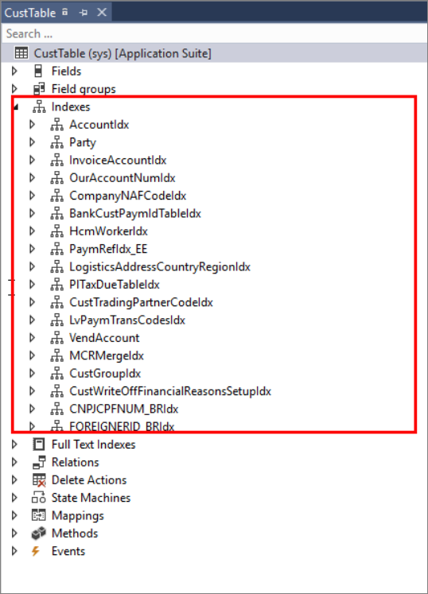

عند إنشاء جدول وحقول، ستضيف هذه الحقول إلى الجدول، ثم تنشئ مجموعات حقول لتجميع الحقول المرتبطة. بعد ذلك، ستقوم بسحب الحقول، مثل أنواع EDT والتعدادات، من AOT أو من مشروعك في مستكشف الحلول. إذا لم تحدد أي مجموعات حقول، فسترى افتراضياً البيانات من حقلين فقط (المفتاح الأساسي وحقول الوصف) في الجدول الأساسي لأنه تتم فهرستها تلقائياً. 

ستعمل مجموعات الحقول على تحسين التناسق في تصميم النموذج وستقلل من حالات اضطرار المستخدمين إلى اختيار الحقول لأنماط النموذج بشكل فردي. عند إجراء تعديل على مجموعة حقول، مثل خاصية تم تغييرها أو حقل مضاف جديد، سيتم تحديث أي نماذج تحتوي على مجموعة الحقول هذه تلقائياً لإظهار التغييرات الجديدة. تتم إضافة مجموعات الحقول من خلال مصمم الجدول بالنقر بزر الماوس الأيمن فوق عقدة مجموعات الحقول لتحديد مجموعة جديدة. بعد ذلك، يمكنك سحب الحقول من الجدول إلى مجموعات الحقول المختلفة المدرجة ضمن عُقدة مجموعات الحقول.

تُظهر الرسوم المتحركة التالية حقلاً يتم تحديده وسحبه من نافذة **مستكشف التطبيقات** إلى عقدة **الحقول** في CustTable في نافذة مصمم الجدول.

يتم إنشاء المؤشرات على جدول لتحسين الكفاءة مع استرجاع البيانات. تمت إضافتها باستخدام مصمم الجدول. يتم تعريف الفهرس باستخدام حقل واحد أو أكثر كمعايير البحث. عندما تحدد الحقول المراد استخدامها للفهرس، ضع في اعتبارك الحقول التي يتم البحث عنها غالباً بواسطة نطاق أو استعلام، أو الحقول التي يتم استخدامها بشكل متكرر في الصلات، أو الحقول التي تُستخدم غالباً لترتيب النتائج أو تجميعها.

ترتيب الأعمدة في الفهرس مهم. لتحقيق الكفاءة، يجب تنظيم الفهرس من العمود الأكثر دقة (أكبر عدد من القيم الفريدة) إلى العمود الأقل دقة.

الأنواع الثلاثة للفهارس المستخدمة في تطبيقات Finance and Operations هي:

-   **فهرس أساسي** - يوفر مفتاحاً فريداً لكل سجل في الجدول. يجب تعيين خاصية **السماح بالتكرارات** إلى **لا** لأنه لا يمكن وجود قيم متعددة لها نفس النتيجة. مثال على الفهرس الأساسي هو رقم الهاتف أو رقم الحساب.
-   **مجمع** - ينظم هذا النوع من الفهرس بيانات الجدول وفقاً لترتيب الفهرس. على سبيل المثال، يتم فرز البيانات الموجودة في دفتر الهاتف أولاً حسب الاسم الأخير ثم بالاسم الأول. لكل اسم أخير وأول، يوجد رقم هاتف مقابل. سيكون الفهرس المجمع في هذه الحالة هو الاسم الأخير.
-   **غير مجمع** - يوفر هذا النوع من الفهرس طريقة للإشارة بسرعة إلى البيانات الموجودة في الفهرس المجمع باستخدام مجموعة محددة من الأعمدة. مثال على ذلك هو الفهرس الموجود في الجزء الخلفي من الكتاب المدرسي. يمكنك البحث عن موضوع معين، ويقدم الفهرس قائمة بأرقام الصفحات التي تحتوي على معلومات حول هذا الموضوع.

غالباً ما يتم استخدام جداول متعددة لجمع بيانات حول موضوع مشابه. يمكنك إنشاء علاقة جدول في الجدول الأساسي لتحديد مدى ارتباطها بجدول ثانوي. تتم إضافة علاقة على عقدة العلاقات أسفل عنوان الجدول في نافذة مصمم الجدول.
يمكنك استخدام علاقات الجدول لعدة أسباب، بما في ذلك ربط الصفوف في جدول بآخر، وإنشاء روابط تلقائية في النماذج لربط جدول بآخر، والبحث عن القيم في جداول أخرى، والتحقق من صحة البيانات عن طريق توفير قيود.

عند إنشاء النماذج، من الشائع أن يكون لديك جداول مرتبطة كمصادر بيانات أساسية حتى يمكن إجراء عمليات البحث. يمكنك إنشاء هذه العلاقة حتى تتمكن من الوصول إلى المعلومات الموجودة في كلا الجدولين باستخدام حقل مشترك، مثل رقم الحساب. يمكن أيضاً استخدام العلاقات لتقييد الصفوف التي يتم إرجاعها في الجدول.

يتم استخدام خصائص **الحقل**، و **الحقل المرتبط**، **القيمة** لإضافة تفاصيل حول العلاقة وإملاء الحقول المرتبطة بين جدولين.

يتم تعريف أنواع العلاقة على النحو التالي:

-   **العلاقة العادية** - تحدد حقول العلاقة بلا شروط.
-   **علاقة الحقل الثابتة** - تحدد حقول العلاقة لتقييد السجلات في الجدول الأساسي.
-   **علاقة الحقل المرتبط الثابتة** - تحدد حقول العلاقة التي تقيد السجلات في الجدول المرتبط.
-   **علاقة المفتاح الخارجي** - تحدد المراسلات بين حقل المفتاح الخارجي في الجدول الحالي وحقل المفتاح الأساسي في جدول أصلي آخر.
