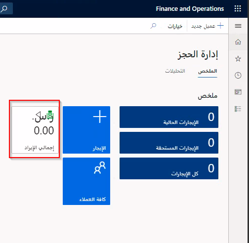
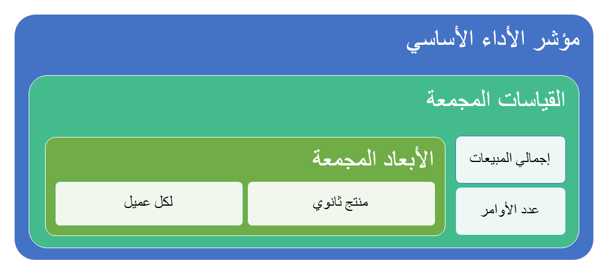

يمكن إنشاء مؤشرات الأداء الأساسية (KPI) في بيئة المطور ثم تضمينها في مساحات العمل لتزويد المستخدمين بقيم أساسية قابلة للقياس تسمح لهم بمعرفة كيفية أداء الأعمال. تُظهر الصورة أدناه مثالاً على لوحة مؤشرات الأداء الأساسية (KPI) في مساحة العمل. 
 

يجب أن يكون لمؤشرات الأداء الأساسية (KPI) أهداف واضحة يتم مراجعتها بشكل دوري لضمان تحقيق الأهداف. يمكن إنشاء مؤشرات الأداء الأساسية (KPI) باستخدام البيانات المجمعة المضمنة في القياسات المجمعة، وهو نموذج يحتوي على مجموعة من القياسات والأبعاد المقابلة لها. القياسات المستخدمة هي أرقام مجمعة، مثل إجمالي المبيعات. يمكن تعيين القياسات الإجمالية لقياس المجموع أو الحد الأدنى أو الحد الأقصى أو العد أو العد المميز أو المتوسط باستخدام خاصية التجميع الافتراضية. 

بشكل افتراضي، تستخدم خاصية التجميع الافتراضية قياس العد. يمكنك نشر القياس المجمع بطريقتين مختلفتين باستخدام خاصية الاستخدام. **InMemoryRealTime** يستخدم فهارس مخزن الأعمدة لقاعدة بيانات SQL Server للحصول على بيانات في الوقت الحقيقي.
**StagedEntityStore** يستخدم مخزن الكيانات الذي يستخدم تقارير Power BI في الوقت الحقيقي تقريباً.  يتيح لك هذا الخيار نشر توزيع القياس في مخزن الكيانات وتحديث البيانات بشكل دوري.

الأبعاد عبارة عن مقسمات يمكن استخدامها لتحليل البيانات. من هذه القياسات والأبعاد المجمعة، يمكنك إنشاء كيان بيانات مجمعة. يمكنك استخدام البيانات المجمعة لتحديد مؤشر الأداء الأساسي (KPI) باستخدام X++. بعد تحديد مؤشر الأداء الأساسي (KPI)، يمكن للمستخدمين تخصيصه في وقت التشغيل.

## إنشاء قياسات مجمعة 

لإنشاء قياسات مجمعة، اتبع الخطوات التالية:

1.  في نافذة **مستكشف الحلول**، انقر بزر الماوس الأيمن فوق مشروعك وحدد **إضافة جديد > صنف جديد**.
2.  حدد **التحليلات > القياس المجمع**.
3.  افتح **مستكشف التطبيق**.
4.  انتقل إلى **النتائج > نموذج البيانات > طرق العرض** وحدد طريقة العرض لإنشاء القياسات.
5.  اسحب **طريقة العرض** إلى **القياس المجمع**.
6.  اسحب حقول **طريقة العرض** وأفلتها في مجموعة **القياس** للحصول على القياس المجمع.
7.  يحتوي كل قياس على خاصية تجميع افتراضية يمكنك تعيينها:
    -   العد
    -   المجموع
    -   AverageOfChildren
    -   DistinctCount
    -   ‏‫الحد الأقصى
    -   الحد الأدنى
8.  احفظ الكل.

## إنشاء الأبعاد المجمعة 

لإنشاء أبعاد مجمعة، اتبع الخطوات التالية:

1.  في نافذة **مستكشف الحلول**، انقر بزر الماوس الأيمن فوق مشروعك وحدد **إضافة جديد > صنف جديد**.
2.  حدد **التحليلات > البُعد المجمع**.
3.  افتح **مستكشف التطبيق**.
4.  انتقل إلى **النتائج > نموذج البيانات > طرق العرض** وحدد طريقة العرض لسحب القياسات.
5.  اسحب الصنف المحدد إلى جذر الأبعاد المجمعة.
6.  اسحب الحقول من طريقة العرض إلى **البُعد المجمع > السمات**.
7.  احفظ الكل.

## إنشاء مراجع أبعاد النماذج  

لإنشاء مراجع أبعاد النماذج، اتبع الخطوات التالية:

1.  اسحب البُعد المجمع وأفلته في عقدة **البُعد** الخاصة بالقياس المجمع.
2.  أنشئ علاقة جديدة في عقدة بُعد القياس المجمع.
3.  قم بتعيين خاصية **سمة البُعد** في العلاقة إلى **نموذج**.
4.  احفظ الكل.

## توزيع القياسات المجمعة 

لتوزيع قياسات مجمعة، اتبع الخطوات التالية:

1.  حدد القياس المجمع.
2.  قم بتعيين خاصية **الاستخدام**:
    -   InMemoryRealTime
    -   StagedEntityStore
3.  انقر بزر الماوس الأيمن فوق القياس المجمع وحدد **إضافة فهارس مخزن الأعمدة**.

## إنشاء كيان البيانات المجمعة 

لإنشاء كيان البيانات المجمعة، اتبع الخطوات التالية:

1.  في نافذة **مستكشف الحلول**، انقر بزر الماوس الأيمن فوق مشروعك وحدد **إضافة جديد > صنف جديد**.
2.  حدد **التحليلات > كيان البيانات المجمعة**.
3.  حدد **إضافة**.
4.  اسحب وأفلت القياس المجمع في مصدر البيانات لكيان البيانات المجمعة.
5.  في مصدر البيانات، اسحب القياسات وأفلتها في عقدة **حقول إدخالات البيانات المجمعة**
6.  في مصدر البيانات، اسحب الأبعاد وأفلتها في عقدة **حقول إدخالات البيانات المجمعة**
7.  أنشئ الحل واحفظه.

## إنشاء مؤشر الأداء الأساسي (KPI) 

لإنشاء مؤشر الأداء الأساسي (KPI)، اتبع الخطوات التالية:

 
1.  انقر بزر الماوس الأيمن فوق مشروع وحدد **إضافة > صنف جديد**.
2.  حدد **التحليلات > مؤشر الأداء الأساسي (KPI)**.
3.  حدد **إضافة**.
4.  قم بتعيين خاصية **القياس** لتحديد قياس مؤشر الأداء الأساسي (KPI).
5.  حدد عقدة **القيمة** الخاصة بمؤشر الأداء الأساسي (KPI).
6.  قم بتعيين مجموعة القياسات في خاصية **مجموعة القياسات**.
7.  قم بتعيين القياس في خاصية **القياس**.
8.  حدد عقدة **الهدف** الخاصة بمؤشر الأداء الأساسي (KPI).
9.  قم بتعيين خاصية **نوع الهدف**.
10. قم بتعيين مجموعة القياسات في خاصية **مجموعة القياسات**.
11. قم بتعيين القياس في خاصية **القياس**.
12. حدد **حفظ**.

## إضافة مؤشر الأداء الأساسي (KPI) إلى مساحة عمل 

لإضافه مؤشر الأداء الأساسي (KPI) إلى مساحة عمل، اتبع الخطوات التالية:

1.  انقر بزر الماوس الأيمن فوق مشروع وحدد **إضافة > صنف جديد**.
2.  حدد **واجهة المستخدم > الإطار المتجانب**.
3.  حدد **إضافة**.
4.  اسحب وأفلت مؤشر الأداء الأساسي (KPI) من **مستكشف الحلول** في الإطار المتجانب الموجود في **مصم الإطارات المتجانبة**.
5.  احفظ.
6.  أنشئ ملحقاً لنموذج مساحة عمل موجود أو أنشئ نموذج مساحة عمل جديداً.
7.  في المصمم، أضف زر **الإطار المتجانب**.
8.  قم بتعيين الخيار المنسدل **خاصية الإطار المتجانب** إلى إطار متجانب مؤشر الأداء الأساسي (KPI) الذي أنشأته.
9.  احفظ الكل وأنشئ الحل.
10. ستُظهر مساحة العمل مؤشر الأداء الأساسي (KPI) الجديد الذي تم إنشاؤه. حدد إطار متجانب مؤشر الأداء الأساسي (KPI) لعرض التفاصيل.
