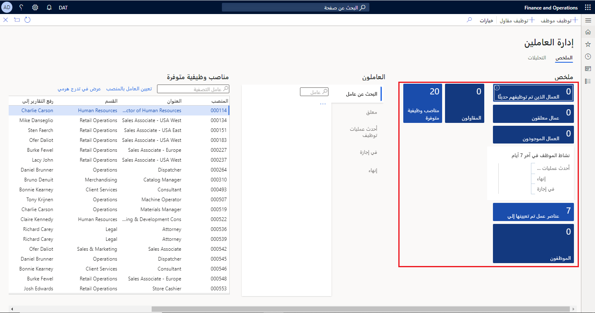

قد تكون عناصر التنقل ضرورية في مساحة العمل لمساعدتك في عرض بيانات إضافية داخل الصفحة. على سبيل المثال، قد يكون لديك عرض على مساحة العمل الخاصة بك لمعرفة إجمالي عدد المبيعات، ولكن عن طريق تحديد ارتباط في البيانات، يمكنك الوصول إلى عرض أكثر تفصيلاً لكل عملية بيع. 

المربعات عبارة عن أزرار تتم إضافتها إلى مساحة عمل تتيح للمستخدم عرض البيانات.
يمكن أن تعرض الإطارات المتجانبة عدداً قياسياً من البيانات، ويمكنها أيضاً توفير إمكانية الوصول للتنقل لعرض المزيد من تفاصيل السجل. يمكنك إنشاء مربعات وإضافتها إلى مساحة العمل من خلال تطوير X++. لإنشاء مربع جديد لمساحة عمل، تحتاج أولاً إلى إنشاء استعلام لسحب المعلومات وعنصر قائمة يستخدم هذا الاستعلام. بعد ذلك، يجب عليك إنشاء مربع يستخدم عنصر القائمة. في نموذج **مساحة العمل**، يمكنك إضافة زر **إطار متجانب** إلى مساحة العمل التي تشير إلى الإطار المتجانب.

## إضافة زر إطار متجانب إلى مساحة العمل الخاصة بك في واجهه المستخدم 
 

لإضافة زر **إطار متجانب** إلى مساحة عملك في واجهة المستخدم، اتبع الخطوات التالية: 

1.  انقر بزر الماوس الأيمن فوق لوحة المعلومات الموجودة أسفل صورة الرأس وحدد **تخصيص**.
2.  حدد زر **+إضافة مساحة عمل**.سيتم إنشاء مساحة عمل جديدة، بعنوان **مساحة العمل الخاصة بي 1**.
3.  انقر بزر الماوس الأيمن فوق **مساحة العمل الخاصة بي 1** وأدخل اسماً جديداً لمساحة عملك. 
4.  افتح جزء التنقل وانتقل إلى **الوحدات > حسابات المقبوضات > العملاء > جميع العملاء**.
5.  في جزء الإجراء، حدد علامة التبويب **خيارات**.
6.  في مجموعة **زر التخصيص**، حدد **إضافة إلى مساحة العمل**.
7.  في القائمة المنسدلة **مساحة العمل**، حدد مساحة عملك. 
8.  في القائمة المنسدلة **عرض تقديمي**، حدد **إطار متجانب**.
9.  حدد **تكوين**.
10. في جزء قائمة **إضافة كـ**، احتفظ بكل الإعدادات الافتراضية وحدد **موافق**.
11. حدد زر **التمويل والعمليات** للعودة إلى لوحة المعلومات.
12. حدد مساحة عملك. يعرض الإطار المتجانب الآن الخصائص التي قمت بتكوينها.

## إضافة زر إطار متجانب إلى مساحة عمل موجودة في بيئة المطور  
 

لإضافة زر **إطار متجانب** إلى مساحة عمل موجودة، اتبع الخطوات التالية:

1.  أنشئ مشروعاً جديداً في Visual Studio وتأكد من أن نموذج مشروعك يشير إلى "إدارة الأساطيل". تحقق من أن نموذج مشروعك يشير إلى "إدارة الأساطيل" باتباع الخطوات التالية:
    1.  حدد قائمة **Dynamics 365**. 
    2.  حدد **إدارة النماذج > تحديث معلمات النموذج**. 
    3.  حدد النموذج الذي تستخدمه في القائمة المنسدلة **اسم النموذج**. 
    4.  حدد **التالي**. 
    5.  تأكد من تحديد نموذج **إدارة الأساطيل** في شاشة **نماذج المراجع**.
2.  مع فتح المشروع الجديد في مستكشف الحلول، انقر بزر الماوس الأيمن فوق مشروع وحدد **إضافة > صنف جديد**.
3.  في إطار **إضافة صنف جديد**، حدد **واجهة المستخدم** في الجزء الأيسر.
4.  حدد **الإطار المتجانب** في الجزء الأوسط.
5.  قم بتسمية الإطار المتجانب الجديد باسم **MyTile**.
6.  حدد **إضافة**.
7.  في إطار **الخصائص** لمشروع MyTile الجديد، حدد **واسع** في حقل **الحجم**.
8.  حدد **الإطار المتجانب الخاص بي** في حقل **التسمية**.
9.  حدد **عرض** في حقل **نوع صنف القائمة**.
10. حدد **FMSetup** في حقل **اسم صنف القائمة**.
11. حدد **حفظ**.
12. من خلال ربط هذا الإطار المتجانب بصنف عرض قائمة FMSetup، عند تحديد الإطار المتجانب في التطبيق، سيتم فتح صفحة **إعداد إدارة الأساطيل**.
13. والآن، ستقوم بتوسيع مساحة عمل **إدارة الحجز** وإضافة الإطار المتجانب إلى قسم **الملخص**.
14. في **مستكشف التطبيقات**، ابحث عن صفحة **FMClerkWorkspace**.
15. انقر بزر الماوس الأيمن فوق **FMClerkWorkspace** وحدد **إنشاء ملحق**.
16. يضاف نموذج جديد إلى مشروعك يسمى **FMClerkWorkspace.Extension**.
17. انقر بزر الماوس الأيمن فوق **FMClerkWorkspace.Extension**، وحدد **إعادة تسمية**،، وقم بتسمية المشروع لـ **FMClerkWorkspace.myExtension**.
18. انقر نقراً مزدوجاً **FMClerkWorkspace.myExtension** لفتحه في مصمم العناصر.
19. في جزء التصميم بمصمم العناصر، افتح **FormTabControl1 > مساحة العمل > PanoramaBody ‏> SummaryTileSection**.
20. انقر بزر الماوس الأيمن فوق **SummaryTileSection** وحدد **جديد > زر الإطار المتجانب**.
21. ستتم إضافة عنصر تحكم جديد إلى النموذج يسمى **TileButtonControl1**.
22. حدد **TileButtonControl1** وانتقل إلى إطار الخصائص.
23. حدد **MyTile** في حقل **الاسم**.
24. حدد **MyTile** في حقل **الإطار المتجانب**.
25. حدد **الإطار المتجانب الخاص بي** في حقل **نص الإطار المتجانب**.
26. أنشئ المشروع واحفظه.
27. لعرض الإطار المتجانب الجديد، افتح تطبيقات التمويل والعمليات وانتقل إلى مساحة **عمل إدارة الحجز**. يجب عرض الإطار المتجانب في قسم **الملخص**.
