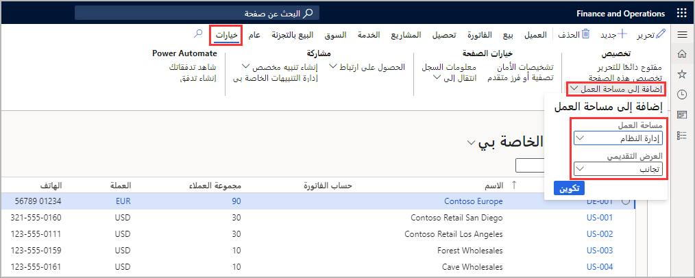

يمكن أن تتضمن مساحات العمل عناصر رئيسية، مثل تلك العناصر التي نوقشت في هذه الوحدة.Workspaces can contain main elements, such as those discussed in this module. يمكن أن تتضمن مساحات العمل أيضاً مؤشرات KPI المضمنة والمخططات والمكونات الأخرى التي تجعل تجربة واجهة المستخدم أكثر فعالية وإفادة.Workspaces can also include built-in KPIs, charts, and other components that make the user interface experience more efficient and useful. في تطبيقات Finance and Operations، يمكن للمستخدمين إنشاء مساحة عمل وإضافة عناصر حالية إلى مساحة العمل من واجهة المستخدم.In Finance and Operations apps, users can create a workspace and add existing elements to a workspace from the user interface. 

عند إضافة عنصر إلى مساحة العمل من واجهة المستخدم، يمكنك تحديد عرض تقديمي للبيانات.When adding an element to a workspace from the user interface, you can select the presentation of the data. تتمثل أنواع العروض التقديمية في الإطار المتجانب والقائمة والارتباط.The presentation types are Tile, List, and Link. يحتوي خيار **إطار متجانب** على تكوين إضافي حيث يمكنك إدخال اسم الإطار المتجانب وعرض عدد السجلات.The **Tile** option has additional configuration where you can enter the tile name and display the record count. وقبل إنشاء الإطار المتجانب، يمكنك تصفية النموذج لعرض السجلات التي ترغب فقط في رؤيتها في الإطار المتجانب.Before creating the tile, you can filter the form to view only the records that you want to see on the tile. يتيح لك خيار **القائمة** تسمية علامة التبويب وتحديد نمط القائمة.The **List** option allows you to name the tab and select the list style. يمكنك أيضاً تحديد الأعمدة التي تريد عرضها.You can also select the columns that you want to display. سيقوم خيار **الارتباط** بإنشاء ارتباط تشعبي بمساحة العمل بحيث يمكنك الوصول بسرعة إلى نموذج آخر.The **Link** option will create a hyperlink to the workspace so you can quickly access other form.
 
 في بيئة المطور، يمكن للمطورين إنشاء لوحات خاصة بمؤشر KPI التي تعرض القياسات المحسوبة. In the developer environment, developers can create KPI tiles that display calculated measures. لإنشاء مؤشر KPI في مساحة عمل المطور، يمكنك إنشاء وتعديل مؤشرات KPI باستخدام بيانات التجميع المضمنة في تجميع القياسات.To create a KPI in the developer workspace, you can create and modify KPIs by using aggregate data that is contained in aggregate measures. من المزايا الرئيسية لإنشاء مؤشرات KPI أنه بعد تحديد مؤشر KPI، يمكن للمستخدمين تخصيصه في وقت التشغيل.A key benefit of developing KPIs is that after a KPI is defined, users can customize it at run time. لإعداد مؤشر KPI في بيئة المطور وإنشائه، يجب اتباع هذه الخطوات عالية المستوي:To develop and create a KPI in the developer environment you should follow these high-level steps:

1.  إنشاء كائن مؤشر KPI.Create the KPI object.
2.  يستخدم في تحديد نطاق مؤشر KPI وأهدافه و/أو اتجاهاته.Define KPI range, goals, and/or tends.
3.  إنشاء إطار متجانب لعرض مؤشر KPI عليها.Create a tile for the KPI to display on.
4.  قم بإضافة مؤشر KPI إلى الإطار المتجانب.Add the KPI to the tile.

يمكنك أيضاً تضمين تقارير Power BI في مساحة العمل الخاصة بك.You can also embed Power BI reports into your workspace. للقيام بذلك، ستحتاج إلى ملء قاعدة بيانات مخزن الكيان المحلي بقياس تجميع مناسب.To do this, you will need to populate the local Entity Store database with the appropriate aggregate measurement. يمكنك إعداد وظيفة دفعية لتحديث قياس التجميع بشكل دوري.You can set up a batch job to periodically update the aggregate measurement. ستحتاج بعد ذلك إلى توصيل Power BI بقاعدة بيانات مخزن الكيان واختيار الجداول وطرق العرض التي سيتم إعداد تقارير عنها.You will then need to connect Power BI to the Entity Store database and choose which tables and views to report on. ومن ثم، يمكنك إعداد التقارير والمخططات ولوحات المعلومات، ثم نشر التقرير وتثبيته في مساحة العمل.From there, you can create reports, charts, and dashboards, and then publish the report and pin it to the workspace.
