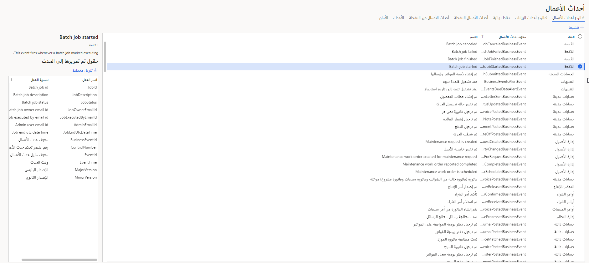

يتم إجراء أحداث الأعمال عند تشغيل عملية أعمال. أثناء عملية الأعمال، يقوم المستخدمون الذين يشاركون فيها بتنفيذ إجراءات العمل لإكمال المهام التي تشكل عملية الأعمال.

في تطبيقات التمويل والعمليات، يمكن أن يكون إجراء العمل الذي يقوم به المستخدم إما إجراء سير عمل أو إجراء غير متعلق بسير العمل.
تعد الموافقة على طلب الشراء مثالاً على إجراء سير العمل، بينما يعد تأكيد أمر الشراء مثالاً على إجراء لا يتعلق بسير العمل. يمكن لكلا النوعين من الإجراءات إنشاء أحداث عمل يمكن للأنظمة الخارجية استخدامها في سيناريوهات التكامل والإخطار.

تُستخدم ملحقات الفئات لتنفيذ أحداث عمل جديدة تسمح للأنظمة الخارجية بتلقي الإخطارات من تطبيقات التمويل والعمليات.

للعثور على أحداث العمل الحالية في المثيل الذي تستخدمه، انتقل إلى **إدارة النظام > الإعداد > أحداث العمل > كتالوج أحداث العمل**. كما هو موضح في لقطة الشاشة التالية، ستجد هنا قائمة بجميع أحداث العمل المتاحة للاستخدام. يمكنك أيضاً تطبيق عوامل التصفية للبحث في كل عمود من الأعمدة. 

> [!div class="mx-imgBorder"]
> 

سوف تستكشف الوحدات التالية إطار عمل حدث العمل والخطوات التي يجب اتخاذها لإنشاء حدث عمل جديد. 