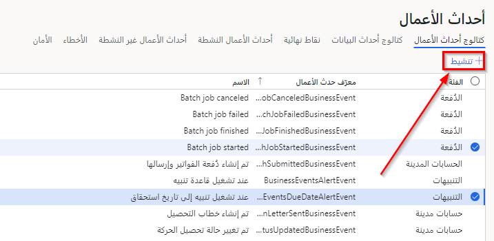

يحدد إطار عمل حدث الأعمال ما إذا كان سيتم نشر حدث أعمال لمستخدم تطبيقات التمويل والعمليات أو لا. من أفضل الممارسات أن يرسل التطبيق حدث أعمال، بغض النظر عما إذا كان حدث الأعمال ممكّناً أو لا. إذا كانت هناك حاجة إلى منطق إضافي مهم، أو إذا كان منطق إرسال حدث أعمال له تأثير على الأداء، يمكن للنظام التحقق مما إذا كان حدث أعمال معين ممكّناً قبل تشغيل منطق الأعمال المرتبط بإرسال أحداث العمل.

يمكن تنشيط أحداث الاعمال في صفحة **أحداث العمل** في وحدة **إدارة النظام**. في الكتالوج، يمكن عرض جميع أحداث العمل جنباً إلى جنب مع حالتها. بشكل افتراضي، لن يتم تعيين أحداث العمل إلى **نشطة** لذا يجب أن تخضع لعملية التنشيط. لتنشيط حدث عمل، حدد حدثاً واحداً أو عدة أحداث عمل، ثم حدد **+تنشيط** في الجزء العلوي الأيسر من الشاشة، كما هو موضح في الصورة التالية.

> [!div class="mx-imgBorder"]
> 

عند تنشيط حدث العمل، يمكنك تحديد ما إذا كان هذا ينطبق على كيانات قانونية متعددة أم كيان واحد فقط. بعد تنشيط أحد أحداث العمل، سيظهر في علامة التبويب **أحداث العمل النشطة** في صفحة **أحداث العمل**، ويمكن إلغاء تنشيطها في أي وقت. إذا قمت بإلغاء تنشيطه، فسيتم إدراجه في علامة التبويب **أحداث العمل غير النشطة**. 

بدلاً من حذف حدث عمل، يتيح لك تعيينه إلى الحالة **غير نشط** الاحتفاظ بمحفوظات الأخطاء لهذا الحدث، ويمكن تنشيطها لاحقاً. 

في بعض الأحيان، عندما تتغير عمليات الأعمال أو المتطلبات، قد لا تكون هناك حاجة لحدث العمل ويمكن تعيينه إلى **غير نشط**، حيث يمكن حذفه لاحقاً حسب الحاجة. 

## كتالوج أحداث الأعمال
يمكن الوصول إلى **أحداث العمل** من **إدارة النظام > الإعداد > أحداث العمل**. يسرد كتالوج أحداث العمل أحداث العمل المتوفرة في المثيل الذي تستخدمه. يعتبر الكتالوج مفيداً لأنه يعرض أحداث العمل المتاحة، ويمكنك تصفيتها حسب **الفئة**، و **معرف حدث العمل**، و **الاسم**.

تحدد فئة حدث العمل مصدره. يتم تعيين أحداث العمل التي تنشأ من نظام سير العمل إلى فئة سير العمل. بالنسبة لأحداث العمل التي تنشأ من وحدات أخرى، يتم استخدام اسم الوحدة كاسم الفئة.

ويتم إنشاء كتالوج أحداث الأعمال أثناء مزامنة قاعدة البيانات في وقت النشر. لذلك، يجب أن يرى المستخدمون القائمة الكاملة لأحداث العمل في الكتالوج. ومع ذلك، في حالة الحاجة إلى تحديث صريح للكتالوج، يمكنك تحديد **إدارة > إعادة إنشاء كتالوج أحداث العمل**.

وبالنسبة إلى كل حدث عمل، يعرض كتالوج أحداث العمل وصفاً. يمكن أن يساعدك هذا الوصف في فهم حدث العمل وسياقه في عملية الأعمال بشكل أفضل. يعرض الكتالوج أيضاً قائمة حقول البيانات التي سيتم إرسالها في الحدث.

في السيناريوهات التي تتطلب فيها أنظمة التكامل الخارجية مخطط الحمولة لحدث عمل أثناء التطوير، يمكنك تحديد **تنزيل المخطط** لتنزيل مخطط JavaScript Object Notation ‏(JSON).

باختصار، يساعد كتالوج أحداث العمل في تحديد أحداث العمل المطلوبة للتنفيذ. كما أنه يساعد في تحديد المخطط لكل حدث عمل.

الخطوة التالية هي إدارة نقاط النهاية.

- محددات أحداث الأعمال
- عام

توفر علامة التبويب **عام** في صفحة **معلمات أحداث العمل** الإعدادات العامة التي يتم تطبيقها على أحداث العمل.

- **عدد مرات إعادة المحاولة‬** – عدد المرات التي سيحاول فيها النظام مرة أخرى إرسال أحداث العمل إلى نقطة نهاية في حالة حدوث خطأ. القيمة الافتراضية هي 3.
- **وقت الانتظار بين المحاولات الجديدة** – الفاصل الزمني بالمللي ثانية بين محاولات إرسال حدث أعمال إلى نقطة النهاية الخاصة به. القيمة الافتراضية هي 1000 مللي ثانية.
- **النقاط النهائية المسموح بها لكل حدث‬** – الحد الأقصى لعدد نقاط النهاية التي يمكنها الاشتراك في نفس حدث العمل في كيان قانوني. القيمة الافتراضية هي 10.
- **استخدام وظيفة الدفعة لأحداث العمل**– تتوفر وظيفة معالجة مجموعة أحداث العمل عندما يكون الحل البديل مطلوباً للتخفيف من المشكلات المتعلقة بالمعالجة المخصصة. إذا قمت بتمكين هذا الخيار، فحدد إجراء **وظيفة دفعة أحداث العمل** لتحديد إعدادات معالج وظيفة الدُفعة. لمزيد من المعلومات حول إعدادات المعالجة المخصصة، راجع وصف علامة التبويب **الأداء** في القسم التالي.
- **Key vault secret cache interval** – عدد الدقائق التي سيتم فيها تخزين أسرار المخزن الرئيسي التي يتم استخدامها لأحداث العمل مؤقتاً في الذاكرة قبل قراءتها وتخزينها مؤقتاً مرة أخرى من المخزن الرئيسي الذي تم تكوينه. القيمة الافتراضية هي 5 دقائق.

## الأداء
يحتوي إطار عمل أحداث العمل على إعدادين أساسيين يمكن أن يؤثران على الأداء:

- معالجة مؤشرات الترابط
- حجم المجموعة
 
يخصص التطبيق مؤشرات ترابط دفعات مخصصة لمعالجة أحداث العمل في الوقت الحقيقي تقريباً. نظراً لأن مؤشرات الترابط هي مورد مشترك لجميع عمليات المعالجة المجمعة، يجب أن تنتبه عندما تقرر تغيير تخصيص مؤشرات الترابط لأحداث العمل.

- **معالجة مؤشرات الترابط** – عدد مؤشرات الترابط المراد استخدامها لمعالجة أحداث العمل. الحد الأقصى للقيمة هو 4.
    - إذا كنت تستخدم معالجة مخصصة لأحداث الأعمال، فإن عدد سلاسل الرسائل هو الرقم لكل مثيل Batch Application Object Server (‏AOS).
    - إذا كنت تستخدم وظيفة دفعة، فإن عدد مؤشرات الترابط هو العدد الإجمالي لمهام الدُفعات الإضافية التي سيتم استخدامها لمعالجة الأحداث.
- **حجم المجموعة‬** – عدد الأحداث المراد تجميعها معاً في وقت واحد للمعالجة بواسطة مؤشر ترابط.
    - من خلال زيادة العدد، فإنك تنتج حزماً أقل وتقلل القدرة على توزيع الأحداث على مؤشرات ترابط متوازية.
    - بتقليل العدد، أنت تنتج المزيد من المجموعات وتزيد من القدرة على توزيع الأحداث على مؤشرات ترابط متوازية. ومع ذلك، إذا جعلت الرقم صغيراً جداً، فستتسبب في موازاة غير ضرورية في المجموعات الصغيرة.

