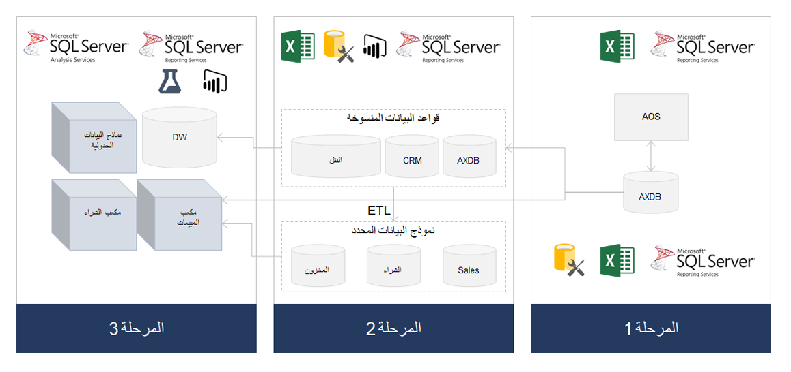

تعد SQL Server Reporting Services (SSRS) النظام الأساسي لإعداد التقارير لـ Dynamics AX 2012. يتم تشغيل التقارير الافتراضية المعرّفة مسبقاً التي يتم توفيرها مع Dynamics AX على النظام الأساسي SSRS. ومع ذلك، فإن التقارير المحلية لا تقتصر فقط على تقارير SSRS. 

تشمل العديد من إمكانات إعداد التقارير التي يمكنك استخدامها مع Dynamics AX 2012ما يلي:

- تقارير SSRS 
- التقارير المالية باستخدام أداة تقارير الإدارة 
- تقارير SSRS وPower BI على قاعدة بيانات منسوخة 
- استعلامات SQL المرتجلة مباشرةً على قاعدة البيانات أو المضمنة في Microsoft Excel 
- تقارير Power BI باستخدام نموذج بيانات جدولي

قبل أن تقرر كيفية إنشاء التقارير الخاصة بك في تطبيقات Finance and Operations، ضع في اعتبارك كيفية استخدام هذه التقارير. اطرح على نفسك أسئلة، مثل:

- هل يجب طباعة التقرير على الورق؟ 
- هل يجب إرسال التقرير إلى جهة حكومية في نهاية السنة؟ 

تأكد من فهمك لاحتياجات التقارير الخاصة بك عند الترقية حتى تتمكن من اتخاذ قرارات مدروسة. 

يمكن وصف الأنواع الثلاثة لنماذج إعداد التقارير التي يمكن استخدامها مع تقارير Dynamics AX 2012 على ثلاث مراحل. 

- **المرحلة 1** - تعرض سيناريو إعداد تقارير يتم فيه إنشاء تصميم التقارير بالكامل حول قاعدة بيانات الإنتاج. المرحلة الأولى هي سيناريو أبسط مع الحجم الصغير والبنية الأكثر بساطة. AOS هو خادم كائنات Axapta في الرسم التخطيطي أعلاه.
- **المرحلة 2** - تعرض النسخ المتماثل لقاعدة البيانات من قاعدة بيانات AX (AXDB). في هذه المرحلة، يمكنك إحضار مصادر بيانات أخرى، وتشغيل عملية الاستخراج، والتحويل، والتحميل (ETL)، وتنسيق نموذج البيانات الخاص بك الذي تم تحسينه لإعداد التقارير. وأخيراً، في **المرحلة 2**، ستستخدم أدوات، مثل Power BI، وExcel، وSQL Server Reporting Services، لإنشاء التقارير وخدمتها للمستخدمين. 
- **المرحلة 3** - تتضمن المتطلبات المعقدة والحجم الكبير. في **المرحلة 3**، يمكنك استخدام مستودع بيانات يتم ملؤه من قاعدة بيانات منسوخة وعمليات ETL. يمكنك أيضاً استخدام نموذج بيانات جدولي أو مكعبات مع SSRS ثم استخدام Power BI، أو Excel، أو SSRS لخدمة التقارير للمستخدمين. 

بالنسبة لكل مرحلة من هذه المراحل، يجب أن تكون قادراً على تحويل الاحتياجات والاستخدامات إلى حل سحابي. 

