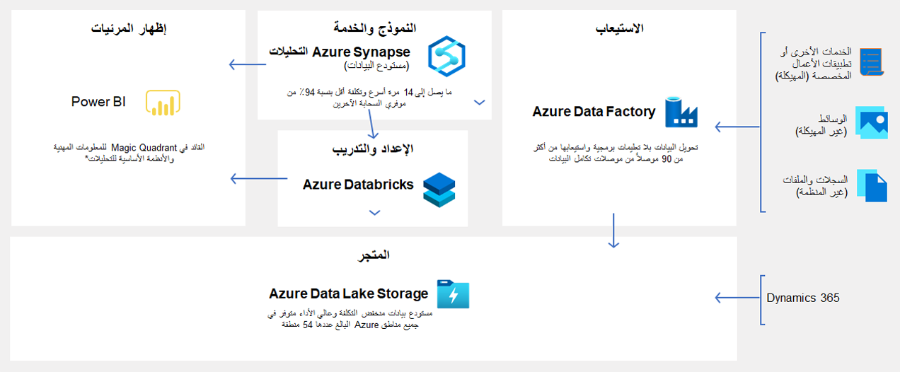

عند الترقية إلى تطبيقات Finance and Operations، ستظهر بنية التقارير الخاصة بك مختلفة للغاية نظراً لأنك الآن على السحابة. 

قم بتحديث مستودع البيانات القديم المحلي لديك باستخدام Azure Data Lake Storage وMicrosoft Azure Synapse Analytics، وأحضر البيانات من أنظمتك المحلية بما في ذلك Dynamics AX 2012وDynamics AX 2009. يمكنك جمع البيانات من تطبيقات Finance and Operations الحالية والأنظمة القديمة والبيانات من الأجهزة والمستشعرات. باستخدام Azure Synapse Analytics، يمكنك استهلاك البيانات الموجودة وفي Data Lake باستخدام T-SQL وغيرها من الأدوات المألوفة. 

يوضح الرسم التخطيطي التالي بنية مستودع البيانات الحديث باستخدام Azure Data Lake Storage. 

 
 

لمزيد من المعلومات، راجع [بنية مستودع البيانات الحديث](https://docs.microsoft.com/azure/architecture/solution-ideas/articles/modern-data-warehouse/?azure-portal=true)

