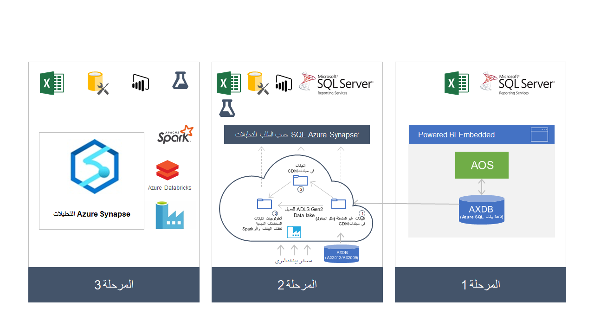

يوضح الرسم الآتي إمكانات التقارير التي تمت مناقشتها في هذه الوحدة التدريبية، مع تعيين مشابه بمراحل مختلفة. 

في **المرحلة الأولى**، في أثناء استخدام تطبيقات Finance and Operations، يستطيع العملاء استخدام عناصر تحكم أصلية ومستندات التشغيل والأعمال وتقارير إلكترونية ومساحات عمل تحليلية. 

في **المرحلة الثانية**، يمكنك استخدام إمكانات تصدير البيانات مثل **التصدير إلى Data Lake** أو **‏‫إحضار قاعدة بياناتك الخاصة (BYOD)‬**. يمكنك أيضاً إحضار مصادر بيانات أخرى ثم استخدام تحليلات وتقارير خدمات Azure Synapse باستخدام Excel وPower BI والخدمات الأخرى. 

في السيناريوهات المتقدمة، كما هو موضح في **المرحلة الثالثة**، يستطيع العملاء استخدام الإمكانات الكاملة لتحليلات Azure Synapse وAzure Databricks وغيرها من إمكانات النظام الأساسي للبيانات Azure. 

