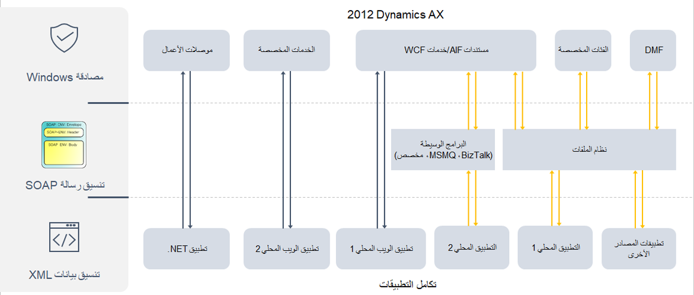

نظراً لأن Dynamics AX 2012 هو حل محلي، فإن تقنيات التكامل تتضمن العديد من التطبيقات، بما في ذلك التطبيقات التي تتكامل من خلال نهج قائم على الملفات، والذي يعتمد إما على الفئات المخصصة أو إطار عمل استيراد / تصدير البيانات (DIXF). 

يتم أيضاً استخدام إطار عمل تكامل التطبيق (AIF) وWindows Communication Foundation ‏(WCF) بشكل شائع في سيناريوهات التكامل، وغالباً ما يتم استخدامهما مع البرامج الوسيطة، مثل Microsoft BizTalk Server ‎أو Microsoft Message Queuing ‏(MSMQ‏) أو التقنيات المخصصة. يمكن لتطبيقات الويب المحلية المخصصة التكامل مع خدمات AIF/WCF والخدمات المخصصة. 

 
نظراً لتغيير إطار عمل التكامل، فمن المحتمل أن عمليات التكامل ستحتاج إلى إعادة التصميم عندما تقوم بالترقية إلى تطبيقات التمويل والعمليات. وخلال هذه الفترة، تأكد من مراعاة ما يلي: 

- استخدم هذه الفرصة لتحديث مكدس التكامل.
- استخدم النظام الأساسي لتكامل السحابة.
- قم بتبسيط البنية العامة، وحاول تقليل عدد عمليات التكامل بين التطبيقات، حيثما أمكن ذلك.
- جهد العامل والتكلفة.
- ضع في اعتبارك التأثير على تكامل التطبيقات.

تستعرض الأقسام التالية بإيجاز مشهد تكامل تطبيقات التمويل والعمليات. ستتم مناقشة هذه الموضوعات بمزيد من التفصيل خلال هذه الوحدة النمطية. 

التغيير الجدير بالملاحظة هو أن Application Integration Framework ‏(AIF) لم يعد مستخدماً؛ لذلك، تم تغيير العديد من سيناريوهات التكامل. يتمثل أساس العديد من سيناريوهات التكامل في **كيانات البيانات** التي تدعم السيناريوهات المتزامنة وغير المتزامنة. 

- بالنسبة **لعمليات التكامل المتزامنة**، ستستخدم OData للتفاعل مع التطبيقات المحلية أو تطبيقات الويب أو تطبيقات ‎.NET. 
- بالنسبة لـ **عمليات التكامل غير المتزامنة**، ستستخدم Data Management Framework‏ (DMF) والبرامج الوسيطة للاتصال بالتطبيقات من مصادر أخرى. 

لا تزال **الفئات المخصصة** قادرة على الاتصال بالتطبيقات من مصادر أخرى، ولا تزال قابلة للتطبيق للاتصال بتطبيقات الويب. تم تقديم **أحداث الأعمال** بحيث يمكنك استخدام أدوات، مثل **خدمات الإرسال في Azure** و **شبكة الأحداث**. علاوة على ما سبق، يمكنك استخدام **الكتابة المزدوجة** للاتصال بالبيانات في Microsoft Dataverse بطريقة ثنائية الاتجاه. 

