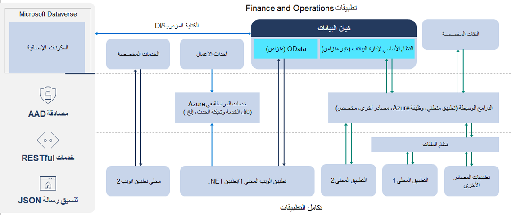
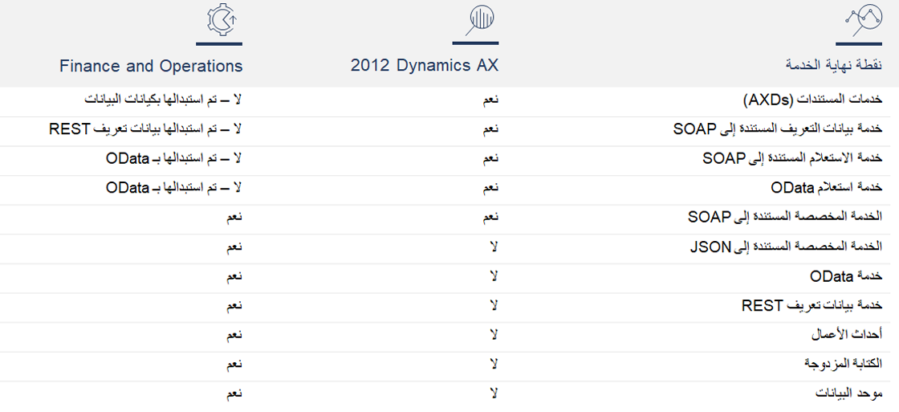

تستخدم تطبيقات Finance and Operations مصادقة Microsoft Azure Active Directory (Azure AD)، وليس مصادقة Windows.Finance and Operations apps use Microsoft Azure Active Directory (Azure AD) authentication, not Windows authentication. خدمات RESTful وتنسيق رسالة JSON هي التنسيقات الموصى بها لعمليات التكامل.RESTful services and a JSON message format are the recommended formats for integrations. يتم استبدال خدمات المستندات، وخدمات بيانات التعريف المستندة إلى SOAP، وخدمات الاستعلام المستندة إلى SOAP، وخدمات استعلام OData ويحل محلها مفاهيم أخرى في تطبيقات Finance and Operations.Document services, SOAP-based metadata services, SOAP-based query services, and OData query services have been replaced with other concepts in Finance and Operations apps. 

