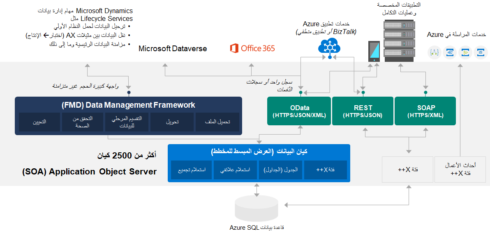
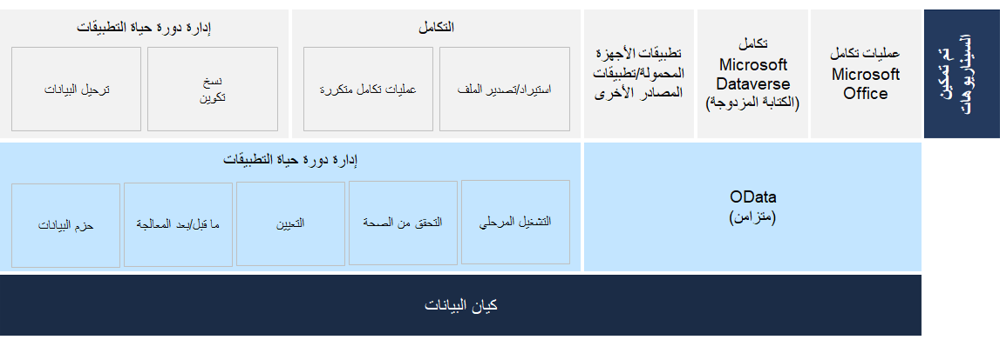

تختلف بنية التكامل لتطبيقات Finance and Operations عن Dynamics AX 2012. يجب أن تكون على دراية بالعديد من المفاهيم الجديدة، بدءاً من مراجعة مكونات التكامل. 

## تكامل البيانات
تدعم عمليات التكامل أنواعاً عديدة من تنسيقات المستندات وتعيين المصادر وعوامل التصفية وتحولات لغة ورقة الأنماط الموسعة (XSLT). يتيح لك هذا الدعم استخدام واجهات برمجة التطبيقات (API) لنقل الحالة التمثيلية الآمنة (REST) وآليات التفويض الأخرى لإرسال واستقبال البيانات باستخدام أنظمة التكامل ثم البناء على كيانات البيانات وData Management Framework‏ (DMF). 

تمنحك كيانات البيانات القدرة على استخدام DMF. كيان البيانات هو تجريد من التنفيذ المادي لجداول قاعدة البيانات. فهي تلخص مفهوم الأعمال في شكل يساعد في تسهيل التطوير والتكامل. يمكن أن تبسط الطبيعة المجردة لكيان البيانات تطوير التطبيقات وتخصيصها. 

توفر كيانات البيانات العديد من الإمكانات التي تساعدك في معالجة نقاط الضعف التي قد تواجهها مؤسستك اليوم:

- توفر مكدساً واحداً لالتقاط منطق الأعمال ولتمكين السيناريوهات مثل عمليات التكامل المتزامنة (OData) وعمليات التكامل/الاستيراد-التصدير غير المتزامنة.
- توفر آلية أساسية لاستخراج/إدراج حزم البيانات لإدارة دورة حياة التطبيق
- تستبدل المفاهيم المتباينة والمجزأة لكيانات AXD وDIXF (إطار عمل استيراد/تصدير البيانات)

توضح الصورة التالية بنية كيان البيانات. 

 

يمكن أن تكون عمليات تكامل البيانات متزامنة أو غير متزامنة:

- **نمط التكامل المتزامن** - يستخدم بروتوكول البيانات المفتوحة (OData) مع التدفق المستمر للبيانات؛ فإنه يحظر الطلبات وأنماط الاستجابة. يحدث هذا النمط عندما يتم حظر المتصل حتى ينتهي المتصل من تشغيل البيانات ويعطي استجابة.
- **نمط التكامل غير المتزامن** - يستخدم واجهة برمجة التطبيقات (API) لبيانات الدُفعات ويعمل من خلال خدمة الدُفعة؛ فهو نمط غير حاجب. يحدث هذا النمط عندما يرسل المتصل الطلب ثم يستمر دون انتظار الاستجابة.

يمكن استدعاء واجهات برمجة التطبيقات (API) لتكامل REST وSOAP التي توفرها تطبيقات Finance and Operations بشكل غير متزامن ومتزامن. 

لمزيد من المعلومات، راجع [نظرة عامة على كيانات البيانات](/dynamics365/fin-ops-core/dev-itpro/data-entities/data-entities/?azure-portal=true).

## المصادقة في السحابة
ستدعم خدمات OData والخدمات المخصصة المستندة إلى JSON وخدمة بيانات تعريف REST مصادقة OAuth 2.0 القياسية. يتم أيضاً دعم [تدفق منح كود التفويض](https://msdn.microsoft.com/library/azure/dn645542.aspx/?azure-portal=true) والخدمة لمكالمات الخدمة باستخدام بيانات اعتماد العميل (السر المشترك أو الشهادة) (راجع [النظام الأساسي لهويه Microsoft وتدفق بيانات اعتماد عميل OAuth 2.0](/azure/active-directory/develop/active-directory-protocols-oauth-service-to-service/?azure-portal=true)). يوجد نوعان من التطبيقات معتمدان في Microsoft Azure Active Directory (Azure AD):

- **تطبيق Native client** – يستخدم هذه التدفق اسم مستخدم وكلمة مرور للمصادقة والتفويض.
- **تطبيق الويب (العميل السري)** – يعد العميل السري أحد التطبيقات التي يمكنها الاحتفاظ بسرية كلمة مرور عميل بالنسبة للعالم. قام خادم التفويض بتعيين كلمة مرور العميل هذه إلى تطبيق العميل.

لمزيد من المعلومات، راجع:

- [OAuth 2.0 في Azure AD](https://msdn.microsoft.com/library/azure/dn645545.aspx/?azure-portal=true)
- [استكشاف مشاكل مصادقة الخدمة وإصلاحها](/dynamics365/fin-ops-core/dev-itpro/data-entities/troubleshoot-service-authentication/?azure-portal=true)

## بنية تستند إلى الحدث
توفر أحداث الأعمال آلية تتيح للأنظمة الخارجية تلقي الإعلامات من تطبيقات Finance and Operations. وبهذه الطريقة، يمكن للأنظمة تنفيذ إجراءات العمل استجابة لأحداث الأعمال.

يتم إجراء أحداث الأعمال عند تشغيل عملية أعمال. أثناء عملية الأعمال، سيقوم المستخدمون الذين يشاركون فيها بتنفيذ إجراءات العمل لإكمال المهام التي تشكل عملية الأعمال.

يمكن أن يكون إجراء العمل الذي يقوم به المستخدم إما إجراء سير عمل أو إجراء غير متعلق بسير العمل. تعد الموافقة على طلب الشراء مثالاً على إجراء سير العمل، بينما يعد تأكيد أمر الشراء مثالاً على إجراء لا يتعلق بسير العمل. يمكن لكلا النوعين من الإجراءات إنشاء أحداث عمل يمكن للأنظمة الخارجية استخدامها في سيناريوهات التكامل والإخطار.

