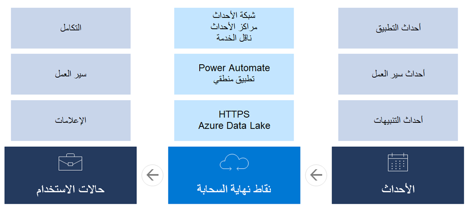

تعمل أحداث الأعمال على تمكين عمليات تكامل سير العمل بين تطبيقات Finance and Operations والأنظمة الخارجية بطريقة منفصلة.Business events enable business process integrations between Finance and Operations apps and external systems in a decoupled fashion. 

- **أحداث الأعمال الثابتة**- يجب ألا يتم إرسال أحداث أعمال خاطئة إلى المستلم.**Durable business events** - No false business events should be sent to the recipient. إذا تم إرسال حدث أعمال خاص بتأكيد أمر الشراء، فيجب على المستلم الوثوق في أن أمر الشراء تم تأكيده بالفعل.If a purchase order confirmation business event was sent out, then the recipient must trust that the purchase order was indeed confirmed. يجب أن يضمن اختيار التصميم طبيعة الحركات هذه.The design choice must ensure this transactional nature. 

- **الموجهة** ينبغي أن تصمم أحداث الأعمال بهدف تحسين مسألة الاستهلاك للمستلم.**Targeted** - Business events must be designed to optimize the consumption story for the recipient. بمعنى آخر، ينبغي أن تسهل على المستلم استهلاك أحداث الأعمال قدر المستطاع.In other words, you must make it as easy as possible for the recipient to consume business events. ولذلك، يجب أن تكون أحداث الأعمال محدده وموجهة لمستهلك معين.Hence, business events must be specific and targeted to a specific consumer. 

- **صامتة** - يجب أن ينتقل المجهود البسيط إلى التصميم المطلوب لتصفيه الضوضاء.**Noiseless** - Little effort should go into the design that is needed to filter out noise. لإجراء أحداث أعمال محددة، تأكد من تجنب كتابه منطق عوامل التصفية لتصفيه الشروط التي لا تتطابق مع حدث الأعمال المتوقع.To make business events specific, make sure that you avoid writing filtering logic to filter out conditions that do not match the expected business event. 

توجد أنواع مختلفة من الأحداث، ومنها **أحداث التطبيق وسير العمل** و **التنبيه**.Different types of events exist, including **Application, Workflow**, and **Alert** events. ويمكن استهلاك هذه الأحداث من خلال نقاط نهاية الخدمات السحابية مثل Microsoft Power Automate أو Azure Logic Apps أو Azure Data Lake Storage للعديد من السيناريوهات المختلفة، مثل عمليات سير العمل أو الإخطارات أو عمليات التكامل.These events can be consumed by cloud endpoints like Microsoft Power Automate, Azure Logic Apps, or Azure Data Lake Storage for many different scenarios, such as for workflows, notifications, or integrations. 

للحصول على مزيد من المعلومات، راجع [استهلاك أحداث الأعمال في تطبيقات Finance and Operations.](https://docs.microsoft.com/learn/modules/business-events-finance-operations/?azure-portal=true).For more information, see [Consume business events in Finance and Operations apps.](https://docs.microsoft.com/learn/modules/business-events-finance-operations/?azure-portal=true).

