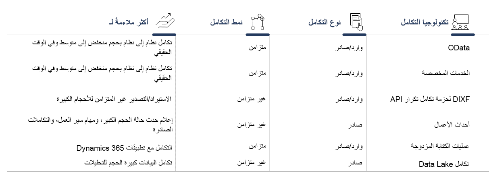

تحتوي تطبيقات Finance and Operations على واجهات برمجة تطبيقات (API) متعددة تدعم سيناريوهات التكامل:Finance and Operations apps contain multiple APIs that support integration scenarios:
 
- بروتوكول البيانات المفتوحة (OData)Open Data Protocol (OData)
- الخدمات المخصصةCustom services
- خدمات الويب الخارجيةExternal web services
- عمليات تكامل Office‬‏‫Office integrations
- عمليات تكامل متكررةRecurring integrations
- واجهة برمجة التطبيقات (API) لحزمة إدارة البياناتData management package API

تعمل واجهة برامج التطبيقات لعمليات التكامل المتكررة وواجهة برمجة التطبيقات (API) لـ Data Management Framework‏ (DMF) على دعم سيناريوهات التكامل المستندة إلى الملفات.Recurring integrations API and the Data Management Framework (DMF) API support file-based integration scenarios. يأتي DMF بشكل جاهز في Finance and Operations ويدعم استيراد البيانات وتصديرها.The DMF comes out of the box with Finance and Operations and supports data import and export. كما تدعم عمليات التكامل المتكررة سيناريوهات استيراد البيانات وتصديرها.Recurring integrations also support data import and export scenarios.

عند تحديد واجهة برمجة تطبيقات (API) التكامل، سيكون لديك العديد من التقديرات.When selecting an integration API, you will have many considerations. ويمكن أن تساعدك بعض نقاط القرار الخاصة بـ DMF وعمليات التكامل المتكررة على اختيار سيناريو تكامل التنفيذ.Some of the decision points for the DMF and recurring integrations can help you chose your implementation integration scenario.

للحصول على مزيد من المعلومات، راجع [سيناريوهات تكامل البيانات](https://docs.microsoft.com/learn/modules/integration-patterns-finance-operations/4-scenarios/?azure-portal=true).For more information, see [Data integration scenarios](https://docs.microsoft.com/learn/modules/integration-patterns-finance-operations/4-scenarios/?azure-portal=true).

يجب تقييم هذه التقديرات بحيث يمكنك تحديد إستراتيجية التكامل الخاصة بك.These considerations should be evaluated so that you can determine your integration strategy. تظهر الصورة الآتية بعض التوصيات لسيناريوهات مختلفة.The following image shows some recommendations for different scenarios.

لمساعدتك على تحديد إستراتيجية التكامل الخاصة بك، تقوم الأقسام الآتية بمراجعة بعض سيناريوهات التكامل للترقية من AX ‏2012.To help you determine your integration strategy, the following sections review some integration scenarios for upgrading from AX 2012.

## سيناريو خدمات النظامSystem services scenario

لدعم مجموعة من الخيارات للتخصيص والبرمجة، يوفر Dynamics AX‏ 2012 أنواع الخدمات الآتية:To support a range of options for customization and programmability, Dynamics AX 2012 provides the following types of services:

- خدمة الاستعلام، والتي توفر الوصول إلى البيانات التي تم إرجاعها في استعلامات AOTQuery Service, which provides access to data that is returned in AOT queries
- بيانات التعريف لكائنات AOT مثل الجداول وأنواع البيانات الملحقة (أنواع EDT)Metadata for AOT objects such as tables and extended data types (EDTs)
- بيانات حول المستخدم المستدعي، مثل اللغة الافتراضية والشركة الافتراضيةData about the calling user, such as default language and default company

تستخدم تطبيقات Finance and Operations خدمة بيانات التعريف REST ‏(‎http;‎//\[‎baseURL]/metadata).Finance and Operations apps uses REST metadata service (http;//\[baseURL]/metadata). 

- **التسميات** – تقوم بإرجاع التسميات من النظام.**Labels** – Returns labels from the system. وتحتوي التسميات على زوج ثنائي من مفتاح اللغة والمعرف بحيث يمكنك استرداد قيمة التسمية.Labels have a dual pair key of language and ID so that you can retrieve the value of the label.
- **كيانات البيانات** – تقوم بإرجاع قائمة بتنسيق JSON لكافة كيانات البيانات في النظام.**Data entities** – Returns a JSON-formatted list of all data entities in the system.

## سيناريو الخدمة المخصصةCustom service scenario

يسمح Dynamics AX ‏2012 بإنشاء الخدمات المخصصة التي يتم عرضها عبر نقاط نهاية SOAP.Dynamics AX 2012 allows the creation of custom services that are exposed through SOAP endpoints. ويسمح السيناريو للأنظمة الخارجية باستدعاء منطق أعمال Dynamics.The scenario allows external systems to call Dynamics business logics.

خصائص الخدمة المخصصة هي:Characteristics of custom service are: 

- متزامنةSynchronous
- قابلة للتخصيصCustomizable
- تسمح بمعلمات التمريرAllows passing parameters
- تتطلب معالجة المنفذRequires port handling
- WCF المستندة إلى SOAPSOAP-based WCF

مثال: تقوم خدمة خارجية (صفحة ويب الواجهة الأمامية) بإرسال أمر لتحديث كمية الأمر وتأكيدها.Example: External service (front end webpage) sends a command to update the order quantity and confirm it.

تسمح تطبيقات Finance and Operations بتنشيط منطق العمل من نظام خارجي باستخدام أساليب مختلفة:Finance and Operations apps allow business logics activation from an external system by using different techniques:

- الخدمة المخصصة المستندة إلى JSONJSON-based custom service
- إجراءات كيان ODataOData entity’s actions
- الخدمة المخصصة المستندة إلى SOAPSOAP-based custom service

تتشارك الأساليب في الخصائص الآتية:The techniques share the following characteristics:

- متزامنةSynchronous
- قابلة للتخصيصCustomizable
- تسمح بمعلمات التمريرAllow passing parameters 
- لا تتطلب معالجة المنفذDo not require port handling
- مصادقة Azure ADAzure AD authentication

## التبادل المستند إلى الملفات لإطار عمل تكامل التطبيق (AIF) أو MSMQApplication Integration Framework (AIF) file-based exchange or MSMQ 

يتم دفع المستندات في Dynamics AX2012 باستخدام تنسيق XML القياسي، أو باستخدام تحويل XSLT.Documents are pushed in Dynamics AX 2012 by using XML standard format, or by using XSLT transformation. يتم إدراج الرسائل في قائمة الانتظار ومعالجتها بشكل غير متزامن.The messages are enqueued and processed asynchronously.

- مستوى صوت عالٍHigh volume
- غير متزامنةAsynchronous 
- التحويل (اختياري)Transformation (optional)

مثال: استيراد بيانات الحركة من مستودع تلقائي، والذي تم إرساله كملفات بتنسيق ‎.csv.Example: Importing movement data from an automated warehouse, which was sent as .csv files.

في تطبيقات Finance and Operations، يمكنك استخدام خدمات Azure أو Data Management Framework‏ (DMF):In Finance and Operations apps, you can use Azure Services or the Data Management Framework (DMF):

- يسمح **Data Management Framework‏** بآلية الإدراج في قائمة الانتظار/إزالة من قائمة الانتظار وعمليات التحويل المدمجة.**Data Management Framework** allows compact enqueuing/dequeuing mechanism and transformations. ويتطلب آلية خارجية لإرسال الملفات إلى Dynamics 365.It requires an external mechanism to send the files to Dynamics 365.
- من خلال **خدمات Azure** باستخدام برنامج وسيط خارجي (على سبيل المثال، Logic Apps)، والتي تسمح بفصل الأعمال في منطق الأعمال ERP من منطق التحويل وتوفير المزيد من المرونة.Through **Azure Services** by using an external middleware (for example, Logic Apps), which allows decoupling the ERP business logics from the transformation logics and provides more flexibility.

