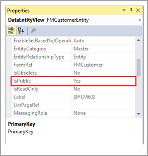
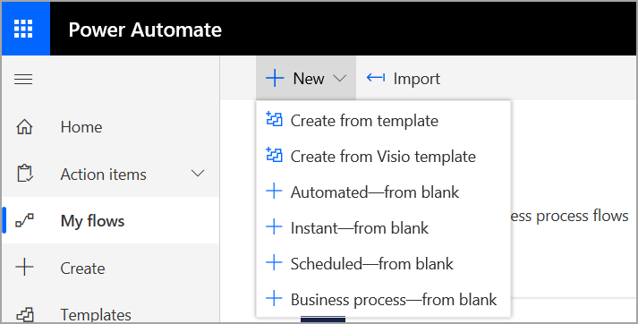
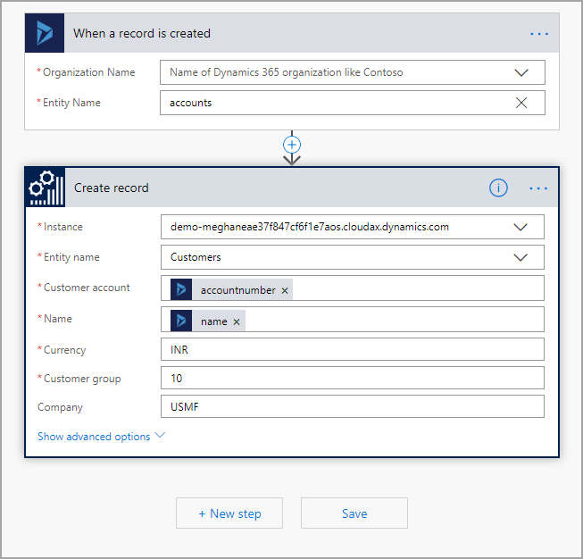

Power Automate هو جزء من Microsoft Power Platform، والذي يمكنك من الاتصال بالبيانات والخدمات وأتمته المهام.Power Automate is part of Microsoft Power Platform, which enables you to connect to data and services and automate tasks. 

يتوفر Power Automate بأكثر من 200 خدمة ويسمح لك بسرعة بإنشاء التدفقات باستخدام القوالب التي يتم نشرها بواسطة Microsoft والشركاء.Power Automate comes with over 200 services that allow you to quickly create flows by using templates that are published by Microsoft and partners. يمكنك أيضاً الاتصال بالسحابة ومصادر البيانات المحلية مثل SharePoint وMicrosoft SQL Server.You can also connect to cloud and on-premises data sources like SharePoint and Microsoft SQL Server.

ويكون لتطبيقات Finance and Operations موصل يتوفر مع Power Automate.Finance and Operations apps have a connector that comes with Power Automate. ضع في الاعتبار إذا كنت تريد الاتصال بالبيانات من تطبيقات Finance and Operations، فيجب أن تكون بياناتك في كيان بيانات، ويجب تكوين هذا الكيان لتمكين واجهة برمجة التطبيقات (API) العامة.Keep in mind, if you want to connect to data from Finance and Operations apps, your data must be in a data entity, and that entity must be configured to enable public API. يمكنك العثور على هذه الخاصية على كائن وحدة البيانات في Visual Studio.You can find this property on the data entity object in Visual Studio.

في لقطة الشاشة التالية، لاحظ انه تم تعيين الخاصية **IsPublic** إلى القيمة **نعم**.In the following screenshot, notice that the **IsPublic** property is set to **Yes**. 

عند تحديد الكيانات التي تحتاج إلى استخدامها للوصول إلى بيانات تطبيقات Finance and Operations، يمكنك البدء في إنشاء التدفق الخاص بك.When you have identified the entities that you need to use to access the Finance and Operations apps data, you can begin creating your flow.

للشروع في العمل مع Power Automate، اتبع هذه الخطوات العالية المستوى:To get started with Power Automate, follow these high-level steps:

1.  افتح الصفحة [Power Automate](https://flow.microsoft.com/?azure-portal=true).Open the [Power Automate](https://flow.microsoft.com/?azure-portal=true) page.
2.  قم بتسجيل الدخول باستخدام حساب Microsoft الخاص بك، أو يمكنك التسجيل مجاناً.Sign in with your Microsoft account, or you can sign up for free.
3.  عند تسجيل الدخول إلى الخدمة، يمكنك استخدام الجزء الأيمن من الشاشة الرئيسية للانتقال إلى المكان الذي ترغب فيه.When you are signed in to the service, you can use the left pane on the home screen to go where you need to.
4.  يمكنك استعراض قوالب تطبيقات Finance and Operations بتحديد **القوالب** في الجزء الأيمن.You can browse the Finance and Operations apps templates by selecting **Templates** on the left pane.
5.  ابحث عن طريق إدخال **عمليات Dynamics 365** في شريط البحث.Search by entering **Dynamics 365 Operations** in the search bar.
6.  يمكنك أيضا إنشاء تطبيق جديد عن طريق تحديد **التدفقات الخاصة بي** في الجزء الأيمن.You can also create a new application by selecting **My flows** on the left pane.
7.  حدد **جديد** في القائمة العلوية.Select **New** on the top menu.
8.  اختر من أحد الخيارات المتعددة الموجودة في القائمة.Choose from one of several options on the menu.

     
9.  عندما تقرر كيف ستقوم بإنشاء تدفقك، ستحتاج إلى تسجيل الدخول إلى اتصال تطبيقات Finance and Operations ببيانات اعتماد تسجيل الدخول.When you decide how you are going to create your flow, you will need to sign in to the Finance and Operations apps connection with your login credentials. عند المصادقة، يمكنك البدء في بناء التدفق الخاص بك.When authenticated, you can begin building your flow.
10. حدد **المثيل**، والذي هو **بيئة تطبيقات Finance and Operations** الخاصة بك.Select the **Instance**, which is your **Finance and Operations apps Environment**.
11. حدد الكيان الذي ترغب في العمل باستخدامه.Select the entity that you want to work with. تُظهر اللقطة التالية تدفق يقوم بإدراج سجل في تطبيقات Finance and Operations عند إضافة سجل في Dynamics 365 Sales.The following screenshot shows a flow that inserts a record into Finance and Operations apps when a record is added in Dynamics 365 Sales. تم تحديد المثيل ويمكن استخدام الكيانات التي قام مستخدم التدفق بالوصول اليها بالنسبة للتدفق.The instance has been specified and the entities that the Flow user has access to can be used for the Flow. ولاحظ في المثال التالي أنه قد تم تحديد **العملاء** في الحقل **اسم الكيان**Notice in the following example that **Customers** is selected in the **Entity name** field.

     
12. إنهاء إعداد التدفق عند ملء **رقم حساب** المبيعات في حقل **حساب العميل** في كيان **العملاء**.Finish setting up your flow when the Sales **accountnumber** is populated into the **Customer account** field in the **Customers** entity. يتم ملء حقل **الاسم** من المبيعات في حقل **الاسم** في كيان **العملاء** في تطبيقات Finance and Operations، وهكذا.The **Name** field from Sales is populated into the **Name** field of the **Customers** entity in Finance and Operations apps, and so on. يتم تحديد هذه الحقول في التدفق باستخدام حقول Dynamics.These fields are specified in the flow by using Dynamics fields.
13. عند الانتهاء من إعداد التدفق، يمكنك اختباره ثم نشره.When finished setting up the flow, you can test it and then publish it.
