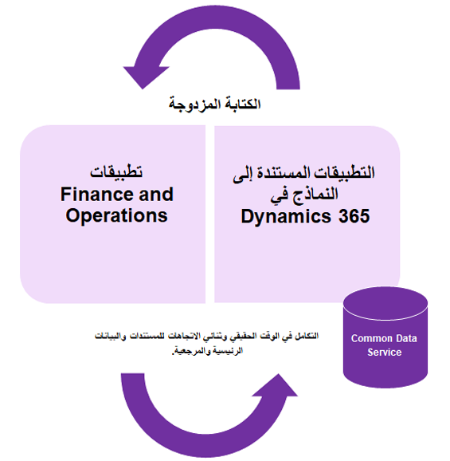
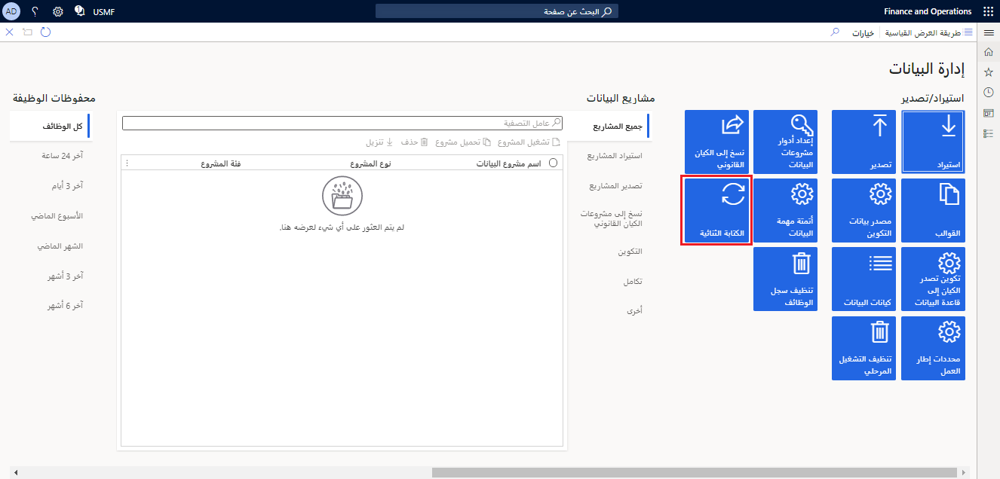

يتيح لك Common Data Model نقل البيانات من أنظمة وتطبيقات متعددة معاً.The Common Data Model lets you bring data from multiple systems and applications together. عندما تحتاج إلى إحضار بيانات من أماكن متعددة، فقد تكون هذه العملية باهظة الثمن وتستغرق وقتاً طويلاً.When you need to bring data from multiple places, this process can be expensive and time consuming. يسمح لك Common Data Model بتجميع بياناتك معاً في عملية مبسطة من خلال توفير لغة بيانات مشتركة لاستخدامها في الأعمال والتطبيقات التحليلية.The Common Data Model allows you to bring your data together in a simplified process by providing a shared data language for business and analytical application to use. يتيح نظام بيانات تعريف Common Data Model إمكانية مشاركة البيانات ومعناها عبر العديد من الأنظمة الأساسية وعمليات الأعمال مثل تطبيقات Power Platform.The Common Data Model metadata system makes it possible for data and its meaning to be shared across multiple platforms and business processes like Power Platform applications. 

يشتمل Common Data Model على مخططات بيانات قابلة للتوسيع محددة مسبقاً ويمكن استخدامها حسب الحاجة.The Common Data Model includes extensible data schemes that are predefined and can be used as needed. تتضمن المخططات الكيانات والسمات وبيانات التعريف الدلالية والعلاقات التي تمثل مفاهيم شائعة الاستخدام داخل المؤسسة مثل **الحساب** أو **الحالة**.The schemas include entities, attributes, semantic metadata, and relationships that represent commonly used concepts within organization such as **Account**, or **Case**. يمكنك استخدام الكيانات القياسية أو توسيع الكيانات القياسية لتناسب احتياجاتك أو إنشاء كيانات مخصصة.You can use the standard entities, extend the standard entities to fit your needs, or create custom entities. 

## السيناريوScenario
قررت شركتك مؤخراً تنفيذ Dynamics 365 for Finance.Your company has recently decided to implement Dynamics 365 for Finance. خارج Finance، تستخدم مؤسستك أيضاً Dynamics 365 Sales.Outside Finance, your organization also uses Dynamics 365 Sales. نظراً لأن كل من هذه التطبيقات مستقل عن بعضها البعض، فلديها هياكل مختلفة تمثل كياناً، على سبيل المثال، **الحساب**.Because each of these applications is independent from each other, they have different structures that represent an entity, for instance, **Account**. قد تكون هذه متشابهة في كل تطبيق ولكنها ليست متشابهة تماماً.These may be similar in each of the applications but not exactly the same. باستخدام Common Data Model، يمكنك إنشاء بياناتك بتنسيق قياسي.By using the Common Data Model, you can build your data in a standardized format. يمكن لكل تطبيق بعد ذلك استخدام نفس البيانات.Each of the applications can then use the same data. 

## Common Data Model وتطبيقات Finance and OperationsThe Common Data Model and Finance and Operations apps
يتضمن Common Data Model البيانات المتوفرة في تطبيقات Finance and Operations.The Common Data Model includes data that is available in Finance and Operations apps. يمكنك إنشاء تطبيقات وملحقات نهائية للمعلومات باستخدام Common Data Model، مما يسمح لك بالتكامل مع تطبيقات وخدمات Microsoft الأخرى.You can build downstream application and extensions using the Common Data Model, allowing you to integrate with other Microsoft application and services. باستخدام Common Data Model وتطبيقات Finance and Operations،  يمكنك استخدام أدوات تحليلية مثل Power BI لدمج البيانات مع تطبيقات أخرى.By using Common Data Model and Finance and Operations apps, you can use analytical tools like Power BI to combine data with other apps. 

يتم وصف كل البيانات في تطبيقات Finance and Operations، بما في ذلك الجداول والكيانات في Common Data Model.All data in Finance and Operations apps, including tables and entities are described in the Common Data Model. سيُمكّنك هذا من دمج البيانات من تطبيقات متعددة بسلاسة وسهولة ضمن مجموعة مقبولة على نطاق واسع من الكيانات القياسية.This will enable you to combine data from multiple applications seamlessly and easily within a broadly accepted set of standard entities. لمعرفة المزيد حول إنشاء الكيانات والعمل معها لCommon Data Model، ارجع إلى وحدة [الشروع في العمل باستخدام Microsoft Dataverse](https://docs.microsoft.com/learn/modules/get-started-with-powerapps-common-data-service/?azure-portal=true).To learn more about creating and working with entities for the Common Data Model, refer to the [Get started with Microsoft Dataverse](https://docs.microsoft.com/learn/modules/get-started-with-powerapps-common-data-service/?azure-portal=true) module.

## Dataverse والكتابة المزدوجةDataverse and dual-write
إذا كنت تستخدم كلا من التطبيقات المستندة إلى النموذج في Dynamics 365، وتطبيقات Finance and Operations، تتيح لك الكتابة المزدوجة دمج البيانات بسلاسة بين التطبيقين.If you are using both model-driven apps in Dynamics 365, and Finance and Operations apps, dual-write lets you seamlessly integrate data between the two applications. على سبيل المثال، قد تستخدم تطبيقات Dynamics 365 Sales وتطبيقات Finance and Operations.For example, you may be using Dynamics 365 Sales, and Finance and Operations apps. يقوم كلا التطبيقين بتخزين بيانات العملاء الخاصة بك.Both applications store your customer data. باستخدام الكتابة المزدوجة، عند إضافة سجل عميل جديد في المبيعات، ستتم إضافة سجل العميل أيضاً في تطبيقات Finance and Operations في الوقت الحقيقي تقريباً.By using dual-write, when a new customer record is added in Sales, the customer record will also be added in Finance and Operations apps in near real time. اتجاه تدفق البيانات متزامن وثنائي الاتجاه.The direction of the data flow is synchronous and bidirectional. يعني هذا أنه يمكنك إدخال البيانات وإخراجها من كلا التطبيقين.This means you can have data going in and out of both applications. 

 

كما يمكن توسيع إطار عمل الكتابة المزدوجة للسماح للمؤسسات بتعديل الوظيفة للعمل وفقاً لعملياتها الفريدة.The dual-write framework is also extensible to allow for organizations to modify the functionality to work according to their unique processes. يمكنك استخدام الكيانات المخصصة وإضافة ملحقات للكيانات الموجودة لتمكين الاستخدام الكامل لـ Dataverse والأدوات لمؤسستك.You can use custom entities, and add extensions to existing entities to enable full use of the Dataverse and tools for your organization. لمعرفة المزيد حول الكتابة المزدوجة، انتقل إلى [نظرة عامة على الكتابة المزدوجة](https://docs.microsoft.com/dynamics365/fin-ops-core/dev-itpro/data-entities/dual-write/dual-write-overview/?azure-portal=true).To learn more about dual-write, go to [Dual-write overview](https://docs.microsoft.com/dynamics365/fin-ops-core/dev-itpro/data-entities/dual-write/dual-write-overview/?azure-portal=true).

## تمكين الكتابة المزدوجة في تطبيقات Finance and OperationsEnable dual-write in Finance and Operations apps
لاستخدام الكتابة المزدوجة وتكوينها، يمكنك البدء بربط بيئة تطبيقات Finance and Operations بـ Dataverse باستخدام **معالج الكتابة المزدوجة**، ثم تمكين خرائط الكيانات.To use and configure dual write, you start by linking your Finance and Operations apps environment to the Dataverse by using the **Dual-write wizard**, and then enable the entity maps.  

لتكوين الكتابة المزدوجة في تطبيقات Finance and Operations، اتبع الخطوات التالية:To configure dual write in Finance and Operations apps, follow these steps:

1.  قم بتسجيل الدخول إلى تطبيقات Finance and Operations.Log in to Finance and Operations apps.
2.  انتقل إلى مساحة عمل **إدارة البيانات**.Navigate to the **Data management** workspace. 
3.  من مساحة عمل **إدارة البيانات**، حدد إطار متجانب **الكتابة المزدوجة**.From the **Data management** workspace, select the **Dual Write** tile. 
    
4.  حدد **ارتباط جديد إلى البيئة**.Select **New link to environment**. سيؤدي هذا إلى تشغيل معالج **إعداد الارتباط بـ Dataverse**.This will launch the **Setup link to Dataverse** wizard. 
5.  في صفحة **اختيار البيئة**، ستحدد البيئة المراد الارتباط بها.On the **Choose environment** page, you will select the environment to link to. ستعرض هذه الصفحة جميع بيئات Dataverse التي يعد المستخدم الذي سجل الدخول إليها مسؤولاً عنها.This page will display all the Dataverse environments that the signed in user is an administrator for. 
6.  حدد الكيانات القانونية الخاصة بك المراد ربطها.Select your legal entities to link. سيتم بعد ذلك إجراء التحقق من السلامة للتحقق من أن نظامك يفي بمتطلبات تمكين الكتابة المزدوجة.A health check will then run to verify that your system meets the requirements for enabling dual-write. 
8.  سيتم عرض ملخص.A summary will display. راجع إشعار الخصوصية والمحتوى، ثم حدد **إنشاء**.Review the privacy notice and content, and then select **Create**. يتم الآن إنشاء ارتباط بين تطبيق Finance and Operations وبيئة Dataverse.A link is now created between your Finance and Operations app and the Dataverse environment. 
10. الآن، يمكنك تطبيق حل تنسيق تطبيق الكتابة المزدوجة.Now, you can apply the dual-write application orchestration solution. 
11. في صفحة **الكتابة المزدوجة** في تطبيقات Finance and Operations، يمكنك تحديد **تطبيق الحل** لتطبيق خرائط الكيانات التي قمت بتنزيلها عند إنشاء الارتباط بين البيئات.In the **Dual-write** page in Finance and Operations apps, you select **Apply solution** to apply the entity maps that you downloaded when the link was created between the environments. 
12. بعد تطبيق الحل، سترى خرائط الكيانات الافتراضية منشورة.After you apply the solution, you will see the default entity maps are published. 
