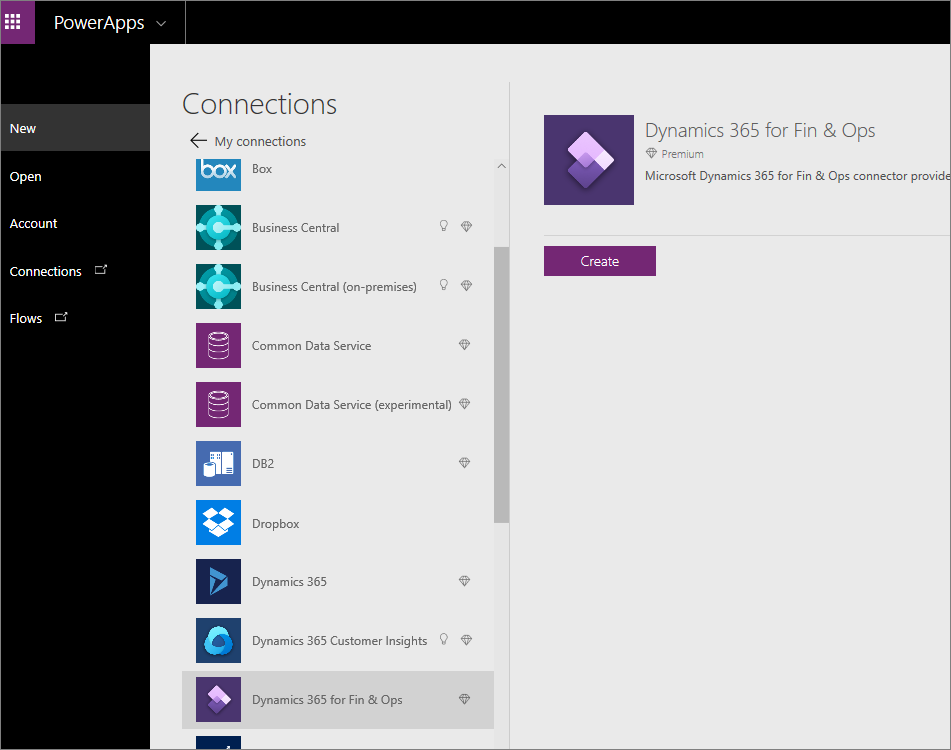
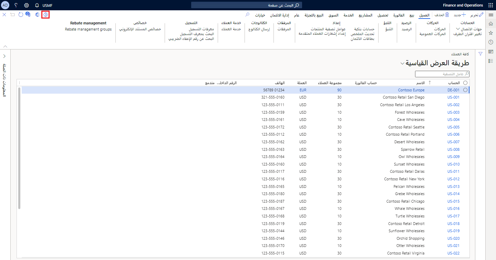
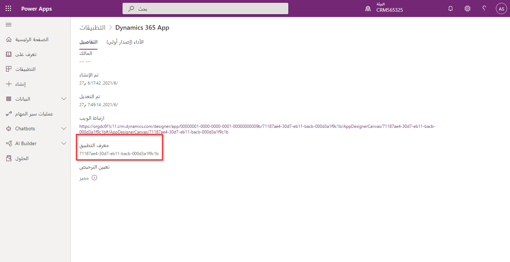

إن Power Apps عبارة عن مجموعة من التطبيقات والخدمات والموصلات ومنصة البيانات التي توفر لك فرصة لإنشاء تطبيقات مخصصة لاحتياجات عملك. باستخدام Power Apps، يمكنك إنشاء تطبيقات أعمال مخصصة بسرعة تتصل ببيانات عملك المخزنة إما في النظام الأساسي للبيانات الأساسية أو في العديد من البيانات عبر الإنترنت والمحلية المصادر (Microsoft Dataverse) أو في مصادر البيانات المختلفة على الإنترنت وفي أماكن العمل (SharePoint، وExcel، وMicrosoft 365، وDynamics 365، وSQL Server، وما إلى ذلك). يمكن أيضاً لـ Power Apps الاتصال بتطبيقات Dynamics 365، بما في ذلك تطبيقات التمويل والعمليات.

مع الوظائف الأصلية لتطبيقات التمويل والعمليات، يمكنك تضمين Power Apps. تتيح الوظيفة للمؤسسات استخدام تطبيقات التمويل والعمليات جنباً إلى جنب مع Power Apps، لتلائم احتياجات الأعمال دون تخصيص كبير. يتيح لك هذا أيضاً الاتصال بالخدمات ومصادر البيانات الأخرى بسهولة بدون خبرة في التطوير.
قبل أن تبدأ في إنشاء تطبيقك، تحتاج إلى معرفة كيفية الاتصال ببيانات تطبيقات التمويل والعمليات الخاصة بك.

تماماً مثل الاتصال ببياناتك باستخدام Power Automate، يجب أن يكون كيان البيانات الذي تستخدمه للوصول إلى البيانات **عام**. تحقق من الخصائص في كيان البيانات لمعرفة ما إذا تم تعيين الخيار **IsPublic** إلى **نعم**.

## قم بالاتصال ببيانات تطبيقات التمويل والعمليات في Power Apps  

اتبع الخطوات التالية للاتصال ببيانات تطبيقات التمويل والعمليات في Power Apps:

1.  حدد كيانات البيانات التي تحتاج إلى استخدامها للوصول إلى البيانات في Power Apps.
2.  يمكنك الوصول إلى **Power Apps** عن طريق الانتقال إلى [Microsoft Power Apps](https://powerapps.microsoft.com/?azure-portal=true).
3.  عندما تقوم بتسجيل الدخول، استخدم الجزء الأيمن للانتقال إلى **Power Apps**.
4.  حدد **التطبيقات** في الجزء الأيسر.
5.  حدد **إنشاء تطبيق** في القائمة العلوية.
6.  حدد نوع التطبيق الذي ترغب في إنشائه.
7.  سيتم تشغيل مصمم موقع الويب، وستحتاج إلى الاتصال بالبيانات الخاصة بك. في هذه الحالة، ستتصل بتطبيقات التمويل والعمليات.
8.  في قسم **ابدأ ببياناتك** على الشاشة، حدد السهم الموجود على الجانب الأيمن من الشاشة لمشاهدة مصادر بيانات إضافية.
9.  في قسم **ابدأ ببياناتك**، حدد **اتصال جديد** لإضافة اتصالك.
10. حدد **Dynamics 365 for Fin & Ops** من قائمة الاتصالات:

    
11. حدد **إنشاء**. 
12. قم بتسجيل الدخول باستخدام تسجيل الدخول إلى تطبيقات التمويل والعمليات للمصادقة.
13. عند المصادقة، حدد المثيل الخاص بك وهو بيئة Dynamics 365 الخاصة بك.
14. بعد تحديد المثيل الخاص بك، حدد الجدول الذي ستعمل به. ضع في اعتبارك أن هذه الكيانات هي كيانات البيانات العامة حيث تملك الأذونات.
15. عند تحديد الجدول، يمكنك تحديد **الاتصال** في الزاوية السفلية اليمنى من الشاشة.

## قم بتضمين Power Apps وتطبيقات الطرف الخارجي في تطبيقات التمويل والعمليات

يمكنك تضمين Power Apps كما يمكنك إنشاء صفحات لتطبيقات التمويل والعمليات. لتضمين Power App في صفحة، اتبع الخطوات التالية:

1. داخل أي صفحة في التطبيق، حدد رمز **Power Apps** في الزاوية العلوية اليمنى من الصفحة:

    
2. حدد **إضافة تطبيق**.
3. اكتب اسم التطبيق في حقل **الاسم**. 
4. الصق معرف التطبيق في حقل **معرف التطبيق**. يمكنك الوصول إلى معرف التطبيق من Power App في صفحة **التفاصيل** في Power Apps: 
5. حدد **سياق الإدخال للتطبيق**.
6. والآن، حدد **حجم التطبيق**. 
7. يمكنك أيضاً تحديد الوصول للكيانات القانونية إذا لزم الأمر باستخدام علامة التبويب السريعة **الكيانات القانونية**.
8. حدد **إدراج**

بالإضافة إلى تضمين Power Apps في Dynamics 365، يمكنك أيضاً تضمين تطبيقات جهات خارجية. قد تحتاج إلى القيام بذلك إذا كنت قد قمت بالفعل بتطوير تطبيق داخلي أو مع شريك.  تتشابه عملية تضمين تطبيقات الجهات الخارجية بتضمين Power Apps. عند تضمين تطبيقات الجهات الخارجية، يمكنك اختيار تضمين التطبيق في صفحة علامة تبويب داخل الصفحات الموجودة في التطبيق.

لتضمين تطبيق جهة خارجية، التطوير مطلوب. تمت إضافة عنصر تحكم مضيف موقع الويب داخل بيئة المطور في Visual Studio للسماح للمطورين بإضافة تطبيقات الجهات الخارجية مباشرةً إلى صفحات التمويل والعمليات. 
