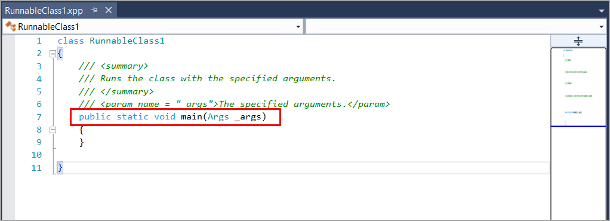

الصنف عبارة عن بناء برمجي يعبر عن بيانات وأساليب الكائنات، والتي يتم إنشاؤها لاحقاً من تلك الفئة.A class is a software construct that expresses the data and methods of the objects, which are later constructed from that class. يشار إلى هذه الكائنات أيضاً على أنها أمثلة.These objects are also referred to as instances. تحدد البيانات في فئة ما حالة الكائن، وتحدد الأساليب في فئة سلوك هذا الكائن.Data in a class defines the state of an object, and the methods in a class define the behavior of that object. الأساليب هي سلسلة من العبارات التي تعمل على البيانات في فئة.Methods are a sequence of statements that operate on the data in a class. 

عادة ما يتم الإعلان عن الأساليب للعمل على متغيرات الحالة للفئة.Usually, methods are declared to operate on the instance variables of a class. يشار إلى هذه الأساليب باسم أساليب المثيل أو الكائن.These methods are referred to as instance or object methods. متغير المثيل هو متغير مرتبط داخل المثيل أو داخل كائن تم إنشاء مثيل له، على عكس متغير ثابت أو متغير فئة مرتبط بفئة.An instance variable is a variable that is bound within the instance or within an instantiated object, as opposed to a static or class variable that is bound to a class. 

يمكنك إضافة فئة إلى مشروعك في **مستكشف الحلول**.You can add a class to your project in **Solution Explorer**. بالإضافة إلى ذلك، يمكنك تحديد نوع الفئة الذي تريد إنشاءه أثناء هذه العملية.Additionally, you can select the type of class that you want to create during this process.

1.  في Visual Studio، أثناء التشغيل كمسؤول، انتقل إلى **مستكشف الحلول**.In Visual Studio, while running as an administrator, go to **Solution Explorer**.
2.  انقر بزر الماوس الأيمن فوق مشروع الخاص بك.Right-click your project.
3.  حدد **إضافة > عنصر جديد**.Select **Add > New Item**.
4.  ضمن **عناصر Dynamics 365**، حدد **رمز**.Under **Dynamics 365 Items**, select **Code**.
5.  حدد إما **فئة** أو **فئة قابلة للتشغيل (وظيفة)**، حسب الغرض من الفئة.Select either **Class** or **Runnable Class (Job)**, depending on the purpose of the class.
6.  أدخل اسماً للفئة.Enter a name for the class.
7.  حدد **إضافة** لإضافة الفئة إلى مشروعك.Select **Add** to add the class to your project.

عندما تقوم بإنشاء فئة، يتم الإعلان عنها كـ `public`، حتى إذا قمت بإزالة معدل `public`.When you are creating a class, it is declared as `public`, even if you remove the `public` modifier. بالاضافه إلى معدل `public`، يمكنك إضافة معدلات `final` و/أو `extends`.In addition to the `public` modifier, you can add the `final` and/or `extends` modifiers. يساعد استخدام معدل `final` على منع وراثة الفئة.Using the `final` modifier helps prevent the class from being inherited. يتم استخدام معدل `extends` عندما تكون الفئة الخاصة بك مشتقة من فئة أخرى.The `extends` modifier is used when your class is derived from another class.

تشبه الفئة القابلة للتشغيل لتطبيقات Finance and Operations، والتي كانت تُعرف سابقاً كوظيفة، فئة قياسية، فيما عدا أنها تحتوي على أسلوب `main`.A runnable class for Finance and Operations apps, known previously as a job, is similar to a standard class, except that it contains a `main` method. يمكنك إضافة أساليب يدوياً إلى الفئة الخاصة بك بما في ذلك أسلوب رئيسي.You can manually add methods to your class, including a main method. سيتم توضيح الأساليب بتفاصيل إضافية في الوحدة التالية.Methods will be described in further detail in the next unit.
توضح اللقطة التالية نافذة محرر الرمز عند إنشاء فئة قابلة للتشغيل باسم `RunnableClass1`.The following screenshot shows the code editor window when you create a runnable class named `RunnableClass1`.

