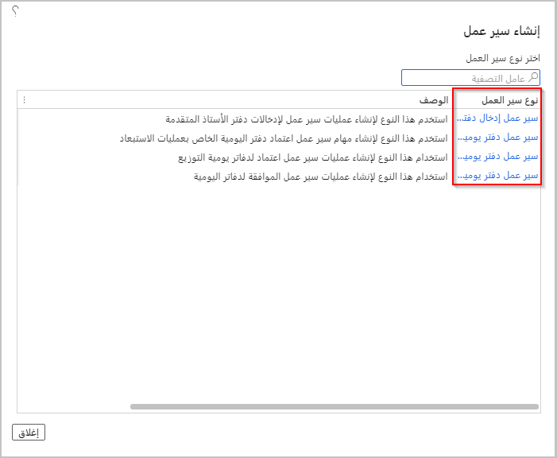
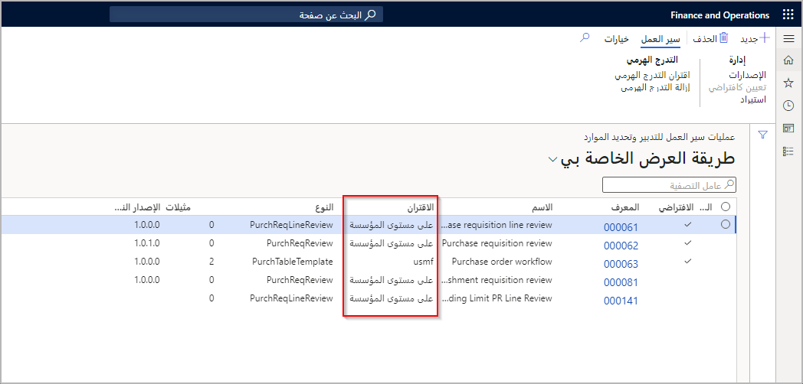

تتوفر مهام سير العمل عبر العديد من المناطق المختلفة لتطبيقات Finance and Operations.

في تطبيقات Finance and Operations، يتم تعريف مصطلح سير العمل بطريقتين:

- **سير العمل كنظام** - يوفر هذا النظام وظائف يمكن استخدامها لإنشاء عمليات سير عمل فردية أو عمليات أعمال.

- **سير العمل كعملية أعمال** - تحدد عملية الأعمال هذه كيفية تدفق المستند عبر النظام من خلال عرض الشخص الذي يجب عليه معالجته والموافقة عليه.

كما ذكرنا، يمثل سير العمل عملية أعمال. وهي تحدد كيف يتدفق المستند، أو ينتقل، عبر النظام من خلال إظهار من يجب عليه إكمال مهمة، أو اتخاذ قرار إما باستخدام ضوابط قرار يدوي أو شرطي، أو الموافقة على مستند. لبدء سير العمل أولاً، قم بتكوين إما عنصر موافقة أو سير عمل فرعي أو مهمة. بعد ذلك، سيتم إرساله للموافقة عليه لإكمال سير العمل.

لفهم مهام سير العمل بشكل أفضل، ضع في اعتبارك السيناريو التالي.
افترض أن Sam قدم تقرير مصاريف بمبلغ 8000.00 دولار أمريكي. في هذا السيناريو، يجب على Ivan مراجعة الإيصالات التي يوجهها Sam إليه. ثم يجب أن يوافق Frank وSue على تقرير المصروفات.

يمكن أن يكون لديك مهام سير عمل متعددة من نفس النوع. على سبيل المثال، افترض أنك تقوم بإنشاء مهام سير عمل طلب الشراء لكل بلد أو منطقة تعمل فيها. قد ترغب في تسمية سير عمل طلب الشراء باسم طلبات الشراء الدنماركية أو طلبات الشراء الإسبانية.

## تعريف أنواع سير العمل

يعتمد تكوين سير العمل على نوع سير العمل. يمكنك إنشاء تكوينات متعددة لسير العمل لكل نوع من أنواع سير العمل.

تتوفر أنواع سير العمل للعديد من الوحدات في النظام بالكامل. على سبيل المثال، في صفحة **دفتر الأستاذ العام > إعداد دفتر اليومية > مهام سير عمل دفتر الأستاذ العام**، حدد **جديد** لعرض أنواع سير العمل المتاحة.

يتوافق كل نوع من أنواع سير العمل مع نوع دفتر اليومية في وحدة معينة. يجب إنشاء تكوين سير عمل واحد لكل نوع دفتر يومية يتم استخدامه مع موافقات سير العمل.

حسب التصميم، تتم مشاركة بعض مهام سير العمل عبر العديد من الكيانات القانونية، والتي نعرفها باسم مهام سير العمل على مستوى المؤسسة، بينما تكون الأنواع الأخرى من مهام سير العمل خاصة بكيان قانوني.

يمكنك تحديد ارتباط سير العمل بمؤسستك من خلال قيمة الحقل في صفحة قائمة مهام سير العمل لكل وحدة في تطبيقات Finance and Operations، كما هو موضح في الشكل.

بعض الوحدات النمطية ليس لديها أي نوع سير العمل على الإطلاق. بدلاً من ذلك، لا يوجد نوع سير العمل الذي تحتاجه للتعامل مع متطلبات عمل معينة. إذا كانت هذه هي الحالة، يمكن لفريق التطوير لديك إنشاء أنواع جديدة لسير العمل في تطبيقات Finance and Operations باستخدام Visual Studio.

قبل التخطيط لإنشاء سير عمل جديد، من الأفضل دائماً معرفة ما إذا كان من الممكن استخدام أي مهام سير عمل جاهزة في تطبيقات Finance and Operations بدلاً من إنشاء مهمة جديدة.
يمكنك دائماً إنشاء إصدار جديد من سير عمل موجود وتعديله بطريقة تلبي متطلبات العمل الخاصة بالعميل.

في حالة عدم وجود سير عمل لمتطلبات معينة، أو عدم وجود مهام سير عمل جاهزة يمكنها تلبية المتطلبات، يمكن لفريق التطوير لديك إنشاء قوالب سير عمل جديدة.

تتوفر عدة أنواع من قوالب سير العمل الجاهزة في تطبيقات Finance and Operations.

## أنواع سير عمل دفتر الأستاذ العام

تتوفر أنواع سير العمل التالية لدفتر الأستاذ العام. كل نوع يتوافق مع نوع دفتر اليومية:

- **سير عمل دفتر اليومية اليومي في دفتر الأستاذ** - استخدم هذا النوع لإنشاء عمليات سير عمل الموافقة لدفاتر اليومية.
- **سير عمل دفتر يومية توزيعات دفتر الأستاذ** - استخدم هذا النوع لإنشاء عمليات سير عمل الموافقة لدفاتر يومية التوزيعات.
- **سير عمل دفتر يومية عمليات حذف دفتر الأستاذ** - استخدم هذا النوع لإنشاء مهام سير عمل الموافقة لدفتر يومية عمليات الحذف.
- **سير عمل إدخالات دفتر الأستاذ المتقدم** - استخدم هذا النوع لإنشاء مهام سير عمل الموافقة لإدخالات دفتر الأستاذ المتقدم.

## أنواع سير عمل الحسابات الدائنة

تتوفر أنواع سير العمل التالية للحسابات الدائنة:

- **الموافقة على فاتورة الشحن** - يدعم سير العمل هذا الموافقة على الفاتورة.
- **سير عمل بند فاتورة المورد** - استخدم هذا النوع لإنشاء سير عمل مراجعة لبنود فاتورة المورد.
- **سير عمل دفتر اليومية للموافقة على فاتورة المورد** - استخدم هذا النوع لإنشاء مهام سير عمل الموافقة لدفاتر يومية الموافقة على فواتير المورّد.
- **سير عمل تغييرات المورد المقترحة** - الموافقة على تغيير المورد المقترح.
- **سير عمل دفتر يومية مصروفات المورد** - استخدم هذا النوع لإنشاء مهام سير عمل الموافقة لدفاتر يومية مصروفات المورد.
- **سير عمل دفتر اليومية لفاتورة المورد** - استخدم هذا النوع لإنشاء مهام سير عمل الموافقة لدفاتر يومية تسجيل فواتير المورّدين.
- **سير عمل دفتر يومية السند الإذني لتسوية المورد** - استخدم هذا النوع لإنشاء مهام سير عمل الموافقة لسير عمل دفتر يومية السند الإذني لتسوية المورد.
- **سير عمل دفتر اليومية للسندات الإذنية لإعادة سحب المورد** - استخدم هذا النوع لإنشاء مهام سير عمل الموافقة لدفاتر يومية السندات الإذنية لإعادة سحب المورد.
- **سير عمل فاتورة المورد** - استخدم هذا النوع لإنشاء مهام سير عمل مراجعة لفواتير المورّدين.
- **سير عمل دفتر يومية حوالات بنك المورد** - استخدم هذا النوع لإنشاء مهام سير عمل الموافقة لدفاتر يومية حوالات بنك المورد.
- **سير عمل دفتر اليومية لسجل فاتورة المورد** - استخدم هذا النوع لإنشاء مهام سير عمل الموافقة لدفاتر يومية سجل فاتورة المورد.
- **سير عمل دفتر اليومية للسندات الإذنية لسحب المورد** - استخدم هذا النوع لإنشاء مهام سير عمل الموافقة لدفاتر يومية السندات الإذنية لسحب المورد.

## أنواع سير عمل حسابات المقبوضات

تتوفر أنواع سير العمل التالية لحسابات المقبوضات:

- **سير عمل الفواتير ذات النص الحر للعميل** - استخدم هذا النوع لإنشاء مهام سير عمل الموافقة للفواتير ذات النص الحر.
- **سير عمل كمبيالة السحب للعميل** - استخدم هذا النوع لإنشاء سير عمل الموافقة لدفاتر يومية كمبيالة سحب العميل.
- **سير عمل كمبيالة التسوية للعميل** - استخدم هذا النوع لإنشاء سير عمل الموافقة لدفاتر يومية كمبيالة التسوية للعميل.
- **سير عمل كمبيالة إعادة سحب العميل** - استخدم هذا النوع لإنشاء سير عمل الموافقة لدفاتر يومية كمبيالة إعادة سحب العميل.
- **سير عمل دفع العميل** - استخدم هذا النوع لإنشاء مهام سير عمل الموافقة لدفاتر يومية دفع العميل.
- **سير عمل كمبيالة اعتراض العميل** - استخدم هذا النوع لإنشاء سير عمل الموافقة لدفاتر يومية كمبيالة اعتراض العميل.
- **سير عمل تغيير العميل المقترح** - الموافقة على تغيير العميل المقترح.
- **سير عمل الفواتير المتكررة للعميل** - استخدم هذا النوع لإنشاء مهام سير عمل الموافقة للفواتير المتكررة.
- **سير عمل دفتر يومية حوالات بنك العميل** - استخدم هذا النوع لإنشاء مهام سير عمل الموافقة لدفاتر يومية حوالات بنك العميل.

## أنواع سير عمل إعداد الموازنة

تتوفر أنواع سير العمل التالية لإعداد الموازنة:

- **سير عمل خطة الموازنة** - استخدم هذا النوع لإنشاء مهام سير العمل ومراجعتها لخطط الموازنة.
- **سير عمل إدخالات سجلات الموازنة** - استخدم هذا النوع لإنشاء مهام سير العمل ومراجعتها لإدخالات سجلات الموازنة.
- **سير عمل إدخالات حساب الموازنة** - استخدم هذا النوع لإنشاء مهام سير العمل ومراجعتها لإدخالات حساب الموازنة.
- **سير عمل الموافقة على الالتزامات** - استخدم هذا القالب لإنشاء مهام سير عمل الموافقة لمستندات الالتزام.
- **سير عمل حجز الموازنة العامة** - استخدم هذا القالب لمراجعة مستندات حجز الموازنة العامة.

## أنواع سير عمل إدارة النقد والبنوك

يتوفر نوع سير العمل التالي لإدارة النقد والبنوك:

- **سير عمل الموافقة على دفتر اليومية للتسوية البنكية** - استخدم هذا النوع لإنشاء مهام سير عمل الموافقة لدفاتر يومية التسوية البنكية.

## أنواع سير عمل إدارة المصروفات

تتوفر أنواع سير العمل التالية لإدارة المصروفات:

- **سير عمل طلبات السفر** - استخدم هذا النوع لإنشاء عمليات سير عمل الموافقة لطلبات السفر.
- **الترحيل التلقائي لعناصر بنود المصروفات** - استخدم هذا النوع لإنشاء مهام سير العمل للترحيل التلقائي لعناصر البنود لتقارير المصروفات.
- **الترحيل التلقائي لتقارير المصروفات** - استخدم هذا النوع لإنشاء مهام سير العمل للترحيل التلقائي للمستندات لتقارير المصروفات.
- **عنصر بند المصروفات** - استخدم هذا النوع لإنشاء موافقات على عناصر البنود لتقارير المصروفات.
- **استرداد ضريبة القيمة المضافة** - استخدم هذا النوع لإنشاء عمليات سير عمل الموافقة لاسترداد ضريبة القيمة المضافة.
- **طلب سلفة نقدية** - استخدم هذا النوع لإنشاء مهام سير عمل الموافقة لطلبات السلف النقدية.
- **تقرير المصروفات** - استخدم هذا النوع لإنشاء عمليات الموافقة على المستندات لتقارير المصروفات.

## أنواع سير عمل إدارة الأصول الثابتة

تتوفر أنواع سير العمل التالية للأصول الثابتة:

- **سير عمل دفتر يومية الأصول الثابتة لترحيل دفتر الأستاذ** - استخدم هذا النوع لإنشاء عمليات سير عمل الموافقة لدفاتر يومية الأصول الثابتة للترحيل.
- **سير عمل دفتر يومية موازنة الأصول الثابتة لدفتر الأستاذ** - استخدم هذا النوع لإنشاء عمليات سير عمل الموافقة لدفاتر يومية موازنة الأصول الثابتة.

## أنواع سير عمل الموارد البشرية

تتوفر أنواع سير العمل التالية للموارد البشرية:

- **تجربة مشروع العامل** - استخدم هذا النوع لإنشاء مهام سير عمل تجارب مشروع العامل من الخدمة الذاتية للموظف.
- **نقل العامل** - استخدم هذا النوع لإنشاء مهام سير عمل لنقل العمال باستخدام إجراءات الموظفين.
- **سير عمل إجراءات الموارد البشرية** - استخدم هذا النوع لإنشاء مهام سير عمل لإجراءات الموظفين، مثل إنشاء وظائف جديدة أو لتعديل المناصب.
- **تغيير تعويض العامل الثابت** - استخدم هذا النوع لإنشاء مهام سير عمل لطلب تغييرات تعويض ثابتة للعمال باستخدام إجراءات الموظفين.
- **موضع ثقة العامل** - استخدم هذا النوع لإنشاء تدفقات عمل لمواضع ثقة العمال من الخدمة الذاتية للموظف.
- **دورات العمال** - استخدم هذا النوع لإنشاء مهام سير عمل لدورات العمال من الخدمة الذاتية للموظف.
- **المبلغ المعار للعمال** - استخدم هذا النوع لإنشاء مهام سير عمل للعناصر المعارة للعمال من الخدمة الذاتية للموظف.
- **مراجعة العامل** - استخدم هذا النوع لإنشاء مهام سير عمل لمراجعة العامل.
- **صورة العامل** - استخدم هذا النوع لإنشاء مهام سير عمل لصور العمال من الخدمة الذاتية للموظف.
- **تعليم العمال** - استخدم هذا النوع لإنشاء مهام سير عمل لتعليم العمال من الخدمة الذاتية للموظف.
- **رقم تعريف العامل** - استخدم هذا النوع لإنشاء مهام سير عمل لرقم تعريف العامل من الخدمة الذاتية للموظف.
- **مهارات العمال** - استخدم هذا النوع لإنشاء مهام سير عمل لمهارات العمال من الخدمة الذاتية للموظف.
- **شهادات العمال** - استخدم هذا النوع لإنشاء مهام سير عمل لشهادات العمال من الخدمة الذاتية للموظف.
- **تعيين العامل** - استخدم هذا النوع لإنشاء مهام سير عمل لتعيين العمال باستخدام إجراءات الموظفين.
- **تجربة العمال الاحترافية** - استخدم هذا النوع لإنشاء مهام سير عمل تجارب العمال الاحترافية من الخدمة الذاتية للموظف.
- **تسجيل دورات العمال** - استخدم هذا النوع لإنشاء مهام سير عمل لتسجيل دورات العمال.
- **إنهاء عمل العامل** - استخدم هذا النوع لإنشاء مهام سير عمل لإنهاء عمل العمال باستخدام إجراءات الموظفين.

## أنواع سير عمل المؤسسة

تتوفر أنواع سير العمل التالية للمؤسسة:

- **سير عمل حدود التوقيع** - استخدم هذا القالب لإنشاء سير عمل لمراجعة طلبات حدود التوقيع.
- **سير عمل إدارة الحالات** - استخدم هذا النوع لإنشاء سير عمل للحالات.
- **معالجة المستندات** - نوع سير العمل لمعالجة المستندات.

## أنواع سير عمل التدبير والتوريد

تتوفر أنواع سير العمل التالية للتدبير والتوريد:

- **سير عمل إخطار استلام الفاتورة** - استخدم هذا النوع لإنشاء فاتورة سير عمل إعلام استلام الفاتورة لإيصالات استلام المنتجات غير المؤكدة.
- **سير عمل إخطار فشل إيصالات استلام المنتجات** - استخدم هذا النوع لإنشاء فاتورة سير عمل إعلام استلام الفاتورة لإيصالات استلام المنتجات الفاشلة.
- **الموافقة على خصم المورد** - نوع الموافقة على سير عمل خصم المورد.
- **سير عمل الموافقة على اتفاقيات الشراء** - استخدم هذا النوع لإنشاء مهام سير عمل الموافقة لاتفاقيات الشراء.
- **سير عمل بنود أوامر الشراء** - استخدم هذا النوع لإنشاء مهام سير عمل المراجعة والموافقة لبنود أوامر الشراء.
- **سير عمل إخطار رفض إيصال استلام المنتجات غير المؤكد** - استخدم هذا النوع لإنشاء مهام سير عمل الإخطارات لإيصالات استلام المنتجات غير المؤكدة المرفوضة.
- **مراجعة بنود طلبات الشراء** - استخدم هذا النوع لإنشاء مهام سير عمل لبنود طلبات الشراء.
- **الموافقة على استيراد الكتالوج** - استخدم هذا النوع لإنشاء مهام سير عمل المراجعة للكتالوجات التي تم استيرادها.
- **سير عمل إخطار تاريخ استحقاق التسليم** - استخدم هذا النوع لإنشاء مهام سير عمل إخطار تاريخ استحقاق التسليم لإيصالات استلام المنتجات غير المؤكدة.
- **سير عمل تطبيق إضافة الموردين** - استخدم هذا النوع لإنشاء مهام سير عمل الموافقة لطلبات تطبيق إضافة الموردين.
- **سير عمل أوامر الشراء** - استخدم هذا النوع لإنشاء مهام سير عمل المراجعة والموافقة لأوامر الشراء.
- **الموافقة على منتج استيراد الكتالوج** - استخدم هذا النوع لإنشاء مهام سير عمل المراجعة لمنتجات الكتالوج التي تم استيرادها.
- **مراجعة طلبات الشراء** - استخدم هذا النوع لإنشاء مهام سير عمل طلبات الشراء.

## أنواع سير عمل إدارة المشاريع ومحاسبتها

تتوفر أنواع سير العمل التالية لإدارة المشاريع ومحاسبتها:

- **سير عمل مراجعة الموازنة الأصلية** - استخدم هذا النوع لمراجعة الموازنة الأصلية.
- **سير عمل مراجعة بنود الجدول الزمني** - استخدم هذا النوع لمراجعة أحد بنود الجدول الزمني.
- **سير عمل طلب عروض الأسعار** - استخدم هذا النوع لمراجعة طلبات عروض الأسعار.
- **سير عمل بمود طلبات الموارد** - استخدم هذا النوع لمراجعة بنود طلبات الموارد.
- **سير عمل مراجعة الجدول الزمني** - استخدم هذا النوع لمراجعة الجدول الزمني.
- **سير عمل مراجعة اقتراحات فواتير المشاريع** - استخدم هذا النوع لمراجعة اقتراحات فواتير المشاريع.
- **سير عمل راجعة عروض أسعار المشاريع** - استخدم هذاالنوع لمراجعة عروض أسعار المشاريع.
- **سير عمل مراجعة الموازنة** - استخدم هذا النوع لمراجعة الموازنة.

## أنواع سير عمل إدارة المخزون

- **دفتر يومية تسوية المخزون** - أنشئ سير عمل الموافقة لدفاتر يومية التسوية.
- **دفتر يومية قائمة مكونات صنف المخزون** - أنشئ سير عمل الموافقة لدفاتر يومية قائمة مكونات الصنف.
- **دفتر يومية جرد المخزون** - أنشئ سير عمل الموافقة لدفاتر يومية الجرد.
- **دفتر يومية حركة المخزون** - أنشئ سير عمل الموافقة لدفاتر يومية الحركة.
- **دفتر يومية تغيير ملكية المخزون** - أنشئ سير عمل الموافقة لدفاتر يومية تغيير الملكية.
- **دفتر يومية جرد علامات المخزون** - أنشئ سير عمل الموافقة لدفاتر يومية جرد العلامات.
- **دفتر يومية نقل المخزون** - أنشئ سير عمل الموافقة لدفاتر يومية النقل.

## أنواع سير عمل Commerce

تتوفر أنواع سير العمل التالية لـ Commerce:

- **سير عمل بنود مبيعات البيع بالتجزئة** - استخدم هذا النوع لمراجعة تجاوز أسعار بنود مبيعات البيع بالتجزئة.
- **سير عمل بنود كتالوج البيع بالتجزئة** - نوع سير عمل الموافقة على كتالوج البيع بالتجزئة.
- **سير عمل بنود عروض أسعار البيع بالتجزئة** - استخدم هذا النوع لمراجعة تجاوز أسعار بنود عروض أسعار مبيعات البيع بالتجزئة.

## أنواع سير عمل المبيعات والتسويق

يتوفر نوع سير العمل التالي للمبيعات والتسويق:

- **إنشاء سير عمل خصم العميل** - نوع سير عمل خصم العميل

## أنواع سير عمل الوقت والحضور

تتوفر أنواع سير العمل التالية للوقت والحضور:

- **سير عمل تسجيل دفتر اليومية للوقت والحضور** - استخدم هذا النوع لإنشاء مهام سير عمل الموافقة لسجلات تسجيل دفتر اليومية للوقت والحضور
- **إجمالي سير العمل لأيام الوقت والحضور** - استخدم هذا النوع لإنشاء عمليات سير عمل الموافقة لسجلات إجمالي أيام الوقت والحضور.

> [!NOTE]
> لمواكبة قائمة مهام سير العمل المتوفرة، ارجع إلى [تقرير أنواع سير العمل](/dynamics365/fin-ops-core/fin-ops/organization-administration/workflow-types-report?azure-portal=true&toc=/dynamics365/supply-chain/toc.json).
