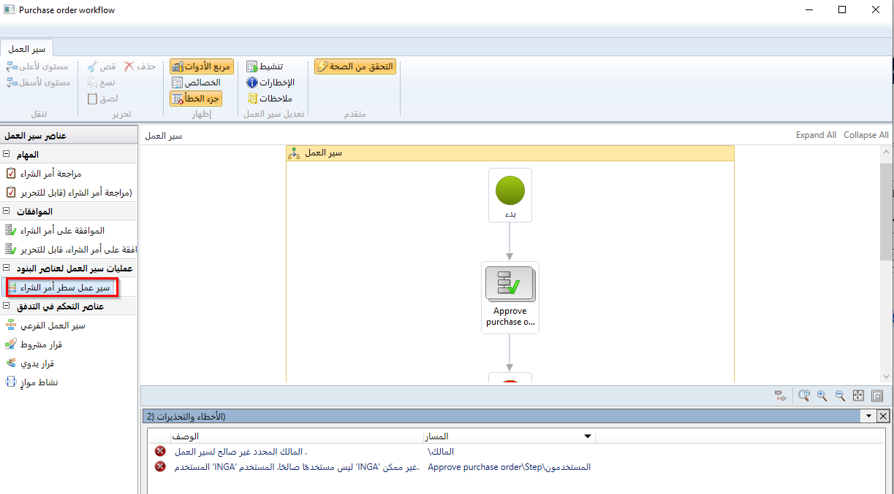
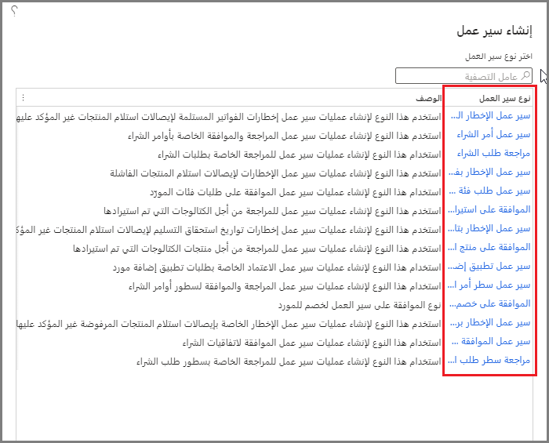
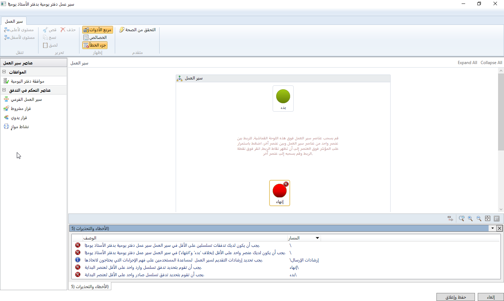
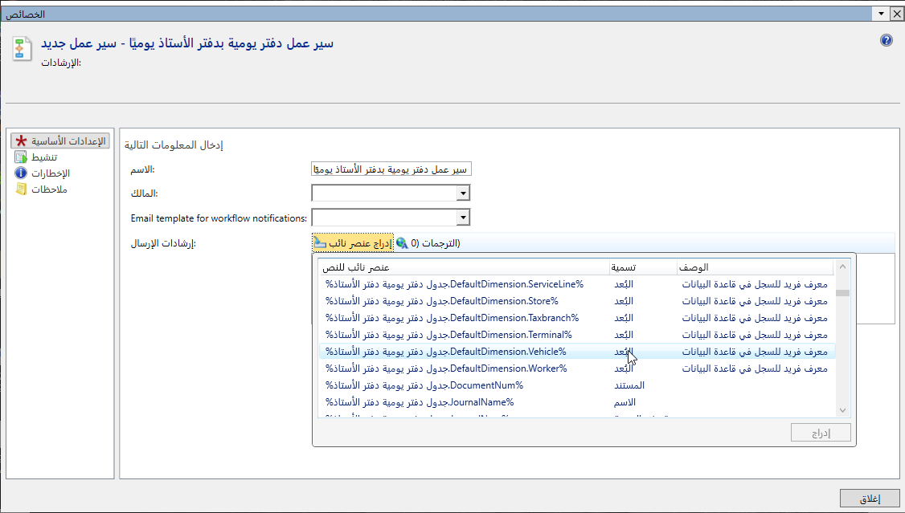
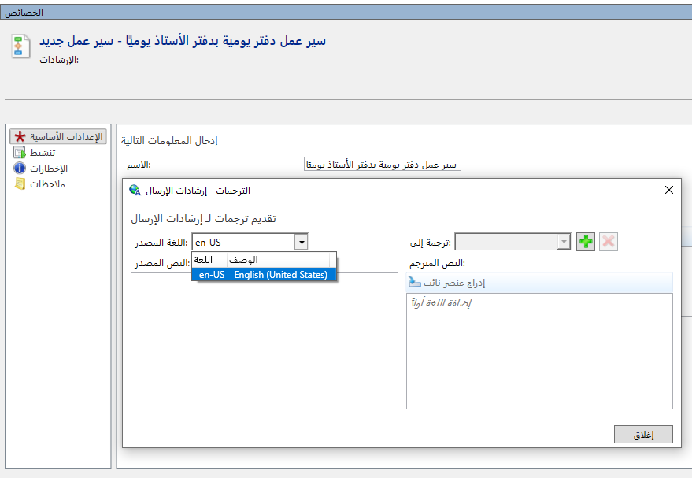

يمكن وصف سير العمل على أنه المهام والخطوات الإجرائية والأشخاص المطلوب منهم إدخال المعلومات وإخراجها والأدوات اللازمة لكل خطوة في عملية الأعمال. 

ويوجد في نهاية هذه الوحدة مقطع فيديو يوضح لك العملية. 

العملية الشاملة لإنشاء سير العمل هي كما يلي:

1. حدد نوع سير العمل من وحدة تطبيقات التمويل والعمليات من صفحة قائمة **دفتر الأستاذ العام > إعداد دفتر الأستاذ > إنشاء مهام سير عمل دفتر الأستاذ**.
2. حدد **جديد** لعرض سير عمل وتحديد في عمود **نوع سير العمل** لفتح **محرر سير العمل**. 
    > [!NOTE]
    >  سيؤدي هذا إلى تشغيل تطبيق يتطلب بيانات اعتماد تسجيل الدخول.
3. تحتوي منطقة **عناصر سير العمل** الخاصة بمحرر سير العمل على العناصر التي يمكن إضافتها إلى سير العمل. لإضافة عناصر إلى سير العمل، اسحبه إلى اللوحة.
4. لتوصيل عنصر سير عمل واحد بآخر، اضغط باستمرار على المؤشر فوق العنصر إلى أن تظهر نقاط الاتصال. انقر على نقطة اتصال وقم بسحبها إلى عنصر آخر. تأكد من توصيل جميع العناصر.
5. قم بتكوين خصائص سير العمل.
6. قم بتكوين عناصر سير العمل.
7. قم بحل أي أخطاء أو تحذيرات.
8. احفظ سير العمل وقم بتنشيطه.

### عناصر سير العمل 

يتكون سير العمل من العناصر التالية:

- **المهام** - المهمة هي وحدة عمل يجب تنفيذها. يمكن إضافة نوعين من المهام إلى سير العمل: يدوي وتلقائي.
- **عمليات الموافقة** - عملية الموافقة هي عملية تتكون من خطوات منفصلة.
- **عناصر سير عمل صنف البند** - يمكن إنشاء سير عمل لمعالجة المستندات أو أصناف البنود في المستند.
- **عناصر التحكم في التدفق** - من الأمثلة على عناصر التحكم في التدفق القرارات اليدوية والشرطية، بالإضافة إلى النشاط الموازي وسير العمل الفرعي.

### المهمة اليدوية 

المهمة اليدوية هي وحدة عمل يجب أن يقوم بها المستخدم. على سبيل المثال، يمكن أن يحتوي سير عمل تقرير المصروفات على مهام يدوية تتطلب من المستخدمين المعينين إكمال الإجراءات التالية:

- راجع الإيصالات التي يتم إرسالها مع تقرير المصروفات.
- اتصل بمدير الموظف.

### مهمة مؤتمتة 

المهمة المؤتمتة هي وحدة عمل يجب أن يؤديها النظام. لا يوجد أي تفاعل بشري مطلوب. على سبيل المثال، يمكن أن يكون لسير عمل أمر المبيعات مهام تلقائية تتطلب من النظام إكمال الإجراءات التالية:

- إجراء فحص ائتمان.
- إنشاء سجل عميل للعميل في حاله عدم وجود سجل بالفعل.

### عمليات الموافقة 

في كل خطوة موافقة، يمكن للمستخدم تنفيذ الإجراءات التالية:

- الموافقة على المستند.
- رفض المستند.
- طلب تغيير في المستند.
- تعيين المستند لمستخدم آخر للموافقة.

### عناصر سير عمل أصناف البنود 

يمكنك إضافة عنصر سير عمل صنف البند إلى سير عمل المستند الخاص به. على سبيل المثال، يمكن إضافة سير عمل بند أمر الشراء إلى سير عمل أمر الشراء كما هو موضح في الشكل التالي.
 
 عند تشغيل عنصر صنف البند، يتم إرسال كل صنف بند في المستند للمعالجة. قد ترغب في أن تتم معالجة جميع أصناف البند بواسطة نفس سير عمل صنف البند، أو قد ترغب في معالجة كل صنف بند بواسطة سير عمل مختلف لصنف البند.

### قرار يدوي 

القرار اليدوي هو النقطة التي ينقسم فيها سير العمل إلى فرعين. يجب على المستخدم اتخاذ قرار، ويحدد هذا القرار الفرع المستخدم لمعالجة المستند الذي تم إرساله.

### قرار شرطي 

القرار الشرطي هو أيضاً نقطة ينقسم فيها سير العمل إلى فرعين. ومع ذلك، يقرر النظام أي فرع يتم استخدامه لمعالجة المستند الذي تم إرساله. لاتخاذ هذا القرار، يقوم النظام بتقييم المستند لتحديد ما إذا كان يفي بالشروط المحددة أو لا.

### نشاط موازٍ 

النشاط الموازي هو عنصر سير العمل الذي يشمل فرعي سير عمل أو أكثر يعملون في نفس الوقت.

### سير العمل الفرعي 

سير العمل الفرعي هو سير العمل الذي يتم تشغيله في سياق سير عمل آخر.

## محرر سير العمل بنقرة واحدة ##
محرر سير العمل هو واجهة رسومية يمكنك استخدامها لإنشاء مهام سير عمل تطبيقات التمويل والعمليات من خلال ترتيب عناصر سير العمل على سطح التصميم.

لفتح محرر سير العمل، حدد نوع سير العمل لفتح **محرر سير العمل بنقرة واحدة**.

 
هذا مشابه لكيفية نمذجة عملية الأعمال بيانياً باستخدام Microsoft Visio. يمكنك إضافة عناصر سير العمل وحذفها وتغيير موضعها بحيث تكون نموذجاً دقيقاً لعمليات الأعمال التي تريد تنفيذها تلقائياً.

تتضمن مكونات محرر سير العمل:

- **جزء الإجراءات** - يحتوي جزء الإجراءات الذي يتم تشغيله على طول الجزء العلوي من محرر سير العمل على أزرار يمكنك استخدامها للتنقل في سير العمل ونسخ عناصر سير العمل ولصقها وتكوين الخصائص. لتكوين خصائص سير العمل بالكامل، حدد اللوحة. لتكوين خصائص عنصر سير عمل معين، حدد هذا العنصر.
- **عناصر سير العمل** - يتكون سير العمل من عناصر مختلفة. يمكن أن تكون هذه العناصر مهام أو عمليات موافقة أو عناصر تحكم في التدفق. يمكن إضافة عناصر سير العمل إلى سير العمل الذي تقوم بإنشائه. لإضافة عناصر، اسحبها من منطقة **عناصر سير العمل** إلى اللوحة.
- **اللوحة** - اللوحة هي المنطقة الرئيسية حيث يمكن ترتيب عناصر سير العمل. تتم الإشارة إلى تدفق عملية الأعمال التي تصممها بواسطة الموصلات التي تنضم إلى العناصر. يمكن أن تحتوي بعض العناصر على عناصر أخرى، والتي بدورها تنشئ علاقة أصل وتابع. على سبيل المثال، يحتوي عنصر الموافقة على خطوة موافقة واحدة أو أكثر؛ هذه الخطوات هي عناصر فرعية لعنصر الموافقة الأصل. إذا قمت بالنقر نقراً مزدوجاً فوق عنصر الموافقة، فيمكنك إضافة خطوات الموافقة وتكوينها.
 

عند فتح محرر سير العمل، يمكنك تكوين خصائص سير العمل هذا. للقيام بذلك، حدد **الإعدادات الأساسية** من الشريط. يتم عندئذٍ عرض صفحة **خصائص سير العمل**.

مالك سير العمل هو الشخص الذي سيدير سير العمل هذا ويحافظ عليه. يمكنك تقديم إرشادات للمستخدمين الذين سيرسلون المستندات للمعالجة والموافقة. تشير هذه الوثائق إلى هؤلاء المستخدمين بصفتهم المنشئين.

إذا كنت تريد تخصيص النص، يمكنك إدراج عناصر نائبة. سيتم استبدال العناصر النائبة بالبيانات المناسبة عند عرضها للمستخدمين. ستتم تعبئة قيمة العنصر النائب من مستند طلب الشراء عند استخدام سير العمل. يعزز هذا ذكاء الأعمال للمستخدمين الذين يعملون مع سير العمل.
 

يمكنك استخدام ميزات الترجمات الخاصة بتطبيقات التمويل والعمليات لترجمة النص إلى لغة مختلفة. تأكد من التحقق من النص الذي تتم ترجمته بواسطة متحدث أصلي.
 

يمكنك إنشاء مهام سير عمل متعددة تستند إلى نفس النوع. على سبيل المثال، يمكنك إنشاء سير عمل طلب شراء لكل بلد أو منطقة تعمل فيها، مثل طلبات الشراء بالدانمارك وطلبات الشراء في إسبانيا.

عندما يكون لديك مهام سير عمل متعددة تستند إلى نفس النوع، فأنت بحاجة إلى تحديد وقت استخدام كل سير عمل. متابعة مع المثال، سوف تحتاج إلى تحديد ما يلي:

- يجب استخدام طلبات الشراء في الدنمارك عندما: البلد/المنطقة = DK
- يجب استخدام طلبات الشراء في إسبانيا عندما: البلد/المنطقة = ES

عند إرسال مستند للمعالجة والموافقة، يتم إنشاء مثيل سير عمل. يمكنك إرسال إخطارات إلى المستخدمين عند بدء أو إكمال أو إنهاء أو إيقاف مثيلات سير العمل (بناءً على سير العمل هذا) بسبب خطأ ما.

تؤدي الأحداث التالية إلى تشغيل الإخطارات:

- **تم البدء** - حدد خانة الاختيار هذه لإرسال إخطارات عند بدء مثيل سير العمل.
- **تم الإيقاف** - حدد خانة الاختيار هذه لإرسال إخطارات عند توقف مثيل سير عمل بسبب خطأ.
- **مكتمل** - حدد خانة الاختيار هذه لإرسال إعلامات عند اكتمال مثيل سير العمل.
- **غير قابل للاسترداد** - حدد خانة الاختيار هذه لإرسال إخطارات عند توقف مثيل سير العمل بسبب خطأ لا يمكن إصلاحه.
- **تم الإنهاء** - حدد خانة الاختيار هذه لإرسال إخطارات عند إنهاء مثيل سير العمل.

تحتاج إلى تحديد من يجب أن يتلقى الإخطار عن طريق تحديد أحد الخيارات التالية:

- **المشارك** - يحتوي على المستخدمين الذين تم تعيينهم لمجموعة أو دور معين. إذا حددت هذا الخيار، حدد علامة التبويب **مستند إلى الدور** لاختيار الدور المناسب. 
- **التدرج الهرمي** – يتيح لك تعيين المهمة للمستخدمين في تدرج هرمي مؤسسي محدد.
- **مستخدم سير العمل** - يحتوي على مستخدمين مشاركين في سير العمل هذا. إذا حددت هذا الخيار، فحدد علامة التبويب **مستخدم سير العمل** لاختيار مشارك لسير العمل هذا.
- **المستخدم** - يتيح لك تحديد مستخدمي تطبيقات التمويل والعمليات محددين. إذا حددت هذا الخيار، حدد علامة التبويب **مستخدم** لاختيار مستخدمي تطبيقات التمويل والعمليات المناسبين. 
- **قائمة الانتظار** - تتيح لك تعيين المهمة إلى قائمة انتظار عناصر سير العمل. إذا تم تحديد هذا الخيار، فأنت بحاجة إلى تحديد علامة التبويب القائمة على قائمة الانتظار وتحديد نوع قائمة الانتظار إما **قوائم انتظار عناصر العمل الشرطي** أو **قوائم انتظار عناصر العمل**.
- **بلا** - يعد هذا خياراً افتراضياً. سوف تحتاج إلى تغييره إلى أي من الخيارات المذكورة أعلاه.

إذا كنت تخطط للخروج من المكتب أو غير متاح للعمل على عناصر العمل، فيمكنك تفويض عناصر عملك أو إعادة تعيينها إلى مستخدمين آخرين.

يمكنك إنشاء مهام سير عمل متعددة تستند إلى نفس القالب. عندما يكون لديك العديد من مهام سير العمل التي تستند إلى نفس القالب، فأنت بحاجة إلى تحديد سير العمل الافتراضي. ستتم معالجة المستندات التي لا تستوفي أياً من الشروط المحددة بواسطة سير العمل الافتراضي.

بعد الانتهاء من تكوين سير العمل، يمكنك تنشيطه لاستخدامه في تطبيقات التمويل والعمليات. عندما يكون سير العمل نشطاً، سيتمكن المستخدمون من إرسال المستندات للمعالجة والموافقة. أثناء إنشاء سير العمل، يعرض جزء الأخطاء والتحذيرات ديناميكياً عدد المشكلات التي يجب حلها قبل أن يصبح سير العمل صالحاً. يمكن فقط تنشيط سير عمل صالح.

يمكنك بسهولة تحديد المشكلات لأي عنصر سير عمل مرئي على اللوحة لأن العنصر سيعرض رمز خطأ في الزاوية العلوية اليمنى. إذا قمت بوضع المؤشر فوق رمز الخطأ، فستظهر رسالة خطأ أو رسالة تحذير. يمكنك الوصول إلى المشكلات الأخرى عن طريق فتحها من جزء الأخطاء والتحذيرات.

يسرد عمود **الوصف** كل مشكلة ويصف المشكلة. على سبيل المثال، قد يشير الوصف إلى أن عنصر سير العمل، مثل مهمة أو موافقة، لا يحتوي على إرشادات للمستخدم المعين. يحدد محرر سير العمل العنصر في سير العمل ويفتح خصائص العنصر للتحرير.

## تعديل سير عمل 

عندما تقوم بتعديل سير عمل، يقوم النظام بإنشاء نسخة جديدة منه. إذا كان سير العمل يحتوي على نسختين أو أكثر، فيمكنك حذف إصدارات معينة. على سبيل المثال، قد ترغب في حذف الإصدارات السابقة من سير العمل لتجنب الالتباس ولمنع أي شخص من جعل الإصدار الخاطئ هو الإصدار النشط.

## حذف سير عمل 

من الممكن حذف سير العمل وجميع إصداراته أو حذف إصدارات معينة من سير عمل. لحذف سير عمل، يجب أن تكون مسؤولاً أو مالك سير العمل. لا يمكنك حذف سير عمل يحتوي على مثيل نشط. عندما تحذف سير عمل في صفحة قائمة **مهام سير العمل**، فإنك تحذف جميع إصدارات سير العمل.

شاهد هذا الفيديو لمعرفة كيفية إنشاء سير عمل لدفتر اليومية العام اليومي:

 > [!VIDEO https://www.microsoft.com/videoplayer/embed/RE48pBt] 
