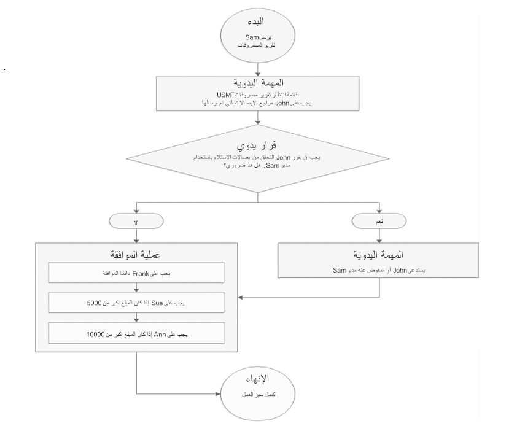

تتطلب بعض المؤسسات أن تتم الموافقة على دفاتر اليومية من قبل مستخدم آخر غير الشخص الذي أدخل دفتر اليومية.Some organizations require that journals be approved by a user other than the person who entered the journal. استناداً إلى أسماء دفتر اليومية، يمكنك المطالبة بالموافقة يدوياً أو الموافقة على سير العمل أو عدم الموافقة.Based on journal names, you can require manual approval, workflow approval, or no approval. 

في حالة إعداد الموافقة على سير العمل لدفتر اليومية، يتم عرض عناصر تحكم إضافية أعلى نموذج **دفتر اليومية**.If workflow approval is set up for a journal, additional controls are displayed at the top of the **Journal** form. تتضمن شريط معلومات أصفر وزر **إرسال** أو قائمة **الإجراءات**.These include a yellow information bar and a **Submit** button or an **Actions** menu.
لا تتوفر بعض الأزرار الموجودة في صفحتي **دفتر اليومية** و **إيصال دفتر اليومية** عند إرسال دفتر يومية للموافقة على دفتر يومية سير العمل.Some buttons in the **Journal** and **Journal voucher** pages are not available when a journal has been submitted for workflow journal approval. عند الموافقة على دفتر اليومية، تتوفر الخيارات الموجودة في قائمة **ترحيل**، ولا تتوفر عناصر التحكم والحقول الأخرى في الصفحة.When the journal is approved, the options in the **Post** menu are available, and the other controls and fields in the page are not. إذا قام مستخدم بتحرير دفتر يومية تمت الموافقة عليه، فتتم إعادة تعيين حالة سير العمل، ولا تتوفر الخيارات الموجودة في قائمة **ترحيل**، وتتوفر عناصر التحكم والحقول الأخرى.If a user edits an approved journal, the workflow status is reset, the options in the **Post** menu are not available, and the other controls and fields are available. عند إجراء تغييرات، يجب إعادة إرسال دفتر اليومية للموافقة عليه.When changes have been made, the journal must be resubmitted for approval.

يمكن أن يشتمل سير العمل على عدة مجموعات من الأشخاص، وهم المنشئ والمكلفون بالمهام ومتخذو القرار والموافقون.A workflow can involve several groups of people: the originator, task assignees, decision makers, and approvers. علي سبيل المثال، يتعين وضع عملية الموافقة علي سير العمل التالية في عين الاعتبار.For example, consider the following workflow approval process. في هذا السيناريو، سير عمل تقرير المصروفات، Sam هو المنشئ، وأعضاء قائمة الانتظار هم المكلفون بالمهام وJohn هو متخذ القرار وFrank وSue وAnn هم الموافقون.In this scenario, the expense report workflow, Sam is the originator, the members of the queue are task assignees, John is a decision maker, and Frank, Sue, and Ann are approvers.

 

## الإجراءات التي يمكن للمنشئ تنفيذهاActions that an originator can perform 

يبدأ المنشئ مثيل سير عمل بإرسال مستند للمعالجة.The originator starts a workflow instance by submitting a document for processing. علي سبيل المثال، يجب أن يحدد Sam زر **إرسال** الموجود في صفحة\*\* تقرير المصروفات\*\* لإرسال تقرير المصروفات الخاص به.For example, Sam must select the **Submit** button on the **Expense report** page to submit his expense report.

## الإجراءات التي يمكن للمكلف بالمهمة تنفيذهاActions that a task assignee can perform 

يمكن تعيين مهمة لعدة أشخاص أو لقائمة انتظار عناصر العمل التي يراقبها عدة أشخاص.A task can be assigned to multiple people or to a work item queue that is monitored by several people. ومع ذلك، لا يستطيع إلا شخص واحد إكمال المهمة.However, only one person can complete a task. 

على سبيل المثال، أرسل Sam تقرير المصروفات وقام بتوجيه إيصالاته إلى إدارة تقارير المصروفات في مؤسسته لمراجعتها.For example, Sam has submitted an expense report and has routed his receipts to his organization's Expense Reports department for review.
يراقب أعضاء إدارة تقارير المصروفات في Adventure Works Cycles International قائمة الانتظار.Members of the Adventure Works Cycles International Expense Reports department monitor the queue. وقد قبلت Julie، عضو هذه الإدارة، مهمة مراجعة تقرير مصروفات Sam وإيصالاته.Julie, a member of that department, has accepted the task of reviewing Sam's expense report and receipts. يمكنها الآن تنفيذ أحد الإجراءات التالية: إكمال أو رفض أو تفويض أو طلب تغيير أو إعادة تعيين أو تحرير.She can now perform one of the following actions: complete, reject, delegate, request change, reassign, or release.

### إكمالComplete 

عندما يكمل مستخدم مهمة، يتم تعيين المستند الذي تم إرساله للمعالجة إلى المستخدم التالي في سير العمل، إذا كان هناك مستخدم تالٍ.When a user completes a task, the document that was submitted for processing is assigned to the next user in the workflow, if there is a next user. إذا لم تكن هناك حاجة إلى إجراء معالجة إضافية، تنتهي عملية سير العمل.If no additional processing is required, the workflow process ends.

على سبيل المثال، قبلت Julie، عضو إدارة تقارير المصروفات في Adventure Works Cycles International، مهمة مراجعة تقرير مصروفات Sam وإيصالاته.For example, Julie, a member of the Adventure Works Cycles International Expense Reports department, has accepted the task of reviewing Sam's expense report and receipts. بعدما تكمل Julie مراجعتها، يتم تعيين المستند إلى John.After Julie completes her review, the document is assigned to John.

### رفضReject 

عندما يرفض مستخدم مستند ما، تنتهي عملية سير العمل.When a user rejects a document, the workflow process ends. 

على سبيل المثال، قبلت Julie، عضو إدارة تقارير المصروفات في Adventure Works Cycles International، مهمة مراجعة تقرير مصروفات Sam وإيصالاته.For example, Julie, a member of the Adventure Works Cycles International Expense Reports department, has accepted the task of reviewing Sam's expense report and receipts. إذا رفض Julie تقرير المصروفات، فستنتهي عملية سير العمل.If Julie rejects the expense report, the workflow process ends.
ويستطيع Sam بعد ذلك إعادة إرسال تقرير المصروفات.Sam can then resubmit the expense report. يمكنه إجراء تغييرات أولاً، أو يمكنه إعادة إرسال الإصدار الأصلي.He can make changes first, or he can resubmit the original version. إذا أعاد Sam إرسال تقرير المصروفات، فستبدأ عملية سير العمل في مهمة المراجعة اليدوية.If Sam resubmits the expense report, the workflow process starts at the manual review task.

### تفويضDelegate 

عندما يقوم مستخدم بتفويض مهمة ما، يتم تعيين المهمة إلى مستخدم آخر.When a user delegates a task, the task is assigned to another user. 

على سبيل المثال، قبلت Julie، عضو إدارة تقارير المصروفات في Adventure Works Cycles International، مهمة مراجعة تقرير مصروفات Sam وإيصالاته.For example, Julie, a member of the Adventure Works Cycles International Expense Reports department, has accepted the task of reviewing Sam's expense report and receipts. تفوض Julie مساعدها Tim لتنفيذ هذه المهمة.Julie delegates this task to Tim, who is her assistant.
وبعد ذلك يتصرف Tim نيابة عن Julie.Tim then acts on behalf of Julie. وبالتالي، عندما يكمل Tim مراجعته، يتم تعيين تقرير المصروفات إلى John، تماماً كما لو أن Julie أكملت المهمة.Therefore, when Tim completes his review, the expense report is assigned to John, just as if Julie had completed the task.

### طلب تغييرRequest change 

عندما يطلب مستخدم إجراء تغيير على مستند تم إرساله، يتم إرسال المستند مرة أخرى إلى المنشئ.When a user requests a change to a document that was submitted, the document is sent back to the originator.

على سبيل المثال، قبلت Julie، عضو إدارة تقارير المصروفات في Adventure Works Cycles International، مهمة مراجعة تقرير مصروفات Sam وإيصالاته.For example, Julie, a member of the Adventure Works Cycles International Expense Reports department, has accepted the task of reviewing Sam's expense report and receipts. تلاحظ Julie بعض الأخطاء في تقرير المصروفات وتطلب إجراء تغييرات.Julie notices some errors on the expense report and requests changes. يتم إعادة إرسال تقرير المصروفات إلى Sam.The expense report is sent back to Sam.

يستطيع Sam إعادة إرسال تقرير المصروفات.Sam can resubmit the expense report. يمكنه إجراء التغييرات المطلوبة أولاً، أو يمكنه إعادة إرسال الإصدار الأصلي.He can make the requested changes first, or he can resubmit the original version. إذا أعاد Sam إرسال تقرير المصروفات، فيجب أن يراجع عضو في قائمة انتظار عناصر العمل تقرير المصروفات والإيصالات مرة أخرى.If Sam resubmits the expense report, a member of the work item queue must review the expense report and the receipts again.

### إعادة تعيينReassign 

يمكن لأعضاء قائمة انتظار عناصر العمل إعادة تعيين المستندات الموجودة في قائمة الانتظار هذه إلى قائمة انتظار أخرى.The members of a work item queue can reassign documents that are in that queue to another queue.

على سبيل المثال تقوم Julie عضو إدارة تقارير المصروفات في Adventure Works Cycles International بمراقبة قائمة الانتظار.For example, Julie, a member of the Adventure Works Cycles International Expense Reports department, is monitoring the queue. وللمساعدة في تحقيق التوازن في حمل العمل، يمكنها إعادة تعيين تقرير المصروفات والإيصالات المضمنة فيه إلى قائمة انتظار أخرى.To help balance the workload, she can reassign the expense report, and the receipts that are included with it, to another queue.

### تحريرRelease 

في بعض الأحيان، قد يقبل أحد أعضاء قائمة انتظار عناصر العمل مهمة، ولكنه يقرر فيما بعد أنه لا يستطيع إكمال المهمة.Occasionally, a member of a work item queue might accept a task, but then decide that he or she can't complete the task. في هذه الحالة، يمكن للشخص الذي قبِل المهمة تحرير المستند وإرساله مرة أخرى إلى قائمة انتظار عناصر العمل.In this case, the person who accepted the task can release the document back to the work item queue.

على سبيل المثال، قبلت Julie، عضو إدارة تقارير المصروفات في Adventure Works Cycles International، مهمة مراجعة تقرير مصروفات Sam وإيصالاته.For example, Julie, a member of the Adventure Works Cycles International Expense Reports department, has accepted the task of reviewing Sam's expense report and receipts. إذا قررت Julie أنه لا يمكنها إكمال المهمة، فيمكنها تحرير المستند.If Julie decides that she can't complete the task, she can release the document. يتم إرجاع تقرير المصروفات إلى قائمة الانتظار، بحيث يستطيع الأعضاء الآخرين في إدارة تقارير المصروفات في Adventure Works Cycles إكمال المهمة.The expense report is returned to the queue, so that other members of the Adventure Works Cycles Expense Reports department can complete the task.

## الإجراءات التي يمكن لمتخذ القرار تنفيذهاActions that a decision maker can perform 

عادةً ما يتم تعيين مستند لمتخذ القرار نظراً لوجود سؤال يجب أن يجيب عنه متخذ القرار.Typically, a document is assigned to a decision maker because there is a question that the decision maker must answer. وعادةً ما تكون إجابة السؤال **نعم** أو **لا** أو **صواب** أو **خطأ**.The answer to the question is typically **Yes** or **No**, or **True** or **False**. إذا لم يحدد متخذ القرار أي من هذه الاختيارات، فيمكنه تفويض القرار.If the decision maker doesn't select one of those choices, he or she can delegate the decision.

يجب على متخذ القرار الإجابة عن سؤال متعلق بالمستند.A decision maker must answer a question that is related to the document. وعادةً ما تكون إجابة السؤال **نعم** أو **لا** أو **صواب** أو **خطأ**.The answer to the question is typically **Yes** or **No**, or **True** or **False**. تحدد الإجابة التي يختارها متخذ القرار فرع سير العمل المستخدم لمعالجة المستند.The answer that the decision maker selects determines the workflow branch that is used to process the document.

على سبيل المثال، يتم تعيين تقرير مصروفات Sam إلى John.For example, Sam's expense report is assigned to John. يجب أن يقرر John ما إذا كانت المعلومات الواردة في المستند تتطلب إجراء اتصال بمدير Sam.John must decide whether the information in the document requires a call to Sam's manager. إذا قرر John أنه يلزم إجراء اتصال، فيتم تعيين تقرير المصروفات إلى Aretha، والتي يجب عليها الاتصال بمدير Sam.If John decides that a call is required, the expense report is assigned to Aretha, who must then call Sam's manager. في حال قرر John أنه لا يلزم إجراء اتصال، فيتم تعيين تقرير المصروفات إلى Frank للموافقة عليه.If John decides that a call isn't required, the expense report is assigned to Frank for approval.

### تفويضDelegate 

عندما يفوض متخذ القرار قرار ما، يتم تعيين المستند إلى مستخدم آخر يجب عليه أن يتخذ القرار.When a decision maker delegates a decision, the document is assigned to another user who must make the decision.

على سبيل المثال، يتم تعيين تقرير مصروفات Sam إلى John.For example, Sam's expense report is assigned to John. يفوض John القرار إلى مساعدته Maria.John delegates the decision to Maria, who is his assistant. وعندئذٍ تتصرف Maria نيابة عن John.Maria then acts on behalf of John. إذا قررت Maria أنه يلزم الاتصال بمدير Sam، فسيتم تعيين تقرير المصروفات إلى Aretha، التي يجب عليها بعد ذلك الاتصال بمدير Sam.If Maria decides that a call to Sam's manager is required, the expense report is assigned to Aretha, who must then call Sam's manager. وفي حال قررت Maria أنه لا يلزم إجراء اتصال، فيتم تعيين تقرير المصروفات إلى Frank للموافقة عليه.If Maria decides that a call isn't required, the expense report is assigned to Frank for approval.

## الإجراءات التي يمكن للموافق تنفيذهاActions that an approver can perform 

عند تعيين مستند إلى أحد الموافقين، يمكن للموافق تنفيذ أحد الإجراءات التالية: الموافقة أو الرفض أو التفويض أو طلب تغيير.When a document is assigned to an approver, the approver can perform one of the following actions: approve, reject, delegate, or request change.

### الموافقة‬Approve 

عندما يوافق أحد الموافقين على مستند ما، يتم تعيين المستند إلى المستخدم التالي في سير العمل، في حالة كان هناك مستخدم تالٍ.When an approver approves a document, the document is assigned to the next user in the workflow, if there is a next user. إذا لم تكن هناك حاجة إلى إجراء معالجة إضافية، تنتهي عملية سير العمل.If no additional processing is required, the workflow process ends.

على سبيل المثال، أرسل Sam تقرير مصروفات بقيمة 7،500 دولار أمريكي، وتم تعيين هذا المستند إلى Frank.For example, Sam has submitted an expense report for USD 7,500, and this document is assigned to Frank. عندما يوافق Frank على المستند، يتم تعيينه إلى Sue للموافقة عليه.When Frank approves the document, it's assigned to Sue for approval. عندما يوافق Sue على تقرير المصروفات، تنتهي عملية سير العمل.When Sue approves the expense report, the workflow process ends.

### رفضReject

عندما يرفض أحد الموافقين مستند ما، تنتهي عملية سير العمل.When an approver rejects a document, the workflow process ends. 

على سبيل المثال، أرسل Sam تقرير مصروفات بقيمة 12،000 دولاراً أمريكياً، وتم تعيين هذا المستند إلى Sue.For example, Sam has submitted an expense report for USD 12,000, and this document is assigned to Sue. في حال رفض Sue تقرير المصروفات، ستنتهي عملية سير العمل.If Sue rejects the expense report, the workflow process ends.
يستطيع Sam إعادة إرسال تقرير المصروفات.Sam can resubmit the expense report. ويمكنه إجراء تغييرات أولاً، أو يمكنه إعادة إرسال الإصدار الأصلي من تقرير المصروفات.He can make changes first, or he can resubmit the original version of the expense report. إذا أعاد Sam إرسال تقرير المصروفات، فستبدأ عملية سير العمل في عملية الموافقة.If Sam resubmits the expense report, the workflow process starts at the approval process.

### تفويضDelegate

عندما يقوم أحد الموافقين بتفويض مستند ما، يتم تعيين المستند إلى مستخدم آخر للموافقة عليه.When an approver delegates a document, the document is assigned to another user for approval.

على سبيل المثال، أرسل Sam تقرير مصروفات بقيمة 12،000 دولاراً أمريكياً، وتم تعيين هذا المستند إلى Frank.For example, Sam has submitted an expense report for USD 12,000, and this document is assigned to Frank. يفوض Frank تقرير المصروفات إلى Ann.Frank delegates the expense report to Ann.
وعندئذٍ تتصرف Ann نيابة عن Frank.Ann then acts on behalf of Frank. وبالتالي، عندما توافق Ann على المستند، يتم تعيينه إلى Sue للموافقة عليه، تماماً كما لو أن Frank وافق عليه.Therefore, when Ann approves the document, it's assigned to Sue for approval, just as if Frank had approved it. بعد موافقة Sue على المستند، يتم إرساله إلى Ann للموافقة عليه.After Sue approves the document, it's sent to Ann for approval.

### طلب تغييرRequest change

عندما يطلب الموافق إجراء تغيير على مستند ما، يتم إرسال المستند مرة أخرى إلى المنشئ.When an approver requests a change to a document, the document is sent back to the originator.

على سبيل المثال، أرسل Sam تقرير مصروفات بقيمة 12،000 دولاراً أمريكياً، وتم تعيين هذا المستند إلى Sue.For example, Sam has submitted an expense report for USD 12,000, and this document is assigned to Sue. إذا طلب Sue إجراء تغيير، فسيتم إعادة إرسال تقرير المصروفات إلى Sam.If Sue requests a change, the expense report is sent back to Sam.
يستطيع Sam إعادة إرسال تقرير المصروفات.Sam can resubmit the expense report. ويمكنه إجراء التغييرات المطلوبة أولاً، أو يمكنه إعادة إرسال الإصدار الأصلي من تقرير المصروفات.He can make the requested changes first, or he can resubmit the original version of the expense report. إذا أعاد Sam إرسال تقرير المصروفات، فسيتم إرساله إلى Frank للموافقة عليه، لأن Frank هو الموافق الأول في عملية الموافقة.If Sam resubmits the expense report, it's sent to Frank for approval, because Frank is the first approver in the approval process.

