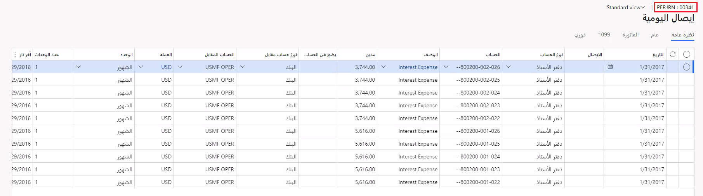

شاهد هذا الفيديو للتعرف على كيفية استخدام سير عمل لدفتر يومية عام يومي، وإرسال سير العمل للاعتماد، واستخدم عناصر العمل لإدارة عملية سير العمل استناداً إلى السيناريو التالي.

**السيناريو**

ضع في اعتبارك سيناريو يتم فيه ترحيل دفتر يومية شهرياً ويجب تقديمه من قِبل كاتب الحسابات الدائنة إلى سير عمل. كجزء من العملية، يتم إعداد دفاتر اليومية الدورية لتوفير قالب للحركات الشائعة بحيث لا يتعين القيام بها في كل مرة يلزم ترحيلها فيها.

 

يوضح المثال أعلاه إدخال فائدة سيتم ترحيله كل شهر من قِبل الكاتب. ونظراً لأنه لا يمكن ترحيل دفتر اليومية الدوري نفسه، يجب سحبه إلى دفتر يومية عام ويتم عرض هذه العملية في الفيديو أدناه. وهذا هو مكان عملية سير عمل دفتر اليومية اليومي لإحضار البيانات من دفتر يومية دوري إلى دفتر يومية يومي، ثم استخدام سير العمل للموافقة. عند إعداد دفتر اليومية اليومي بنجاح بالحسابات اللازمة، يمكن بعد ذلك تقديمه إلى سير العمل وتتم الموافقة عليه من قِبل الموافق كما هو محدد في سير العمل.

وكمستشار وظيفي، يجب أن تشرح أنه لا يمكن ترحيل دفاتر اليومية الدورية إلى تطبيقات التمويل والعمليات مباشرةً. تعمل دفاتر اليومية الدورية كقالب لدفاتر اليومية ذات الطبيعة اليومية للإيصالات الدورية.
حيث يساعدك ذلك على تجنب التخصيص غير الضروري.  

في هذا الفيديو، نعرض الفرق بين اعتماد دفتر يومية عام واستخدام سير عمل، واستخدام دفتر يومية الفترة. 

&nbsp;
 > [!VIDEO https://www.microsoft.com/videoplayer/embed/RE48pBu]
