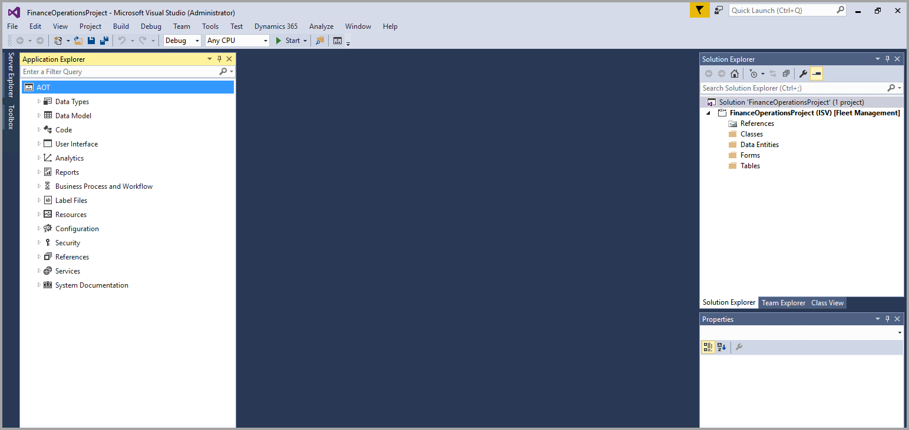

بينما يعمل المستخدمون عادةً في واجهة المستخدم، يعمل المطورون في Visual Studio في بيئة المطورين الخاصة بهم. يستخدم المطورون Visual Studio لإنشاء العناصر وتخصيصها وتنفيذ عمليات المطورين الأخرى. تسمح بيئة المطورين الجديدة للمطورين بالعمل في بيئتهم الخاصة مع استمرار امتلاك القدرة على التعاون والعمل مع المطورين والفرق الأخرى باستخدام التحكم في المصدر. يتم استخدام "مصمم العناصر" لإنشاء العناصر، بينما يتم استخدام "مستكشف التطبيقات" لإدارة العناصر.

من المهم مزامنة أي تغييرات في البيانات مع قاعدة البيانات للتأكد من تحديث جميع العناصر في شجرة كائن التطبيق (AOT).

