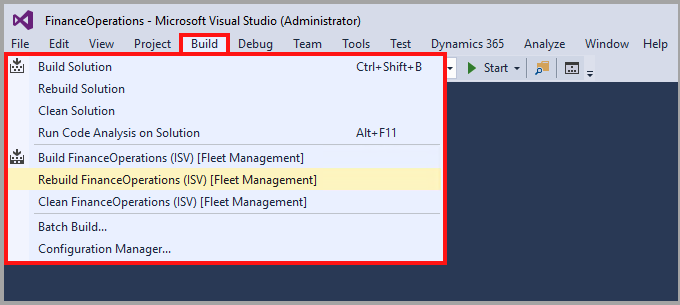

تحتوي المشاريع في Visual Studio على عناصر يتم تخزينها كبيانات تعريف عند إنشائها.Projects in Visual Studio contain elements, which are stored as metadata when they are built. وبعد ذلك يستخدم التطبيق بيانات التعريف لتشغيل ملحقاتك.The metadata is then used by the application to run your extensions. 

لإنشاء مشروع جديد، انتقل إلى **ملف**، ثم **جديد**، ثم قم بتحديد **مشروع** أو اضغط على **Ctrl + Shift** مع الضغط على المفتاح **N**.To create a new project, go to **File**, then **New**, and then select **Project** or hold **Ctrl + Shift** while pressing the **N** key. في معالج المشروع، قم بتسمية مشروعك وتأكد من تحديد النموذج الذي ينتمي إليه.In the project wizard, name your project and make sure to select the model where it belongs. من الصعب تغيير النموذج عندما تبدأ في إضافة ملفات إلى المشروع، لذا فإن القيام بذلك في وقت مبكر أمر بالغ الأهمية.The model is difficult to change when you start adding files to the project, so getting it right early on is crucial.

يتيح لك معالج **المشروع الجديد** أيضاً تحديد التبعيات إذا كنت تعرف النماذج التي قد تستخدمها أو تقوم بتوسيع العناصر منها.The **New project** wizard also lets you select dependencies if you know which models you might be using or extending elements from. إذا لم يكن الأمر كذلك، يمكنك تحرير قائمة تبعيات النموذج لاحقاً أثناء إضافة العناصر.If not, you can edit the model dependencies list later as you add elements. تأكد من عدم نسيانها لأن التبعية المفقودة ستمنع نموذجك من الإنشاء بنجاح.Make sure that you do not forget it because a missing dependency will prevent your model from building successfully.

لإنشاء النماذج، لديك بعض الخيارات اعتماداً على ما تحتاج إلى بنائه.For the building of models, you have a few options depending upon what you need to build. يمكنك إنشاء أو إعادة إنشاء مشروعك أو الحل الخاص بك من نافذة **مستكشف الحلول** عن طريق النقر بزر الماوس الأيمن فوق مشروع أو الحل الخاص بك ثم تحديد خيار تنفيذ إنشاء أو إعادة إنشاء.You can build or rebuild your project or solution from the **Solution Explorer** window by right-clicking your project or solution and then selecting the option to perform a build or rebuild. يمكنك أيضاً تنفيذ إنشاء من قائمة **إنشاء** تماماً كما تفعل في أي مشروع Visual Studio آخر.You can also perform a build from the **Build** menu just like you would in any other Visual Studio project.

لإنشاء النموذج الخاص بك، أو جميع النماذج، حدد **إنشاء النماذج** من قائمة **Dynamics 365** لفتح مربع حوار حيث يمكنك اختيار النماذج التي سيتم بناؤها.To build your model, or all models, select **Build Models** from the **Dynamics 365** menu to open a dialog where you can select which models to build. عند تحديد جميع الطرز التي تحتاجها، استخدم زر **إنشاء** لبدء الإنشاء.When you have selected all the models that you need, use the **Build** button to start the build.

شاهد هذا الفيديو لرؤية كيف يمكنك إنشاء مشروع جديد.Watch this video to see how you can create a new project. 

 > [!VIDEO https://www.microsoft.com/videoplayer/embed/RE4bbcG]
