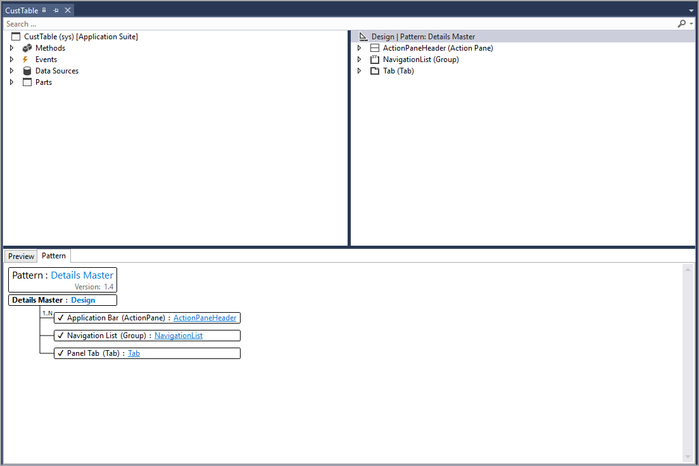

مصمم العنصر هو مركز التطوير في Visual Studio. يمكن تعديل العناصر الجديدة، ويمكن توسيع العناصر الموجودة داخل AOT ليتم تعديلها حسب الحاجة ضمن هذه النافذة.

يبدأ إنشاء عنصر جديد في نافذة **مستكشف الحلول**:
 
1.  انقر بزر الماوس الأيمن فوق مشروع وحدد **إضافة صنف جديد**.
2.  يؤدي هذا إلى فتح مربع حوار حيث يمكنك اختيار نوع الكائن المراد إضافته، ثم قم بتسميته. عند تأكيد اختياراتك، سيظهر العنصر في نافذة **مستكشف الحلول**.
3.  حدد العنصر في نافذة **مستكشف الحلول**، الذي سيقوم بإحضاره إلى مصمم العنصر لتحريره.
4.  لتوسيع عنصر من AOT، انقر بزر الماوس الأيمن فوقه وحدد **توسيع**. سيؤدي ذلك إلى إضافته إلى نافذة **مستكشف الحلول**. 

يختلف مظهر مصمم العنصر حسب نوع العنصر ولكن عادةً ما يحتوي على طريقة عرض هرمي لبيانات العنصر والعناصر أو الكود من ذوي الصلة. يمكنك سحب العناصر وإسقاطها في طريقه العرض هذه، حيث تتم هيكلتها بشكل مناسب، وعرض الخصائص في أي عقدة محددة في نافذة **الخصائص**. بالنقر بزر الماوس الأيمن فوق عناصر الكود، يمكنك فتحها في محرر الكود لإجراء التعديلات باستخدام ميزات الكود التي اعتدت على مشاهدتها في Visual Studio، مثل Intellisense.

يكون للنماذج تخطيطاتها الخاصة، والتي تتكون من ثلاثة نوافذ:

-   **مصمم النموذج** - يحتوي على عرض هرمي لبنية النموذج.
-   **مصمم العنصر العادي** - للعقدة المحددة في طريقة العرض
-   **مصمم النمط**- يساعدك على مطابقة تخطيطات النماذج الموجودة واصطلاحات واجهة المستخدم في تطبيقات Finance and Operations. عند بدء إنشاء نموذج، يمكنك تطبيق نمط بالنقر بزر الماوس الأيمن فوق عقده النموذج في مصمم النموذج وتحديد **تطبيق النمط**. يؤدي هذا إلى ملء متطلبات النمط في مصمم النمط بحيث يمكنك معرفة ما تحتاج إلى إضافته لإكمال النموذج. 

الصورة التالية هي مثال لمصمم عنصر النموذج. 

