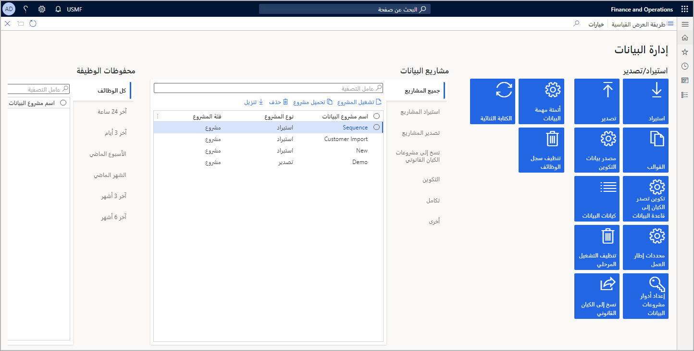

تتسح مساحة عمل **إدارة البيانات** للمستخدمين إعداد وظائف البيانات المتكررة داخل مشروع لتطبيقات التمويل والعمليات. ضمن مساحة العمل هذه، يمكنك إعداد مشروع استيراد أو تصدير يشير إلى كيان بيانات محدد.

المكونات الثلاثة الرئيسية لإعداد مشروع البيانات المتكررة في مساحة عمل **إدارة البيانات** هي:

-   **الملف** - سيدفع تكاملك الخارجي أو يسحب الملفات الفردية بحيث يمكن معالجتها من خلال وظيفة البيانات المتكررة هذه. في هذه الحالة، يكون تنسيق الملف المتوقع هو نفس التنسيق الذي تم تحديده عند إضافة الكيان إلى مشروع البيانات.
-   **حزمة البيانات** - يمكنك دفع ملفات حزم البيانات أو سحبها للمعالجة. تعد حزمة البيانات تنسيقاً جديداً يتيح لك إرسال ملفات بيانات متعددة كوحدة واحدة يمكن استخدامها في مهام التكامل.
-   **معالجة الرسائل في أمر** - يمكنك تمكين هذا الخيار لفرض المعالجة المتسلسلة للملفات الواردة في سيناريو استيراد. ينطبق هذا الخيار فقط على الملفات وليس حزم البيانات.

>[!IMPORTANT]
>قبل أن تتمكن من إنشاء وظيفة بيانات متكررة، يجب عليك تسجيل التطبيق في Azure Active Directory للحصول على معرف التطبيق (معرف العميل). لاحظ أنه يمكن لمستخدم مسؤول واحد فقط في Azure Service إضافة التطبيق ومشاركة معرف العميل مع المطورين.

لمعرفه المزيد حول تسجيل أحد التطبيقات مع Azure AD، راجع [نظرة عامة على نقاط نهاية الخدمة](/dynamics365/fin-ops-core/dev-itpro/data-entities/services-home-page/?azure-portal=true). 

للوصول إلى مساحة عمل **إدارة البيانات** وإنشاء وظيفة بيانات متكررة، اتبع الخطوات التالية:

1.  انتقل إلى تطبيقات التمويل والعمليات.
2.  حدد جزء التنقل، ثم انتقل إلى **مساحات العمل > إدارة البيانات**.
3.  في مساحة عمل **إدارة البيانات**، حدد **تصدير**. يمكنك تحديد **استيراد** اختيارياً لأنه يمكن إعداد الوظائف المتكررة لوظائف الاستيراد والتصدير.
4.  في صفحة **التصدير**، أدخل اسماً للوظيفة.
5.  حدد **تنسيق البيانات الهدف**. 
6.  حدد **اسم الكيان** من القائمة المنسدلة.
7.  حدد ما إذا كنت تريد إنشاء حزمة بيانات.
8.  حدد **إضافة كيان**. 
9.  يمكنك اتباع الخطوات من 4 إلى 8 لإضافة المزيد من الكيانات إلى الوظيفة.
10. بعد إضافة جميع الكيانات إلى وظيفة التصدير، حدد كل الملفات والكيانات التي تريدها كجزء من وظيفة البيانات المتكررة عن طريق تحديد خانة الاختيار في الزاوية العلوية اليمنى لكل كيان.
11. حدد **إنشاء وظيفة بيانات متكررة** في جزء الإجراءات.
12. في صفحة **إنشاء وظيفة البيانات المتكررة**، حدد اسماً للوظيفة.
13. بشكل اختياري، أضف وصفاً للوظيفة.
14. حدد **مجموعة الدُفعات** التي ستكون هذه الوظيفة جزءاً فيها.
15. قم بإعداد التكرار عن طريق تحديد ارتباط **اتعيين تكرار المعالجة** أعلى الصفحة.
16. حدد تاريخ البدء ووقت البدء والمنطقة الزمنية وتاريخ الانتهاء ونمط التكرار في صفحة **تعيين تكرار المعالجة**.
17. حدد **موافق**.
18. قم بتوسيع علامة التبويب السريعة **إعداد سياسة التفويض**.
19. الصق معرف التطبيق في الحقل وقم بالتمكين.
20. حدد **موافق**.
