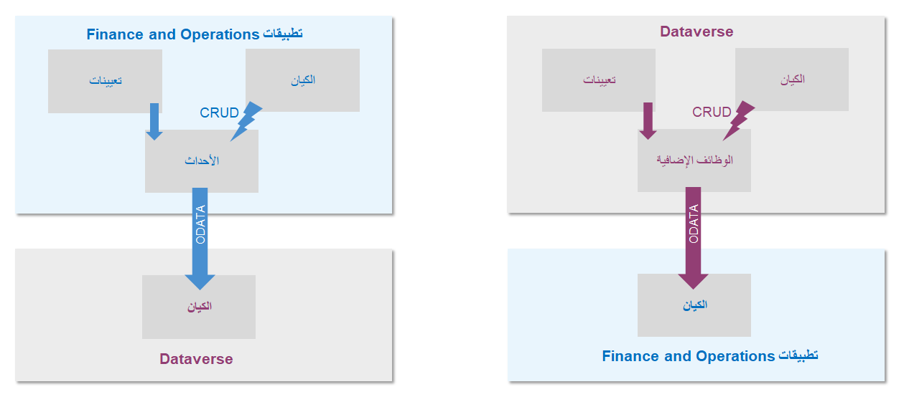

يمكنك استخدام Microsoft Dataverse لتمكين تدفق البيانات بين تطبيقات Finance and Operations وDynamics 365 Sales وDynamics 365 Customer Service.You can use Microsoft Dataverse to enable the flow of data between Finance and Operations apps and Dynamics 365 Sales, and Dynamics 365 Customer Service. ونظراً لوجود Sales وCustomer Service في Dataverse وتكامل تطبيقات Finance and Operations مع Dataverse، تتكامل تطبيقات Finance and Operations مع جميع أجزاء تطبيقات مشاركة العملاء، مثل Dynamics 365 Sales وDynamics 365 Customer service وDynamics 365 Marketing وDynamics 365 Field service، بالإضافة إلى Dynamics 365 Talent.Because Sales and Customer Service reside in Dataverse, and Finance and Operations apps integrates with Dataverse, Finance and Operations apps integrates with all parts of customer engagement apps, such as Dynamics 365 Sales, Dynamics 365 Customer service, Dynamics 365 Marketing, Dynamics 365 Field service, as well as Dynamics 365 Talent. 

على سبيل المثال، يمكن أن تتدفق معلومات العميل في Sales إلى تطبيقات Finance and Operations.For example, customer information in Sales can flow to Finance and Operations apps. لا يتعين عليك نقل البيانات يدوياً أو استخدام أداة تكامل بيانات تابعة لجهة خارجية.You don't have to manually move the data or use a third-party data integration tool. يتيح استخدام نهج Dataverse لتكامل البيانات تمكين تجربة مستخدم One Dynamics 365.Using a Dataverse approach to data integrations enables a One Dynamics 365 user experience. كما أنها تُمكن حلقات التعليقات الرقمية بين العملاء والمنتجات والأشخاص والعمليات.It also enables digital feedback loops among customers, products, people, and operations. 

للحفاظ على البيانات الموجودة في Dataverse محدثة، يمكنك تكوين بيئات تطبيقات Finance and Operations لربطها بـ Dataverse كجزء من تدفق توزيع البيئة في Lifecycle Services (LCS).To keep the data in the Dataverse up to date, you can configure Finance and Operations apps environments to link to the Dataverse as part of the environment deployment flow in Lifecycle Services (LCS). عند نشر البيئات، يمكنك تكوين بيئة Dataverse موجودة، أو إنشاء بيئة جديدة.When deploying environments, you can configure an existing Dataverse environment, or create a new one. ويمكن بعد ذلك إعداد البيانات للتدفق بين التطبيقات مع القليل من العمل المطلوب في الخلفية.The data can then be set up to flow between the applications with little work required on the back end.

تمثل Data Integrator for Admins خدمة تكامل من نقطة إلى نقطة تُستخدم لتكامل البيانات في Dataverse، وهي كيفية مزامنة البيانات عبر تطبيقات Dynamics 365.The Data Integrator for Admins is a point-to-point integration service that is used to integrate data into Dataverse, which is how you can synchronize data across Dynamics 365 applications. يتضمن النظام الأساسي لتكامل البيانات قوالب جاهزة توفرها الفرق المسؤولة عن التطبيق، بما في ذلك تطبيقات Finance and Operations وSales.The Data Integration platform includes out-of-the-box templates that are provided by application teams, including Finance and Operations apps and Sales.

كما تم إنشاء قوالب مخصصة من قبل شركاء Microsoft وعملائها.Custom templates have also been built by Microsoft partners and customers. توفر قوالب التكامل هذه مخططاً مع كيانات محددة مسبقاً وتعيينات الحقول، والتي تتيح تدفق البيانات من المصدر إلى الوجهة.These integration templates provide a blueprint with predefined entities and field mappings, which enable data to flow from the source to the destination. بالإضافة إلى ذلك، توفر قوالب التكامل القدرة على نقل البيانات قبل استيرادها.Additionally, integration templates provide the ability to transform the data before it is imported.

وفي كثير من الأحيان، يمكن أن يكون المخطط بين تطبيقات المصدر والوجهة مختلفاً، والقالب الذي يحتوي على كيانات محددة مسبقاً وتعيينات الحقول تعد نقطة بداية جيدة لمشروع التكامل.Many times, the schema between the source and destination apps can be different, and a template with predefined entities and field mappings is a good starting point for an integration project.

يُظهر الرسم التالي البنية الخلفية للنهج المتزامن لعمليات تكامل البيانات.The following graphic shows the behind-the-scenes architecture of the synchronous approach to data integrations. تتدفق البيانات بين تطبيقات Finance and Operations وDataverse في نمط ثنائي الاتجاه في وقت قريب من الوقت الحقيقي.Data flows between Finance and Operations apps and Dataverse in a bi-directional pattern in nearly real time. تعد هذه الوظيفة متوفرة في حالة جاهزة للاستخدام وهي النهج المفضل لتكامل البيانات.This functionality is available out of the box and is the preferred data integration approach.

لمعرفة المزيد حول تكامل البيانات المتزامن، انتقل إلى [مزامنة الحسابات مباشرة من Sales إلى العملاء في Supply Chain Management](https://docs.microsoft.com/dynamics365/supply-chain/sales-marketing/accounts-template-mapping-direct/?azure-portal=true)، والذي يقدم مثالاً على التدفق النقدي المحتمل المستخدم لمزامنة البيانات من Sales إلى Dynamics 365 Supply Chain Management.To learn more about synchronous data integration, go to [Synchronize accounts directly from Sales to customers in Supply Chain Management](https://docs.microsoft.com/dynamics365/supply-chain/sales-marketing/accounts-template-mapping-direct/?azure-portal=true), which provides an example of the prospect-to-cash flow that is used to synchronize data from Sales to Dynamics 365 Supply Chain Management.

لإعداد مشروع تكامل البيانات وإنشاء اتصال، اتبع هذه الخطوات عالية المستوى:To set up a data integration project and create a connection, follow these high-level steps:

1.  إنشاء اتصال (توفير بيانات اعتماد لمصادر البيانات).Create a connection (provide credentials to data sources).
2.  إنشاء مجموعه اتصال (تحديد بيئات الاتصال التي قمت بإنشائها في الخطوة السابقة).Create a connection set (identify environments for connections that you created in the previous step).
3.  إنشاء مشروع تكامل البيانات باستخدام قالب (إنشاء تعيينات محددة مسبقاً أو استخدامها لكيان واحد أو أكثر).Create a data integration project by using a template (create or use predefined mappings for one or more entities).
4.  بعد إنشاء مشروع تكامل، يجب أن توفر اتصالاً لكل نظام ستعمل عليه في مدخل Microsoft Power Apps.After the integration project has been created, you must provide a connection for each system that you will be working with in the Microsoft Power Apps portal.

يمكنك اختيار استخدام نهج غير متزامن لعمليات تكامل البيانات بين تطبيقات Finance and Operations وDataverse، ولكن أحادي الاتجاه.You can choose to use an asynchronous approach for data integrations between Finance and Operations apps and Dataverse, but it is one-directional. وهذا يعني أن البيانات يمكن أن تتدفق فقط من تطبيقات Finance and Operations إلى Dataverse أو من تطبيقات Dataverse إلى Finance and Operations.This means that data can flow only from Finance and Operations apps to Dataverse, or from Dataverse to Finance and Operations apps. ولا تتدفق بسلاسة ذهاباً وإياباً.It does not seamlessly flow back and forth.
ولا يكون تدفق البيانات أيضاً في الوقت الحقيقي.The data flow is also not in real time.

لمزيد من المعلومات حول تكامل بيانات Dataverse، راجع وحدة الموجز لهذه الوحدة للحصول على مراجع.For more information about Dataverse data integration, see the Summary unit of this module for references.
