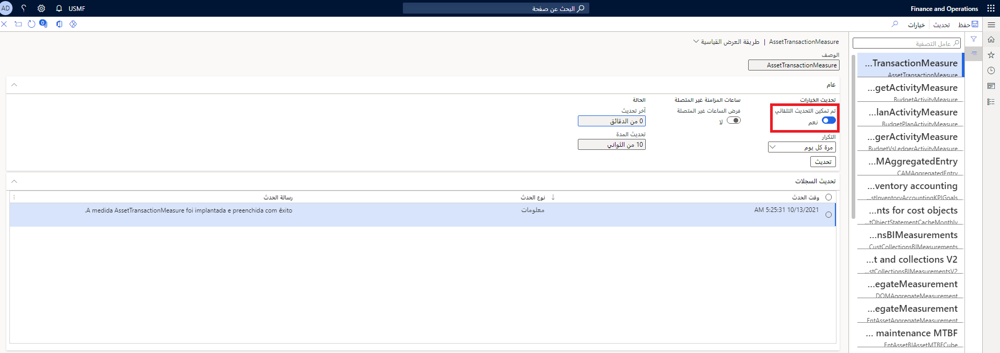
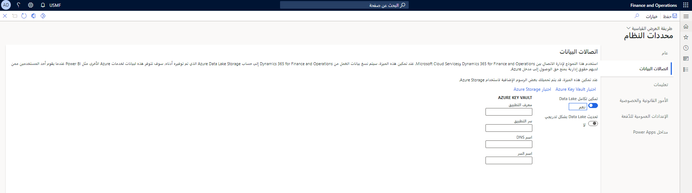

Microsoft Azure Data Lake Storage هو تجمع لا محدود للبيانات يمكن المؤسسات من تشغيل الإجراءات الذكية. فهو يزيل تعقيدات تناول وتخزين جميع بياناتك مع جعلها أسرع للتشغيل مع التحليلات المجمعة والمتدفقة والتفاعلية. 

يمكّنك Azure Data Lake Storage من الحصول على تخزين سحابي أقل تكلفة من وحدات التخزين السحابية التي توفرها قواعد البيانات الارتباطية. تتضمن هذه البيانات بيانات الأعمال التي يتم تخزينها تقليدياً في أنظمة الأعمال ومستودعات البيانات، بالإضافة إلى بيانات الجهاز وأجهزة الاستشعار، مثل الإشارات من الأجهزة. بالإضافة إلى ذلك، تدعم Data Lake Storage مجموعة من الأدوات ولغات البرمجة التي تمكن من الإبلاغ عن كميات كبيرة من البيانات والاستعلام عنها وتحويلها. 

يمكن لتطبيقات Finance and Operations استخدام Data Lake Storage لإمكانيات الذكاء الاصطناعي والتحليلات، مما يتيح لك الاستفادة من فعالية التكلفة ونقاط القوة لتقنية Azure Data Lake Storage. 

يتوفر متجر الكيان في Azure Data Lake Storage بحيث يمكنك تمكين تحليلات الذكاء الاصطناعي المتقدمة، مثل الاستدلال على البيانات، عبر تطبيقات Finance and Operations والبيانات الأخرى في Azure Data Lake Storage. توفر تطبيقات Finance and Operations وصولاً مباشراً إلى البيانات غير المشمولة التي لم تتم تسويتها في وقت قريب من الوقت الحقيقي. 

تتوفر مخططات متجر الكيانات في Azure Data Lake Storage بحيث يمكنك الوصول مباشرةً إلى البيانات التي لم تتم تسويتها للتقارير والتحليلات. يتم تخزين القياسات المجمعة‬‏‫ في Data Lake Storage كنماذج للبيانات العامة التي تمكن سيناريوهات تجميع البيانات والتحليل الثري. على سبيل المثال، يمكن إرفاق بيانات القياس التجميعي Microsoft Power BI كتدفقات بيانات مرجعية واستخدامها في إعداد التقارير باستخدام Power BI. يمكن لمستخدمي Power إنشاء مجموعات بيانات وتقارير جديدة في Power BI Desktop.

اتبع هذه الخطوات لإتاحة متجر الكيانات باعتباره data lake:

1.  تمكين تحديث متجر الكيان التلقائي قبل تمكين تكامل data lake عن طريق الانتقال إلى **إدارة النظام > إعداد > متجر الكيان**. 
2.  تتضمن صفحة **متجر الكيان** جميع **المقاييس المجمعة** في الجزء الأيمن. حدد أحد السجلات. 
3.  قم بتغيير **تمكين التحديث التلقائي** للتبديل إلى **نعم**. 

    
 
    > [!IMPORTANT]
    > هذا الإجراء غير قابل للإلغاء. عند التبديل إلى تحديث متجر الكيان التلقائي، لا يمكنك العودة إلى تجربة واجهة المستخدم القديمة. 
    
4.  حدد التحديث **التكرار**. يمكنك تحديد **كل ساعة** أو **مرتين في اليوم** أو **مرة واحدة في اليوم** أو **مرة واحدة في الأسبوع**. 

    > [!NOTE]
    > يمكن للمسؤولين تحديث المقاييس المجمعة عند الطلب عن طريق تحديد المقياس المجمع للتحديث، ثم تحديد **تحديث** في جزء الإجراءات. 

اتبع هذه الخطوات لتكون قادرًا على العمل في متجر الكيان باعتباره data lake:

1.  انتقل إلى **إدارة النظام > إعداد النظام > معلمات النظام**.
2.  حدد علامة التبويب **اتصالات البيانات** في الجزء الأيمن. 

     

3.  قم بتغيير **تمكين تكامل Data Lake** إلى **نعم**. 
4.  إذا كنت ترغب في تحديث Data Lake Storage في دفعات صغيرة متكررة عند تحديث البيانات في النظام، قم بتغيير **التحديث المستمر لـ Data Lake** إلى **نعم**. 
5.  أدخل المعلومات التالية:
    - **معرّف التطبيق** – معرّف التطبيق لتطبيق Microsoft Azure Active Directory (Azure AD).
    - **سر التطبيق**: مفتاح التطبيق (السر) لتطبيق Azure AD.
    - **اسم DNS**: اسم DNS لـ Key Vault. 
    - **الاسم السري**: اسم السر الذي أضفته إلى Key Vault مع معلومات سلسلة الاتصال.
6.  عند إدخال كافة المعلومات، حدد **اختبار Azure Key Vault** وكذلك **اختبار تخزين Azure** للتحقق من أن Dynamics 365 يمكنه الوصول إلى معلومات التكوين المتوفرة. 

يجب الآن ملء بيانات متجر الكيان في موقع التخزين الذي قمت بتوفيره، وليس في قاعدة بيانات متجر الكيان الارتباطي.

لمزيد من المعلومات، راجع [جعل متجر الكيانات متاحاً باعتباره Data Lake](/dynamics365/fin-ops-core/dev-itpro/data-entities/entity-store-data-lake/?azure-portal=true).

