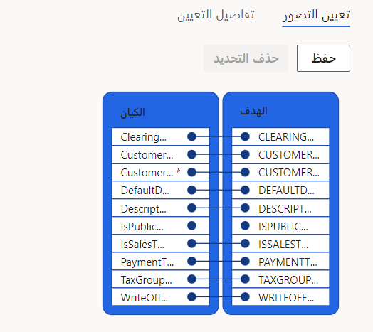
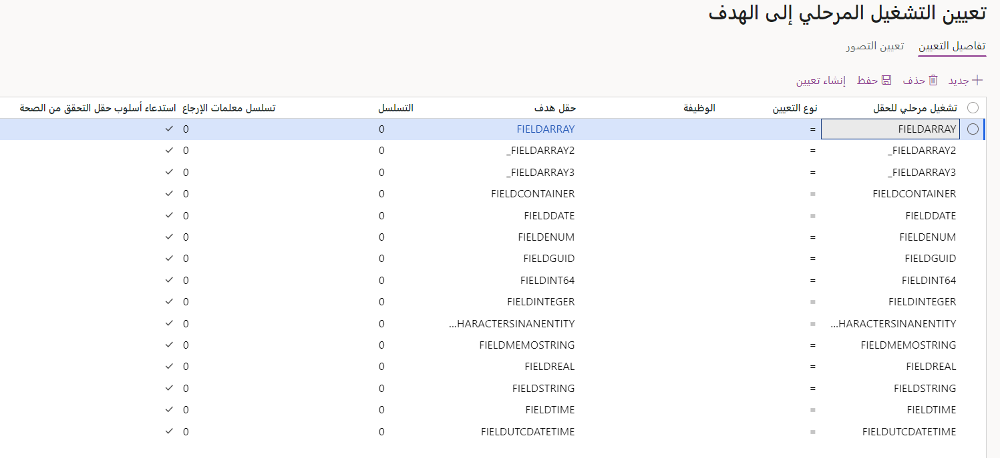

تعد إدارة البيانات ميزة هامة لمساعدتك في استيراد البيانات أو تصديرها مع الأنظمة الأخرى بشكل غير متزامن. يقوم عنصر **كيان البيانات** الموجود في شجرة مكونات البرنامج (AOT) بتشغيل عمليات نقل البيانات. كجزء من عملية التصدير أو الاستيراد، فأنت مطالب بإجراء تحويل البيانات الوسيطة لتحضير البيانات للتطبيق الهدف. يمكن تحويل البيانات من خلال التكوين. بالإضافة إلى ذلك، الخيارات متوفرة لمساعدتك في تطوير التعليمات البرمجية لتنفيذ تحويلات معقدة.

## التحويل باستخدام التكوين
يكون لتطبيقات التمويل والعمليات مفهوم لجداول التشغيل المرحلي بين الجداول المصدر والجداول الوجهة. من المصدر، يتم إدراج البيانات أو تحديثها في جدول التشغيل المرحلي ثم تحويلها إلى الوجهة. يمكن تحويل البيانات قبل إدراجها في جدول التشغيل المرحلي. يمكنك أيضاً تحويل البيانات أثناء نقل البيانات إلى الوجهة من التشغيل المرحلي. 

## تحويل البيانات بين مصدر البيانات الخارجي وجدول التشغيل المرحلي
عند إنشاء مشروع **تصدير** أو **استيراد** جديد في إدارة البيانات، ستظهر أيقونة في بند المشروع في العمود **عرض التعيين**. عند تحديد هذه الأيقونة، يظهر تعيين التصور بين جدول التشغيل المرحلي ومصدر البيانات الخارجي، كما هو موضح في لقطة الشاشة التالية. توفر علامة التبويب **تفاصيل التعيين**، الموجودة بجانب علامة التبويب **تعيين التصور**، تفاصيل تعيين الحقل من المصدر إلى الهدف وخيار التحويل الأساسي للبيانات. 

> [!div class="mx-imgBorder"]
> 

تتضمن الوظائف التي يمكنك الحصول عليها من صفحة **تفاصيل التعيين**:

- **تجاهل القيم الفارغة** - إذا كان هناك متطلب مطبق لتجاهل سجل إذا كانت قيمة حقل معين فارغة، فيجب عليك استخدام هذه الميزة.

- **مؤهل النصوص** - المتطلبات موجودة، مثل ملف نقل البيانات يحتاج إلى أن يحتوي على عمود من النوع سلسلة وقد تحتوي قيمة هذا العمود على فاصلة، وهي أيضًا محدد الأعمدة. 
    على سبيل المثال، تتضمن أسماء المؤسسة الخاصة بك فواصل، وتكون القيمة التي تستخدمها لمحدد الأعمدة هي أيضاً فاصلة. يمكنك استخدام مؤهل النصوص لحل هذا التعارض، والذي سيضيف علاماتي الاقتباس المزدوجة لتحديد عمود **النص**.

- **استخدام تسمية التعداد** - يعد هذا الخيار خانة اختيار، والتي يمكنك تحديدها لاستخدام تسمية التعداد في ملف نقل البيانات.

- **منشأ تلقائي** - قد يكون لدى بعض الحقول في أحد الكيانات متطلبات لتحديث البيانات التي ينشئها النظام أثناء الاستيراد بدلاً من توفير البيانات في ملف الاستيراد المصدر. في مثل هذه المواقف، يمكنك استخدام الوظيفة التي تم إنشاؤها تلقائياً في تفاصيل التعيين الخاصة بالكيان. 
    على سبيل المثال، يمكن أن يكون لكيان العميل رقم الطرف الذي يتم إنشاؤه تلقائياً أثناء الاستيراد ويتم إنشاء معلومات دفتر العناوين العمومي. عند تحديد خانة الاختيار **منشأ تلقائي** لأحد الحقول، سيتم تغيير الحقل المصدر إلى **تلقائي**.

- **افتراضي تلقائي** - قد يكون لدى بعض الحقول في أحد الكيانات متطلبات لتحديث البيانات التي ينشئها النظام أثناء الاستيراد بدلاً من توفير البيانات في ملف الاستيراد المصدر. في مثل هذا السيناريو، يمكنك استخدام خانة الاختيار **افتراضي تلقائي** في تفاصيل التعيين الخاصة بالكيان. عند تحديد خانة الاختيار **افتراضي تلقائي**، سيتم تمكين الزر **القيمة الافتراضية** في صفحة **تعيين المصدر إلى التشغيل المرحلي**، حيث يجب إدخال القيمة الافتراضية.

- **تحويل** - قد يكون لدى بعض الحقول في أحد الكيانات متطلبات تحديث القيم المحددة أثناء الاستيراد استناداً إلى القيمة المتوفرة في ملف الاستيراد المصدر. على سبيل المثال، في مصدر التطبيق، قيمة حقل معين هي خطأ أم صحيح. أثناء الاستيراد في Dynamics 365، يجب استيراد القيمة كـ **لا** أو **نعم**. سيسمح لك زر **التحويل** في النموذج **تعيين المصدر إلى التشغيل المرحلي** بإدخال معلومات تعيين قيمة إلى قيمة، والتي ستقوم بتحديث الحقول المضمنة أثناء عملية الاستيراد.

## تحويل البيانات بين تطبيقات التمويل والعمليات وجدول التشغيل المرحلي
يمكنك الوصول إلى كيان البيانات من إطار **كيانات البيانات** في مساحة عمل **إدارة البيانات**. لإضافة منطق تحويل البيانات، حدد زر **تعديل تعيين الهدف** في شريط الأوامر لكيان البيانات المحدد. يجب أن تظهر صفحة **تفاصيل التعيين**. 

> [!div class="mx-imgBorder"]
> 

تتوفر خيارات إنشاء الحقول الظاهرية والأعمدة المحسوبة في كيان البيانات. ستظهر هذه الحقول في حقل **التشغيل المرحلي**، الذي يمكنك تعيينه مع الحقول **الهدف** في التمويل والعمليات. يمكنك تطوير منطق تحويل البيانات في الحقول الظاهرية أو الأعمدة المحسوبة بكتابة كود X++.
 
### الأعمدة المحسوبة
خذ بعين الاعتبار العوامل التالية عند تطوير منطق تحويل البيانات في الأعمدة المحسوبة:

- يتم إنشاء **القيمة** بواسطة العمود المحسوب في طريقة عرض SQL.
- وأثناء القراءة، يتم حساب البيانات بواسطة SQL ويتم إحضارها مباشرةً من طريقة العرض.
- بالنسبة للكتابات، يجب أن يقوم كود X++ المخصص بتحليل قيمة الإدخال ثم كتابة القيم التي تم تحليلها إلى الحقول العادية لكيان البيانات. يتم تخزين القيم في الحقول العادية لمصادر البيانات الخاصة بالكيان.
- الحقول المحسوبة تستخدم غالباً من أجل القراءات.
- إذا كان الأمر ممكنا، يجب عليك استخدام الأعمدة المحسوبة بدلاً من الحقول الظاهرية لأنها محسوبة على مستوى خادم SQL، بينما يتم حساب الحقول الظاهرية صفاً تلو الآخر X++.

### الحقول الظاهرية
خذ بعين الاعتبار العوامل التالية عند تطوير منطق تحويل البيانات في الحقول الظاهرية:

- الحقول الظاهرية غير دائمة.
- يتم التحكم في الحقول الظاهرية بواسطة كود X++ المخصص.
- تحدث القراءة والكتابة من خلال كود X++ المخصص.
- تستخدم الحقول الظاهرية عادةً لقيم الإدخال التي يتم حسابها باستخدام كود X++ ولا يمكن استبدالها بأعمدة محسوبة.
